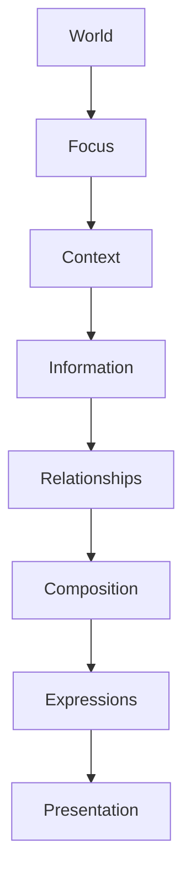

<!--
File: docs/design/language/mdl-003-mental-model/05-information.md
Document: MDL-003
Chapter: 05
Title: Information
Status: Draft
Version: 0.2
-->

# Information

---

# Purpose

Information is the first concept within the Mosaic Mental Model that exists independently from the user interface.

Everything before this chapter has described **how Mosaic understands the user's entertainment world**.

This chapter begins describing **what actually exists inside that world**.

The distinction is intentional.

Mosaic should fundamentally understand **information**, not interface.

The interface is simply one possible way of communicating that information.

This concept becomes the foundation for the Composition Engine, Module SDK and future runtime systems.

---

# Definition

Within MDL, **Information** is defined as:

> **A single, meaningful piece of knowledge describing the user's entertainment world.**

Information is atomic.

It cannot be meaningfully divided into smaller concepts without losing semantic value.

Examples include:

- Episode 14 releases tomorrow.
- Current watch progress is 68%.
- Chapter 12 has been completed.
- Hans Zimmer composed this soundtrack.
- This film is based on a novel.
- This actor also appears in another series.

These statements remain meaningful regardless of how they are eventually presented.

---

# Why Information Exists

Traditional UI systems frequently begin with interface.

Examples include:

```
Timeline Widget

Recommendation Card

Progress Bar

Metadata Panel
```

These are interface concepts.

They describe presentation.

Mosaic intentionally begins one layer earlier.

Instead it asks:

> **What do we actually know?**

Examples.

```
Episode Release

Progress

Relationship

Author

Runtime

Genre
```

The platform should understand these concepts before deciding how they should appear.

---

# Information Before Interface

This distinction is fundamental.

The following statement should be considered a fundamental architectural assumption of Mosaic.

> **Modules contribute information.**

> **Mosaic contributes interface.**

Future engineering systems should therefore avoid coupling knowledge to presentation.

---

# Information Is Permanent

Interfaces evolve.

Information rarely does.

Example.

```
Episode Release

↓

Tomorrow
```

Today this information may appear as:

- Timeline
- Hero
- Notification

Tomorrow it may appear as:

- Calendar
- Voice Assistant
- Smart TV Overlay

The information remains identical.

Only its expression changes.

This separation allows the platform to evolve without redefining its underlying knowledge.

---

# Characteristics Of Information

Every Information object should satisfy the following properties.

## Meaningful

It communicates something useful.

---

## Independent

It exists independently from presentation.

---

## Reusable

Many different compositions may consume the same information.

---

## Relational

Information may connect to other information.

---

## Observable

Changes may trigger updates elsewhere within the system.

---

# Information Categories

Although future specifications will formalise the complete Information Model, information generally belongs to one of the following categories.

## Progress

Examples:

- watch progress
- reading progress
- listening progress

---

## Time

Examples:

- release date
- runtime
- publication date
- countdown

---

## Identity

Examples:

- title
- author
- studio
- artist
- cast

---

## Relationship

Examples:

- sequel
- adaptation
- soundtrack
- franchise
- shared actor

---

## Status

Examples:

- airing
- completed
- ongoing
- paused

---

## Availability

Examples:

- available locally
- streaming
- downloaded
- offline

---

These categories intentionally describe meaning.

Not presentation.

---

# Information Is Universal

The same conceptual information should exist regardless of media type.

Example.

Progress.

Television.

```
Episode 12

68%
```

Books.

```
Chapter 9

68%
```

Music.

```
Album

68%
```

The Progress concept remains identical.

Only the domain changes.

This allows Mosaic to build reusable systems rather than media-specific implementations.

---

# Good Examples

## Example 01

Anime module.

Provides:

```
Episode Release

↓

Tomorrow
```

The module does **not** decide how that information appears.

---

## Example 02

Book module.

Provides:

```
Reading Progress

↓

Chapter 12

↓

68%
```

Again...

Information.

Not interface.

---

## Example 03

Movie metadata.

Provides:

```
Actor

↓

Appears In

↓

Interstellar
```

Relationship.

Not navigation.

---

# Anti-patterns

The following violate the Information model.

## Returning Interface

```
Timeline Widget
```

Wrong.

---

## Returning HTML

```
<div>

...
```

Wrong.

---

## Returning Layout

```
Left Panel

↓

Metadata

↓

Card
```

Wrong.

The module has started designing the interface.

That responsibility belongs to Mosaic.

---

# Information And Relationships

Information rarely exists alone.

Example.

```
Episode 15

↓

Tomorrow

↓

Frieren
```

These concepts become useful because they relate to one another.

The next chapter formalises these relationships.

Information provides facts.

Relationships provide meaning.

---

# Information Flow

The conceptual flow introduced by MDL is therefore:



Notice that presentation appears almost at the end of the process.

This ordering is intentional.

---

# Engineering Implications

Although implementation belongs within MDS specifications, this Mental Model establishes several architectural expectations.

Future systems should allow:

- multiple consumers of the same information
- multiple presentations of the same information
- multiple devices sharing the same information
- modules contributing information without UI knowledge

This architectural flexibility is considered one of the primary long-term advantages of the Mosaic platform.

---

# Summary

Information is the first concept within MDL that exists independently from interface.

The platform should understand:

> **What is true**

before deciding:

> **How it should be shown.**

Every future Mosaic experience should therefore begin with Information rather than presentation.

---

# Review Status

**Status**

Draft

**Next File**

`06-relationships.md`
