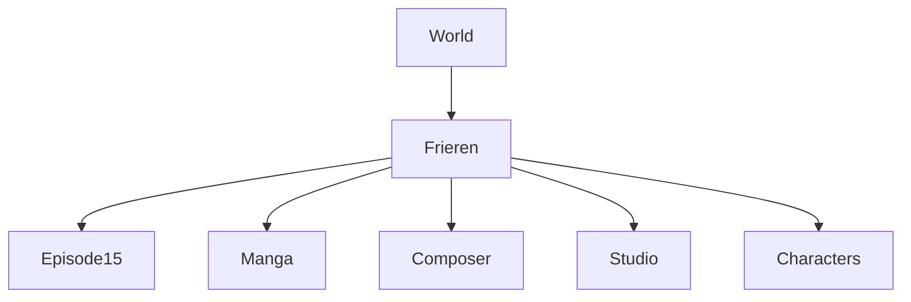
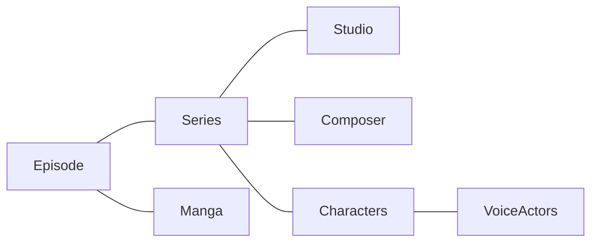

<!--
File: docs/design/language/mdl-003-mental-model/06-relationships.md
Document: MDL-003
Chapter: 06
Title: Relationships
Status: Draft
Version: 0.2
-->

# Relationships

---

# Purpose

Information, by itself, is useful.

Relationships transform information into understanding.

This chapter introduces one of the most important concepts within the Mosaic Mental Model.

Without relationships, Mosaic becomes a searchable database.

With relationships, Mosaic becomes an entertainment companion.

Relationships explain **why** pieces of information matter together.

---

# Definition

Within MDL, a **Relationship** is defined as:

> **A meaningful connection between two or more pieces of information.**

Relationships create context.

Relationships create understanding.

Relationships create discovery.

Information provides facts.

Relationships provide meaning.

---

# Why Relationships Exist

People rarely experience entertainment as isolated media.

Instead they naturally connect experiences.

Examples include:

> "That actor was also in..."

> "This anime was adapted from..."

> "The composer also wrote..."

> "The next book continues..."

These connections are not interface features.

They are relationships that already exist.

Mosaic's responsibility is to reveal them naturally.

---

# Relationships Before Navigation

Traditional applications encourage navigation.

```
Movie

↓

Actor Page

↓

Filmography

↓

Another Movie
```

Every step requires navigation.

Mosaic instead understands the relationship directly.

```
Movie

↓

Actor

↓

Related Works
```

The interface simply reveals that relationship.

The user explores naturally rather than navigating mechanically.

---

# Types Of Relationships

Relationships exist at many levels.

## Sequential

Describes progression.

Examples include:

- next episode
- previous episode
- next chapter
- sequel
- chronological order

---

## Structural

Describes ownership or composition.

Examples include:

- season belongs to series
- episode belongs to season
- chapter belongs to book
- track belongs to album

---

## Creative

Describes people and production.

Examples include:

- actor
- director
- composer
- author
- illustrator
- studio

---

## Narrative

Describes fictional connections.

Examples include:

- spin-off
- adaptation
- prequel
- alternate timeline
- shared universe

---

## Personal

Describes relationships to the user.

Examples include:

- currently watching
- completed
- bookmarked
- favourite
- continue reading

These relationships are unique to each World.

---

# Relationships Are First-Class Concepts

A common mistake is treating relationships as metadata.

Within MDL they are significantly more important.

Metadata describes objects.

Relationships describe worlds.

Consider:

```
Frieren

↓

Fantasy
```

Metadata.

Now consider:

```
Frieren

↓

Adapted From

↓

Manga
```

Relationship.

The second naturally leads somewhere.

The first merely categorises.

Mosaic should favour meaningful relationships over passive categorisation whenever practical.

---

# Relationship Density

Not every relationship deserves equal emphasis.

Some relationships are fundamental.

Others are incidental.

Example.

```
Frieren

↓

Episode 15
```

Strong.

```
Frieren

↓

Composer
```

Medium.

```
Frieren

↓

Won Award

↓

2023
```

Weak.

The strength of a relationship should influence future composition systems.

Not every relationship deserves equal visual weight.

---

# Relationships Are Directional

Relationships intentionally possess direction.

Example.

```
Book

↓

Adapted Into

↓

Film
```

is not necessarily identical to

```
Film

↓

Based On

↓

Book
```

Both describe the same connection.

Each answers a different user question.

Future engineering systems should preserve relationship direction where practical.

---

# Relationships Build Worlds

A World is not simply a collection of information.

It is a network.



As relationships increase...

The World becomes richer.

Not because more information exists.

Because understanding increases.

---

# Good Examples

## Example 01

Current Focus

```
Dune
```

Relationships.

- sequel
- author
- audiobook
- film
- soundtrack

The interface naturally supports exploration.

---

## Example 02

Current Focus

```
Hans Zimmer
```

Relationships.

- Interstellar
- Dune
- Gladiator
- Live Performances

No recommendation engine required.

The relationships already exist.

---

## Example 03

Current Focus

```
Breaking Bad
```

Relationships.

- Better Call Saul
- El Camino
- Vince Gilligan
- Bryan Cranston

Again...

The experience expands naturally.

---

# Anti-patterns

The following behaviours weaken the relationship model.

## Flat Lists

```
Movie

Movie

Movie

Movie
```

Nothing explains why these belong together.

---

## Artificial Relationships

```
Trending

↓

Because Popular
```

Popularity is not a meaningful relationship.

It is a ranking.

---

## Hidden Relationships

Relationships exist but remain inaccessible behind unnecessary navigation.

Understanding becomes fragmented.

---

# Relationships And Composition

Relationships do not directly determine interface.

They influence composition.

```
Information

↓

Relationships

↓

Importance

↓

Composition
```

This distinction is critical.

Relationships create meaning.

Composition communicates meaning.

Presentation renders composition.

Each layer possesses one responsibility.

---

# Modules

Modules should contribute relationships.

Not interface.

Example.

Anime Module.

```
Episode

↓

Next Episode
```

Book Module.

```
Book

↓

Audiobook
```

Music Module.

```
Artist

↓

Concert
```

The platform remains responsible for deciding:

- emphasis
- hierarchy
- timing
- interaction

Relationships enrich the World.

The platform decides how users experience them.

---

# Relationship Graph

Long-term, Mosaic should increasingly understand entertainment as a graph rather than a hierarchy.

Traditional hierarchy.

```
Series

↓

Season

↓

Episode
```

Relationship graph.



This richer model enables future experiences without requiring additional interface concepts.

---

# Summary

Relationships transform information into understanding.

Without relationships...

Mosaic organises media.

With relationships...

Mosaic understands entertainment.

This distinction is one of the defining characteristics of the Mosaic Mental Model.

---

# Review Status

**Status**

Draft

**Next File**

`07-composition.md`
