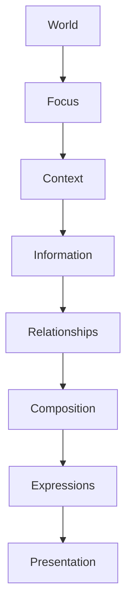

<!--
File: docs/design/language/mdl-003-mental-model/07-composition.md
Document: MDL-003
Chapter: 07
Title: Composition
Status: Draft
Version: 0.2
-->

# Composition

---

# Purpose

If Information defines **what** Mosaic knows, and Relationships define **how those pieces of information connect**, Composition defines:

> **What deserves the user's attention right now.**

Composition is not a layout engine.

It is a decision-making engine.

Its responsibility is to transform understanding into experience.

Composition determines:

- emphasis
- hierarchy
- grouping
- priority
- visual rhythm

It intentionally does **not** determine colours, typography or components.

Those belong to the Mosaic Design System.

---

# Definition

Within MDL, **Composition** is defined as:

> **The intentional organisation of information that communicates the user's current World with the least possible cognitive effort.**

Composition exists before interface.

The interface merely renders the composition.

---

# Why Composition Exists

Without composition every piece of information competes equally.

Example.

```
Continue Watching

↓

Upcoming Episode

↓

Author

↓

Runtime

↓

Genres

↓

Cast

↓

Reviews

↓

Studio
```

Everything is technically useful.

Nothing is clearly important.

Composition exists to answer one question.

> **"What should the user notice first?"**

---

# Composition Is Not Layout

This distinction is fundamental.

Layout answers:

> Where should things be placed?

Composition answers:

> Why should something deserve attention?

Layout is geometric.

Composition is conceptual.

Many different layouts may successfully express the same composition.

---

# Composition Is Temporary

A composition exists only for the current moment.

As Focus changes...

Composition changes.

As Context changes...

Composition changes.

As Relationships become more relevant...

Composition changes.

The World remains stable.

Composition evolves continuously.

---

# The Responsibility Of Composition

Composition determines:

- emphasis
- hierarchy
- grouping
- density
- breathing space
- progression

Composition intentionally does **not** determine:

- spacing values
- colours
- shadows
- typography
- motion curves

Those are implementation concerns.

---

# Inputs

Composition consumes concepts.

Not interface.

Its inputs include:

```
World

↓

Focus

↓

Context

↓

Information

↓

Relationships
```

These inputs describe understanding.

Not presentation.

---

# Outputs

Composition produces:

- priority
- importance
- grouping
- emphasis
- structure

These outputs are later transformed into interface by the Design System.

Future specifications introduce **Expressions** as the bridge between composition and presentation.

---

# The Goal Of Composition

The primary objective of composition is:

> **Reduce interpretation.**

A user should not need to ask:

- What matters?
- Where do I begin?
- Why is this here?
- What should I do next?

A good composition answers those questions before they are consciously asked.

---

# One Composition

Every experience should possess one dominant composition.

Example.

```
Watching

↓

Playback

↓

Progress

↓

Next Episode

↓

Related Information
```

Not:

```
Playback

Recommendations

Trending

Downloads

News

Modules

Friends

Settings

Statistics
```

Multiple competing centres of attention create unnecessary cognitive work.

---

# Composition Evolves

Composition should never appear to rebuild itself.

Instead it should evolve.

Example.

```
Episode Complete

↓

Progress Updates

↓

Next Episode Gains Priority

↓

Timeline Expands

↓

Playback Controls Reduce
```

Nothing has appeared arbitrarily.

The composition has simply reorganised itself.

Future specifications formalise this behaviour through the Interaction Model.

---

# Composition Is Intentional

Every element within a composition should justify its existence.

If removing something produces no noticeable reduction in understanding...

It probably did not belong there.

Composition is therefore an editorial process.

Not an additive one.

---

# Density

Composition determines information density.

Some situations naturally require:

```
Sparse

↓

High Focus

↓

Large Hierarchy
```

Others require:

```
Dense

↓

Exploration

↓

Rich Relationships
```

Neither is inherently correct.

Density should emerge from Context rather than arbitrary layout rules.

---

# Breathing Space

Whitespace is not unused interface.

Whitespace communicates:

- hierarchy
- confidence
- rhythm
- separation

Composition should intentionally leave room for change.

Crowding information simply because space exists weakens understanding.

---

# Grouping

Information should be grouped according to meaning.

Not implementation.

Good grouping.

```
Current Episode

↓

Progress

↓

Next Episode
```

Poor grouping.

```
Progress

↓

Module

↓

Cast

↓

Settings

↓

Recommendations
```

Related concepts should remain visually close because they are conceptually close.

---

# Priority

Every piece of information possesses priority.

Priority is contextual.

Example.

```
Runtime
```

During playback.

Low priority.

Before playback.

Higher priority.

Context changes priority.

Priority changes composition.

Composition changes presentation.

---

# Progressive Disclosure

Composition should reveal information progressively.

Users should never be overwhelmed simply because more information exists.

Example.

```
Focus

↓

Essential Information

↓

Supporting Information

↓

Exploration
```

Information should appear when it becomes useful.

Not merely because it exists.

---

# Composition Is Device Independent

Composition is conceptual.

Desktop.

Television.

Mobile.

Tablet.

All may express the same composition differently.

The hierarchy remains identical.

Only presentation changes.

---

# Good Examples

## Watching

```
Focus

↓

Playback

↓

Progress

↓

Next Episode

↓

Related Works
```

Simple.

Clear.

Predictable.

---

## Reading

```
Focus

↓

Current Chapter

↓

Reading Progress

↓

Bookmarks

↓

Author
```

Again...

The composition answers the user's immediate questions.

---

# Anti-patterns

## Dashboard Thinking

Attempting to display every available metric simultaneously.

---

## Equal Weight

Every section appears equally important.

Nothing naturally attracts attention.

---

## Random Layout

Information arranged according to implementation convenience rather than conceptual relationships.

---

## Static Composition

Every screen contains identical hierarchy regardless of changing Context.

---

# Composition Pipeline



Composition is the final conceptual step before the interface begins to exist.

---

# Summary

Composition is not concerned with pixels.

It is concerned with understanding.

Its responsibility is to determine:

> **What deserves attention?**

Everything after Composition concerns how that decision is communicated.

Everything before Composition concerns why that decision exists.

Composition is therefore the bridge between knowledge and interface.

---

# Review Status

**Status**

Draft

**Next File**

`08-expressions.md`
