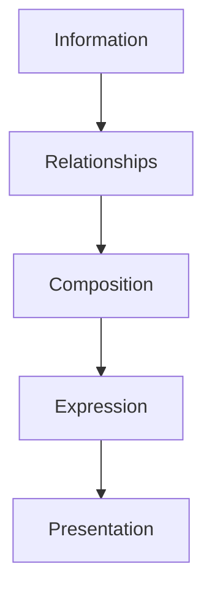

<!--
File: docs/design/language/mdl-003-mental-model/08-expressions.md
Document: MDL-003
Chapter: 08
Title: Expressions
Status: Draft
Version: 0.2
-->

# Expressions

---

# Purpose

If Composition decides:

> **What deserves attention?**

Expressions decide:

> **How should that understanding be communicated?**

Expressions bridge the gap between conceptual understanding and user interface.

They intentionally remain independent from visual implementation.

This distinction is one of the most important architectural concepts within Mosaic.

It allows the platform to evolve its interface without changing the underlying understanding of the user's World.

---

# Definition

Within MDL, an **Expression** is defined as:

> **The conceptual representation chosen to communicate a piece of information within the current composition.**

An Expression is **not**:

- a component
- a widget
- a tile
- HTML
- Flutter
- SwiftUI

Those are implementations.

Expressions exist one layer above presentation.

---

# Why Expressions Exist

Traditional UI systems tightly couple information with interface.

For example:

```
Progress

↓

Progress Bar
```

This coupling makes future evolution difficult.

Instead, Mosaic separates the concepts.

```
Progress

↓

Expression

↓

Presentation
```

The platform first determines **what** it wishes to communicate.

Only afterwards does it determine **how**.

---

# Information Does Not Choose Its Own Expression

This is an important architectural rule.

Information never decides how it should appear.

Example.

```
Episode Release

↓

Tomorrow
```

The information remains constant.

Possible Expressions include:

- Timeline
- Countdown
- Hero Detail
- Notification
- Metadata
- Calendar Entry

The appropriate Expression depends entirely upon the current Composition.

---

# Expressions Are Contextual

Expressions change naturally with Context.

Example.

Current Context:

```
Watching Episode
```

Episode Release may become:

```
Timeline
```

Current Context:

```
Browsing Calendar
```

The same information may become:

```
Calendar Entry
```

Current Context:

```
Series Overview
```

The same information may become:

```
Hero Subtitle
```

Nothing about the underlying information changed.

Only its Expression.

---

# Expressions Preserve Meaning

Although Expressions change...

Meaning should remain stable.

The user should recognise:

> "This is still the next episode."

regardless of whether it appears as:

- a Timeline
- a Badge
- Hero metadata
- Calendar event

Expression changes should never alter understanding.

---

# Expressions Are Reusable

Multiple information types may share the same Expression.

Example.

Timeline Expression.

Used for:

- episode releases
- chapter progression
- reading history
- album release chronology

Likewise:

Progress Expression.

Used for:

- television
- books
- music
- games

Expressions describe communication patterns rather than media types.

---

# Expressions Are Independent Of Components

Future MDS specifications may implement an Expression using many different components.

Example.

```
Timeline Expression
```

Desktop:

Large Timeline Tile

Television:

Condensed Timeline Shelf

Mobile:

Single Timeline Card

Voice Assistant:

Spoken summary

The Expression remains identical.

Only presentation differs.

---

# Good Examples

## Example 01

Information:

```
Reading Progress

↓

68%
```

Expression:

```
Progress
```

Presentation:

Desktop:

Large Progress Tile

Mobile:

Compact Progress Tile

---

## Example 02

Information:

```
Next Episode

↓

Tomorrow
```

Expression:

```
Timeline
```

Presentation:

Hero Timeline

or

Sidebar Timeline

or

Notification

The platform chooses.

Not the module.

---

# Anti-patterns

## Information Returning Components

```
Episode Release

↓

Timeline Widget
```

Incorrect.

The information has become coupled to presentation.

---

## Modules Choosing Expressions

```
Module

↓

Hero
```

Incorrect.

Modules should contribute information.

The Composition Engine determines Expression.

---

## Components Becoming Concepts

```
Progress Bar
```

treated as the architectural concept.

Incorrect.

Progress is the concept.

The Progress Bar is merely one implementation.

---

# Expression Selection

The selection of an Expression depends upon several inputs.

```
Information

↓

Relationships

↓

Current Context

↓

Composition

↓

Expression
```

The process intentionally delays presentation decisions until sufficient understanding exists.

---

# Relationship To Tiles

A common misconception is that Expressions are Tiles.

They are not.

Instead:

```
Expression

↓

Rendered

↓

Tile
```

Example.

```
Timeline

↓

Timeline Tile
```

or

```
Timeline

↓

Hero Detail
```

or

```
Timeline

↓

Notification
```

The Expression remains identical.

Presentation changes.

---

# Future Runtime

Long-term, the Composition Engine should determine Expressions dynamically.

Future inputs may include:

- device class
- accessibility preferences
- available space
- interaction history
- current Context

The user should experience consistent understanding even as the visual presentation adapts.

---

# Conceptual Model



Expressions intentionally separate:

Understanding

from

Rendering.

---

# Design Consequences

Introducing Expressions produces several long-term advantages.

The platform gains:

- reusable communication patterns
- device independence
- module consistency
- presentation flexibility
- future-proof architecture

Most importantly...

Information becomes independent from interface.

---

# Summary

Expressions answer one question.

> **How should this understanding be communicated?**

They deliberately sit between Composition and Presentation.

This separation allows Mosaic to evolve visually without redefining the conceptual model established by MDL.

Expressions therefore represent the final conceptual layer before interface begins.

---

# Review Status

**Status**

Draft

**Next File**

`09-presentation.md`
