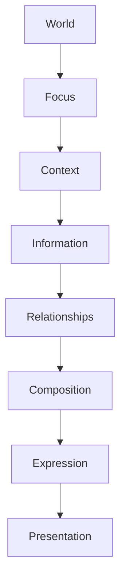

<!--
File: design/mdl/MDL-003 Mental Model/09-presentation.md
Document: MDL-003
Chapter: 09
Title: Presentation
Status: Draft
Version: 0.1
-->

# Presentation

---

# Purpose

Presentation is the final stage of the Mosaic Mental Model.

Everything preceding this chapter has deliberately avoided discussing user interface.

Only now, after the platform understands:

- the World
- the current Focus
- the current Context
- Information
- Relationships
- Composition
- Expressions

does interface become relevant.

This ordering is intentional.

Presentation is the consequence of understanding.

It is never the source of understanding.

---

# Definition

Within MDL, **Presentation** is defined as:

> **The physical manifestation of an Expression using the capabilities of a specific client platform.**

Presentation is where concepts finally become interface.

Examples include:

- Tiles
- Typography
- Materials
- Motion
- Colour
- Icons
- Layout

Presentation answers one question.

> **How should this Expression appear on this device?**

---

# Presentation Is Disposable

Unlike the concepts introduced earlier within MDL, Presentation is expected to evolve continuously.

Examples include:

- new Material Systems
- new operating systems
- new rendering technologies
- new interaction devices
- new accessibility capabilities

The Presentation layer should absorb these changes without requiring modifications to:

- World
- Focus
- Context
- Information
- Relationships

This separation is one of the primary architectural objectives of the Mosaic Design Language.

---

# Presentation Is Platform Specific

The same Expression may be presented differently depending upon device capabilities.

Example.

Expression:

```
Timeline
```

Desktop.

```
Timeline Tile

↓

Five upcoming episodes

↓

Artwork
```

Television.

```
Timeline Shelf

↓

Two upcoming episodes
```

Mobile.

```
Compact Timeline

↓

Single upcoming episode
```

Voice Assistant.

```
"The next episode airs tomorrow."
```

The platform changes.

Understanding remains identical.

---

# Presentation Is Not The Product

One of the easiest mistakes contributors can make is confusing interface with experience.

The interface is only one possible representation of the user's World.

Future platforms may present the same World using:

- augmented reality
- virtual reality
- voice interfaces
- automotive displays
- wearable devices

The Mental Model should remain unchanged.

Presentation should adapt.

---

# Presentation Is Responsible For

Presentation determines:

- visual hierarchy
- typography
- materials
- spacing
- animation
- layout
- responsiveness
- interaction affordances

Presentation intentionally does **not** determine:

- meaning
- importance
- relevance
- relationships
- user intent

Those decisions have already been made earlier in the pipeline.

---

# The Tile

Presentation introduces one important visual primitive.

The Tile.

A Tile is **not** the fundamental unit of Mosaic.

The Tile is merely one presentation mechanism.

Conceptually:

```
Information

↓

Relationships

↓

Composition

↓

Expression

↓

Tile
```

The Tile exists because it is an effective way to communicate information across:

- desktop
- mobile
- television
- tablet

Future presentation systems may introduce additional visual primitives without changing the Mental Model.

---

# Materials

Presentation is responsible for choosing materials.

Examples include:

- Canvas
- Acrylic
- Hero
- Overlay

Materials communicate:

- depth
- hierarchy
- separation

Materials should never redefine meaning.

That responsibility belongs to Composition.

---

# Motion

Presentation owns animation.

It does not own behaviour.

Behaviour is defined by:

MDL-004

Presentation merely communicates that behaviour through:

- duration
- easing
- movement
- emphasis

Presentation should therefore never invent interaction.

It should communicate interaction.

---

# Brand

Presentation communicates brand identity.

Brand identity should remain:

- recognisable
- restrained
- supportive

The interface should never overpower entertainment artwork.

Future MDS specifications define:

- brand colour
- atmosphere
- runtime palette
- materials

Presentation applies those systems consistently.

---

# Accessibility

Presentation is responsible for adapting experiences to user needs.

Examples include:

- reduced motion
- high contrast
- larger text
- alternative navigation
- assistive technologies

Accessibility should not alter the underlying Mental Model.

Only its presentation.

The user should experience the same understanding regardless of presentation differences.

---

# Anti-patterns

## Presentation Defining Meaning

Example.

```
Red

↓

Important
```

Meaning should never depend solely upon colour.

Meaning should already exist before presentation.

---

## Components Becoming Concepts

Treating:

```
Timeline Tile
```

as the architectural concept.

Incorrect.

Timeline is the concept.

The Tile is simply one presentation.

---

## Device-Specific Thinking

Designing concepts exclusively around:

- HTML
- Flutter
- SwiftUI

The Mental Model becomes coupled to implementation.

Future evolution becomes unnecessarily difficult.

---

# The Complete Mental Model

The complete conceptual pipeline established by MDL-003 is therefore:



Notice that Presentation appears last.

This ordering is intentional.

Everything before Presentation is independent from interface.

Everything after Presentation belongs to implementation.

---

# Relationship To MDS

The Mental Model ends here.

The next responsibility belongs to the Mosaic Design System.

MDS answers questions such as:

- Which material?
- Which typography?
- Which spacing?
- Which motion?
- Which colour?
- Which component?

MDL intentionally avoids those concerns.

MDL explains:

> **What should be communicated.**

MDS explains:

> **How it should look.**

---

# Summary

Presentation is the physical expression of the user's World.

It should faithfully communicate:

- understanding
- relationships
- hierarchy
- context

without redefining them.

Presentation may evolve continuously.

The Mental Model should remain stable.

This separation allows Mosaic to remain recognisably Mosaic regardless of future platforms or technologies.

---

# Review Status

**Status**

Draft

**Next File**

`10-user-vs-system-model.md`
