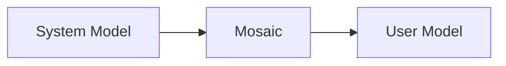

<!--
File: design/mdl/MDL-003 Mental Model/10-user-vs-system-model.md
Document: MDL-003
Chapter: 10
Title: User Model vs System Model
Status: Draft
Version: 0.1
-->

# User Model vs System Model

---

# Purpose

Every successful software platform maintains two separate models.

The first describes how the software actually works.

The second describes how users believe it works.

These models should never be identical.

Instead, the implementation should exist to support the user's understanding while remaining largely invisible.

This chapter formally separates these two models within Mosaic.

---

# Two Models

Every Mosaic implementation contains:

```
System Model

↓

Mental Translation

↓

User Model
```

The System Model belongs to engineering.

The User Model belongs to experience.

MDL intentionally defines the User Model.

Engineering remains free to optimise the System Model provided the User Model remains stable.

---

# The System Model

The System Model describes technical reality.

Examples include:

- SQLite
- DuckDB
- GraphQL
- HTTP
- WebSockets
- Plugins
- Authentication
- Caching
- Event Streams
- Composition Engine
- Rendering Pipeline

These concepts are important.

They are simply not important to the user.

---

# The User Model

The User Model describes conceptual reality.

Examples include:

- My World
- My Current Focus
- Continue Watching
- Reading Progress
- Next Episode
- Related Books
- My Collection

These concepts explain the platform without exposing implementation.

Users should never need to translate technical architecture into entertainment concepts.

Mosaic performs that translation for them.

---

# Why The Models Must Differ

Consider the following engineering implementation.

```
SQLite

↓

DuckDB

↓

Metadata Providers

↓

Relationship Graph

↓

Composition Engine

↓

Renderer
```

This architecture may be elegant.

It is also meaningless to the majority of users.

The equivalent User Model is:

```
My World

↓

What I'm Enjoying

↓

What Helps Me Continue
```

The second model is dramatically simpler.

It therefore becomes the model users naturally adopt.

---

# The Translation Layer

One of Mosaic's primary responsibilities is translating the System Model into the User Model.



Users should never experience the System Model directly.

The quality of Mosaic depends upon how effectively this translation occurs.

---

# The Cost Of Leaking Implementation

Implementation details occasionally leak into user experience.

Examples include:

```
Refresh Metadata

Clear Cache

Plugin Failed

Provider Offline

Mapping Conflict

Sync Database
```

These concepts describe implementation.

Not entertainment.

Whenever possible they should be translated into language users naturally understand.

Example.

Instead of:

```
Metadata Refresh Failed
```

Prefer:

```
We couldn't update information for this series.

Your existing information is still available.
```

The implementation remains accurate.

The experience becomes significantly calmer.

---

# Administration

Administration intentionally occupies a unique position.

Administrators occasionally require access to parts of the System Model.

Examples include:

- storage
- plugins
- providers
- users
- diagnostics

Even here, Mosaic should progressively reveal technical detail.

Family members sharing a server should not immediately encounter engineering terminology.

Administrators should be able to move from:

```
Simple

↓

Advanced

↓

Diagnostic
```

rather than beginning with raw implementation.

---

# Extensions

Plugins contribute primarily to the System Model.

They provide:

- information
- relationships
- capabilities

They should not redefine the User Model.

Regardless of how many plugins are installed, users should continue experiencing:

- one World
- one Focus
- one Companion
- one Composition model

The platform is responsible for preserving conceptual consistency.

---

# Failure

Failures should be translated through the User Model whenever practical.

System Model.

```
AniList API Timeout
```

User Model.

```
Episode information couldn't be updated.

We'll try again automatically.

You can continue watching normally.
```

The user understands the consequence.

They do not need to understand the implementation.

---

# Engineering Freedom

Separating these models gives engineering significant freedom.

The following may change without affecting the User Model:

- databases
- APIs
- rendering engines
- frontend frameworks
- plugin architecture
- networking
- storage

Provided the conceptual experience remains stable.

This separation is one of the primary long-term objectives of MDL.

---

# Anti-patterns

## Implementation Terminology

```
DuckDB

SQLite

Provider

GraphQL

HTTP
```

appearing throughout the user experience.

---

## Plugin Personalities

Plugins introducing competing terminology.

```
Library

↓

Collection

↓

Shelf

↓

Archive
```

for the same concept.

The User Model becomes fragmented.

---

## Engineering Navigation

Users navigating implementation rather than entertainment.

Example.

```
Metadata

↓

Providers

↓

Mappings
```

instead of

```
Series

↓

Characters

↓

Related Works
```

The implementation has become visible.

---

# User Confidence

The User Model should continuously reinforce confidence.

Users should increasingly feel:

"I know how Mosaic works."

without actually understanding:

- composition engines
- relationship graphs
- runtime systems
- metadata providers

Confidence comes from conceptual consistency.

Not technical knowledge.

---

# Relationship To Future Specifications

Future specifications should continue strengthening this separation.

Examples include:

- Composition Engine
- Runtime Atmosphere
- Extension SDK
- GraphQL UI
- Information Model

These systems should become increasingly sophisticated internally while making the user experience progressively simpler.

---

# Summary

The Mental Model belongs to users.

The System Model belongs to engineers.

Mosaic succeeds when users never need to think about the System Model in order to enjoy their entertainment.

Every future engineering decision should therefore ask:

> **Does this strengthen the User Model...**

or

> **Does it leak the System Model?**

Only the first outcome aligns with the Mosaic Design Language.

---

# Review Status

**Status**

Draft

**Next File**

`11-governance.md`
