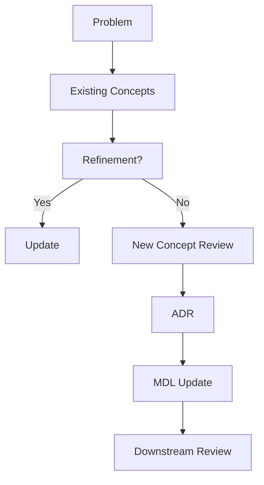

<!--
File: design/mdl/MDL-003 Mental Model/11-governance.md
Document: MDL-003
Chapter: 11
Title: Mental Model Governance
Status: Draft
Version: 0.1
-->

# Mental Model Governance

---

# Purpose

The Mental Model is one of the most stable architectural artefacts within the Mosaic Design Language.

Unlike implementation, which evolves continuously, the Mental Model should change only when there is compelling evidence that it no longer represents the experience Mosaic intends to create.

This chapter defines how the Mental Model is maintained throughout the lifetime of the platform.

---

# Governance Philosophy

The Mental Model is not owned by engineering.

Nor is it owned by design.

It belongs to the product.

Engineering implements it.

Design communicates it.

Product protects it.

This shared ownership ensures the conceptual model remains stable even as implementation evolves.

---

# Conceptual Stability

Every concept introduced within MDL-003 should have an expected lifespan measured in years.

| Concept | Expected Lifetime |
|----------|-------------------|
| World | Decades |
| Focus | Years |
| Context | Years |
| Information | Years |
| Relationships | Years |
| Composition | Years |
| Expressions | Years |
| Presentation | Evolves continuously |

The lower layers of the architecture should change significantly more frequently than the higher layers.

This separation allows Mosaic to innovate without forcing contributors or users to relearn the product.

---

# What Requires Review

The following changes require formal Mental Model review.

- Introducing a new conceptual object.
- Removing an existing conceptual object.
- Changing the meaning of an existing concept.
- Introducing alternative conceptual hierarchies.
- Altering relationships between concepts.
- Introducing new architectural abstractions visible to contributors.

These changes affect every downstream specification.

They should never be treated as ordinary implementation work.

---

# What Does Not Require Review

The following changes do **not** normally require Mental Model review.

- New UI components.
- Material changes.
- Typography updates.
- Motion tuning.
- Responsive layouts.
- Platform-specific implementation.
- Rendering optimisations.

These belong to MDS rather than MDL.

---

# The Mental Model Test

Before introducing any new concept contributors should answer the following questions.

## Question One

Does this represent something that genuinely exists within the user's entertainment world?

---

## Question Two

Can this concept already be represented by an existing MDL concept?

---

## Question Three

Would users naturally describe their experience using this concept?

---

## Question Four

Will this concept still make sense if Mosaic is rebuilt in ten years?

---

## Question Five

Does introducing this concept simplify the overall model...

...or merely relocate complexity?

Only concepts satisfying all five questions should normally become part of MDL.

---

# Concept Growth

The preferred evolution of the Mental Model is refinement rather than expansion.

Prefer:

```
Existing Concept

↓

Refinement
```

instead of:

```
Existing Concept

↓

New Concept

↓

Exception

↓

Special Case
```

Every additional concept permanently increases contributor cognitive load.

The Mental Model should therefore remain intentionally small.

---

# Relationship To Engineering

Engineering should implement the Mental Model.

It should not redefine it.

For example.

Engineering may optimise:

- storage
- transport
- rendering
- caching
- networking

Engineering should not introduce new user-facing concepts purely because they simplify implementation.

Conceptual architecture should drive technical architecture.

Not the reverse.

---

# Plugin Governance

Plugins should extend the World.

They should not redefine it.

Examples.

Good:

```
Book Plugin

↓

Adds

Reading Progress
```

Poor:

```
Book Plugin

↓

Introduces

Reading Workspace
```

The second example introduces a competing conceptual model.

Plugins enrich existing concepts.

They do not create parallel realities.

---

# Future Evolution

The following concepts are intentionally expected to evolve in later specifications.

- Information Graph
- Relationship Graph
- Composition Solver
- Runtime Expressions
- Adaptive Presentation

However...

These evolutions should strengthen the existing hierarchy rather than replace it.

---

# Signs The Mental Model Requires Revision

Revision should be considered only when multiple indicators exist.

Examples include:

- contributors repeatedly invent competing terminology
- extensions consistently require conceptual exceptions
- multiple specifications describe the same idea differently
- users consistently misunderstand the same concept
- engineering repeatedly introduces workarounds around conceptual boundaries

One isolated implementation problem is insufficient justification.

Repeated conceptual friction is.

---

# Governance Workflow



The Mental Model should evolve through refinement wherever possible.

Introducing new concepts should remain rare.

---

# Concept Retirement

Concepts should almost never be removed.

If retirement becomes necessary:

1. Mark the concept as deprecated.
2. Introduce its replacement.
3. Record the migration path.
4. Update all downstream specifications.
5. Preserve historical documentation.

The conceptual history of Mosaic is considered valuable architectural knowledge.

---

# Summary

The Mental Model is one of the longest-lived artefacts within Mosaic.

Its purpose is not merely to explain the platform.

Its purpose is to ensure that every contributor, regardless of discipline, is thinking about the same product in the same way.

Protecting that shared understanding is the primary objective of governance.

---

# Architectural Decisions

| ADR | Decision |
|------|----------|
| ADR-034 | The Mental Model is considered product architecture rather than implementation architecture. |
| ADR-035 | New concepts require formal conceptual review before entering MDL. |
| ADR-036 | Engineering implementation should adapt to the Mental Model rather than redefining it. |
| ADR-037 | Plugins extend existing concepts rather than introducing competing conceptual models. |

---

# Review Status

**Status**

Draft

**Next File**

`12-adrs.md`
