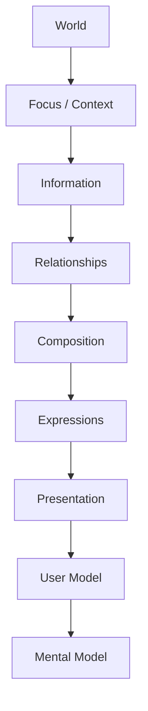

<!--
File: docs/design/language/mdl-003-mental-model/12-adrs.md
Document: MDL-003
Chapter: 12
Title: Architectural Decision Records
Status: Draft
Version: 0.2
-->

# Architectural Decision Records

---

# Purpose

Architectural Decision Records (ADRs) preserve the reasoning behind the conceptual architecture established within MDL-003.

Unlike implementation decisions, the concepts defined by the Mental Model are expected to influence every future engineering, design and module decision made within Mosaic.

These ADRs explain **why** those concepts exist.

Future contributors should be able to understand the reasoning behind the Mental Model without needing access to the original design workshops.

---

# Decision Format

Decision format, lifecycle and review expectations are governed by **MDG-001 — Documentation Authority Guide**.

This chapter records decisions specific to this specification and avoids redefining the shared ADR process.

# ADR-049

## Title

Treat The User's World As The Primary Organising Concept

### Status

Accepted

### Context

Traditional media software organises itself around libraries, pages and folders.

Founder discovery consistently described entertainment as a personal world rather than a collection of files.

### Decision

The highest-level concept within Mosaic becomes the **World**.

Every subsequent concept exists within it.

### Consequences

Future systems should organise information around the user's World rather than software structures.

Navigation should become movement within a World rather than movement between applications.

---

# ADR-050

## Title

Separate Focus From Context

### Status

Accepted

### Context

Early exploration treated Focus and Context as interchangeable concepts.

Further investigation demonstrated they answer different questions.

### Decision

Focus answers:

> What currently matters?

Context answers:

> Why does it matter right now?

### Consequences

Future composition systems can adapt to contextual changes without unnecessarily changing Focus.

---

# ADR-051

## Title

Treat Information As The Primary Architectural Unit

### Status

Accepted

### Context

Traditional module systems generally contribute interface.

This tightly couples capability to presentation.

### Decision

Modules contribute Information.

The platform determines presentation.

### Consequences

Future interfaces become:

- reusable
- device independent
- accessible
- composition driven

The module ecosystem remains visually coherent.

---

# ADR-052

## Title

Relationships Are First-Class Concepts

### Status

Accepted

### Context

Relationships were initially treated as metadata.

During founder workshops it became clear that relationships are responsible for the majority of meaningful exploration.

### Decision

Relationships become first-class conceptual objects.

Metadata becomes one possible Information category.

### Consequences

Future composition systems should prioritise meaningful relationships over passive categorisation.

---

# ADR-053

## Title

Composition Exists Before Interface

### Status

Accepted

### Context

Many UI frameworks tightly couple composition and rendering.

This makes adaptation difficult.

### Decision

Composition becomes a conceptual layer.

Presentation becomes a separate concern.

### Consequences

Future rendering systems remain free to evolve while preserving the same understanding.

---

# ADR-054

## Title

Introduce Expressions Between Composition And Presentation

### Status

Accepted

### Context

Directly mapping Composition to UI components created unnecessary coupling.

A missing abstraction existed between understanding and rendering.

### Decision

Introduce the concept of Expressions.

Expressions communicate understanding.

Presentation renders Expressions.

### Consequences

The same Expression may be rendered differently on:

- desktop
- mobile
- television
- voice interfaces

without changing the conceptual model.

---

# ADR-055

## Title

Presentation Is An Implementation Concern

### Status

Accepted

### Context

Early discussions frequently described interface concepts before conceptual ones.

This encouraged contributors to think in components rather than understanding.

### Decision

Presentation becomes the final stage of the Mental Model.

Everything preceding Presentation is implementation independent.

### Consequences

Future client applications remain free to innovate while preserving conceptual consistency.

---

# ADR-056

## Title

Separate The User Model From The System Model

### Status

Accepted

### Context

Engineering architecture naturally exposes concepts such as databases, modules and APIs.

These concepts unnecessarily complicate the user experience.

### Decision

The User Model becomes the primary conceptual model described by MDL.

Engineering architecture should translate itself into that model.

### Consequences

Implementation remains flexible.

User understanding remains stable.

---

# ADR-057

## Title

Mental Model Before Engineering Architecture

### Status

Accepted

### Context

Many software projects allow implementation constraints to shape conceptual design.

This often results in user experiences that mirror technical architecture.

### Decision

The Mental Model becomes the authoritative conceptual architecture.

Engineering architecture should adapt to it wherever practical.

### Consequences

Future implementation decisions become easier because conceptual boundaries already exist.

---

# ADR Relationships

Each ADR intentionally builds upon the previous one.

Together they define the conceptual architecture of Mosaic.

---

# Future ADRs

Future Mental Model ADRs are expected to cover:

- Information Graph
- Relationship Graph
- Domain Model
- World Persistence
- Context Resolution
- Composition Solver
- Runtime Expression Selection

These concepts intentionally remain outside the scope of MDL-003 Version 0.1.

---

# ADR Governance

Mental Model ADRs should rarely change.

Changes should occur only when:

- conceptual ambiguity exists,
- repeated contributor confusion occurs,
- user research invalidates an assumption,
- architectural evolution requires refinement.

Implementation convenience is **not** sufficient justification for changing the Mental Model.

---

# Summary

The ADRs contained within MDL-003 describe the conceptual decisions that make Mosaic possible.

Future engineering systems should treat these decisions as architectural constraints rather than implementation suggestions.

The conceptual integrity of Mosaic depends upon preserving them.

---

# Review Status

**Status**

Draft

**Next File**

`13-contributor-guidance.md`
