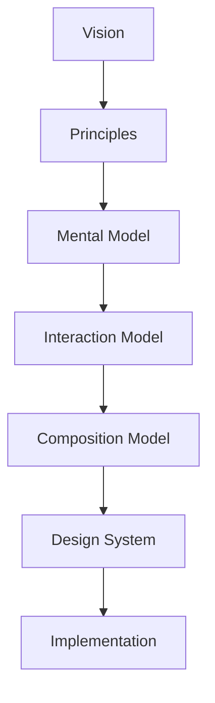
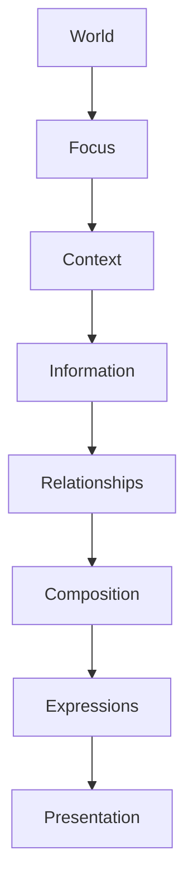

<!--
File: docs/design/language/mdl-003-mental-model/index.md
Document: MDL-003
Status: Draft
Version: 0.4
-->

# MDL-003 — Mental Model

> *The interface users see is only the visible expression of the world Mosaic understands.*

---

# Purpose

[MDL-001](../mdl-001-vision/index.md) established **why** Mosaic exists.

[MDL-002](../mdl-002-principles/index.md) established **how** design decisions are made.

MDL-003 defines **how Mosaic thinks**.

This specification establishes the conceptual model that every contributor should internalise before designing interfaces, engineering systems or module APIs.

Unlike a UI framework, the Mental Model describes concepts rather than components.

It explains what exists inside the world of Mosaic independently of how those concepts are eventually rendered.

---

# Relationship to Previous Specifications



Everything below MDL-003 assumes the concepts defined here.

If the Mental Model changes, every downstream specification should be reviewed.

---

# Scope

This specification defines:

- Conceptual architecture
- User mental model
- Platform mental model
- Foundational concepts
- Relationships between concepts
- Information hierarchy
- World model

This specification intentionally does **not** define:

- Components
- Motion
- Layout
- Tokens
- Materials
- Typography
- Rendering

Those concepts belong to later MDL and MDS specifications.

---

# Guiding Question

MDL-003 exists to answer one question.

> **How should contributors think about Mosaic?**

Not:

> How should they implement it?

---

# Mental Model Statement

Users should never think of Mosaic as:

- a media server
- a dashboard
- a streaming service
- a collection of pages

Instead they should naturally understand it as:

> **Their personal entertainment world.**

Everything within Mosaic should reinforce this understanding.

---

# Primary Concepts

The conceptual hierarchy introduced by MDL-003 is expected to become the foundation for future specifications.



Each layer answers a different question.

Future chapters define each concept individually.

---

# Expected Outcome

After reading MDL-003 a contributor should naturally understand:

- what exists within Mosaic
- how concepts relate
- what the UI is actually representing
- why composition behaves the way it does
- why modules contribute information rather than interface

without discussing implementation technologies.

---

# Repository Structure

```

design/

└── mdl/

    └── MDL-003 Mental Model/

        README.md

        00-document-control.md

        01-what-is-a-mental-model.md

        02-the-world.md

        03-focus.md

        04-context.md

        05-information.md

        06-relationships.md

        07-composition.md

        08-expressions.md

        09-presentation.md

        10-user-vs-system-model.md

        11-governance.md

        12-adrs.md

        13-contributor-guidance.md

        references.md

        glossary.md
```

---

# Dependencies

Required reading:

- [MDL-001 — Mosaic Design Language Vision](../mdl-001-vision/index.md)
- [MDL-002 — Principles](../mdl-002-principles/index.md)

Downstream specifications:

- [MDL-004 — Interaction Model](../mdl-004-interaction-model/index.md)
- [MDL-005 — Composition Model](../mdl-005-composition-model/index.md)
- [MDP-001 — Adaptive Composition Runtime](../../../engineering/architecture/mdp-001-adaptive-composition-runtime/index.md)
- MDS-011 Module Design Specification *(planned; not yet published)*
