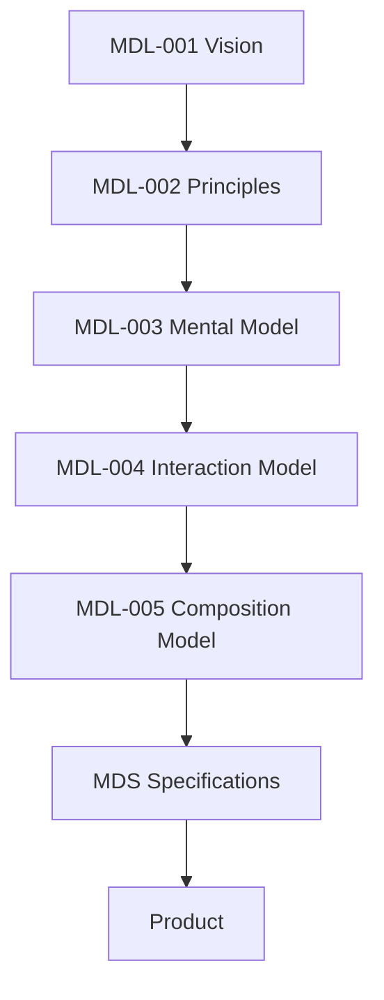
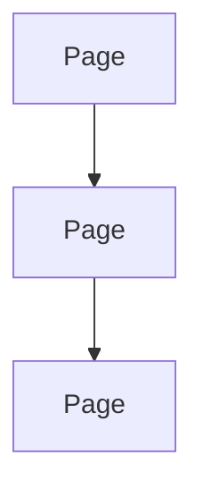

<!--
File: docs/design/language/mdl-004-interaction-model/00-document-control.md
Document: MDL-004
Title: Interaction Model
Status: Draft
Version: 0.4
-->

# Document Control

---

# Document Information

| Property | Value |
|----------|-------|
| Document ID | MDL-004 |
| Title | Mosaic Design Language — Interaction Model |
| Classification | Internal |
| Status | Draft |
| Version | 0.4 |
| Owner | AdamNi-7080 |
| Parent Specifications | [MDL-001 — Mosaic Design Language Vision](../mdl-001-vision/index.md), [MDL-002 — Principles](../mdl-002-principles/index.md), [MDL-003 — Mental Model](../mdl-003-mental-model/index.md) |
| Repository | `/design/mdl/MDL-004 Interaction Model/` |

---

# Purpose

MDL-004 defines the behavioural architecture of Mosaic.

Where the Mental Model establishes **what exists**, the Interaction Model establishes **how those concepts evolve over time**.

It defines the expected behaviour of the platform independently from:

- visual appearance
- rendering technology
- frontend framework
- animation implementation
- platform-specific interaction

This separation ensures that interaction remains conceptually consistent regardless of implementation.

---

# Authority

MDL-004 governs behavioural architecture.

Its authority extends to:

- User Experience
- Interaction Design
- Motion Philosophy
- Runtime Behaviour
- Composition Behaviour
- Navigation Behaviour
- Module Behaviour

MDL-004 intentionally does **not** define:

- animation timing
- easing curves
- visual styling
- typography
- materials
- spacing

Those concerns belong to the Mosaic Design System.

---

# Relationship To MDL

The Interaction Model occupies a unique position within the Design Language.

The Interaction Model translates conceptual understanding into observable behaviour.

It answers:

> **What happens when the user's World changes?**

---

# Design Intent

Traditional applications are built around navigation.

Users move:

Mosaic intentionally rejects this model.

Instead:

The World remains.

Focus changes.

Context evolves.

Composition reorganises.

Presentation updates.

The user experiences continuity rather than relocation.

---

# Behavioural Scope

This specification governs the behaviour of:

- Focus
- Context
- Composition
- Expressions
- Navigation
- Discovery
- Interaction States
- Runtime Adaptation

It intentionally avoids implementation-specific discussion.

---

# Reader Expectations

Before continuing, contributors should already understand:

- Why Mosaic exists.
- How design decisions are made.
- How Mosaic understands the user's World.

MDL-004 assumes familiarity with:

- [MDL-001](../mdl-001-vision/index.md)
- [MDL-002](../mdl-002-principles/index.md)
- [MDL-003](../mdl-003-mental-model/index.md)

This document does not redefine those concepts.

Instead, it explains how they behave.

---

# Stability

Interaction behaviour should evolve more slowly than implementation.

Expected lifetime:

| Artefact | Expected Lifetime |
|----------|-------------------|
| Components | Months |
| Motion Curves | Months |
| Behaviour | Years |
| Mental Model | Decades |

This distinction allows Mosaic to modernise visually while preserving behavioural consistency.

---

# Success Criteria

MDL-004 succeeds when:

- users rarely become disoriented
- movement always feels intentional
- interaction reinforces understanding
- navigation feels increasingly unnecessary
- contributors naturally describe behaviour using MDL terminology

Interaction should become understandable before it becomes beautiful.
