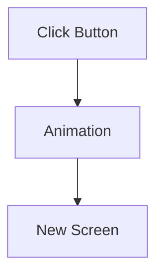
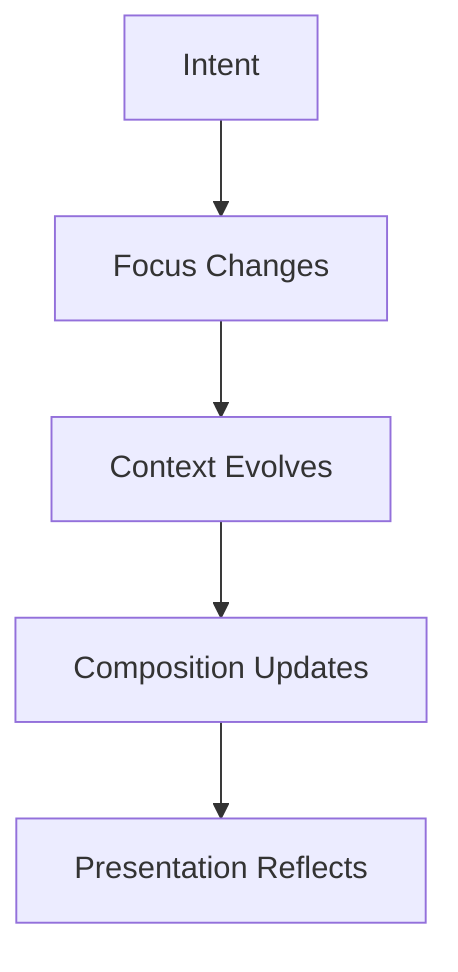
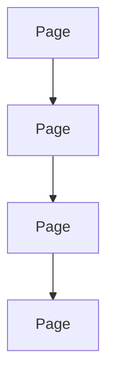
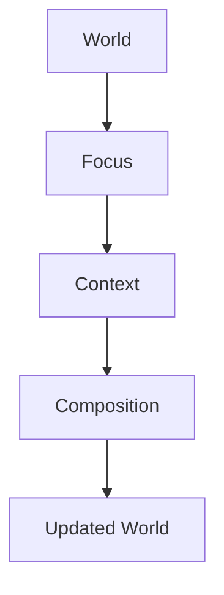
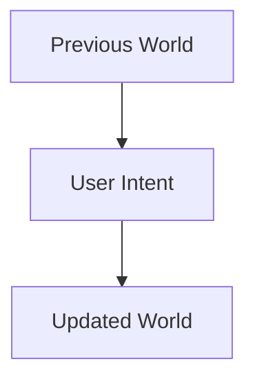
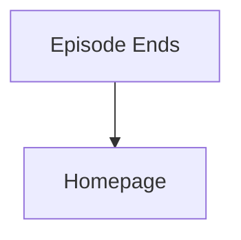
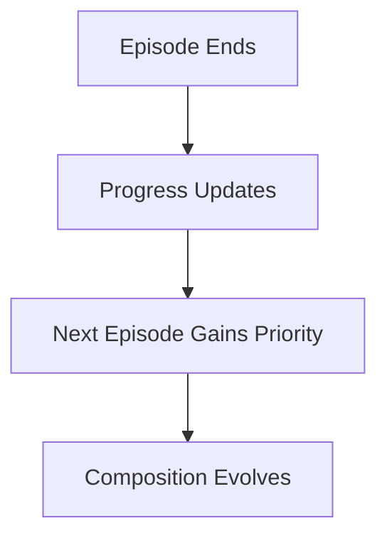
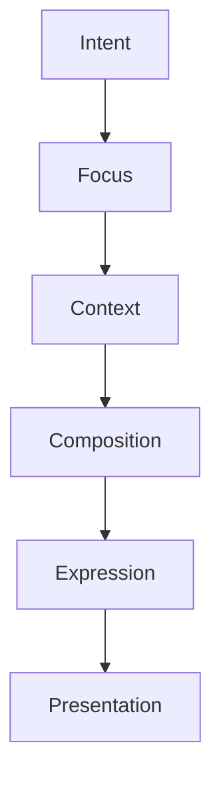

<!--
File: docs/design/language/mdl-004-interaction-model/01-what-is-an-interaction-model.md
Document: MDL-004
Chapter: 01
Title: What Is An Interaction Model?
Status: Draft
Version: 0.4
-->

# What Is An Interaction Model?

---

# Purpose

Before defining how Mosaic behaves, contributors must first understand what an Interaction Model is.

Many software projects unintentionally treat interaction as a collection of animations, transitions and user inputs.

Within the Mosaic Design Language, interaction is something much broader.

Interaction defines **how the user's World evolves over time**.

It is the behavioural layer that connects the conceptual architecture defined by the Mental Model with the visual implementation defined by the Design System.

---

# Definition

Within MDL, an **Interaction Model** is defined as:

> **The behavioural rules that govern how the user's World changes in response to time, intent and interaction.**

Interaction is not:

- animation
- navigation
- gestures
- buttons
- transitions

Those are implementations of interaction.

Interaction itself describes behavioural change.

---

# Why An Interaction Model Exists

A user continually asks the Platform foundation questions.

Often without consciously realising it.

Questions such as:

- Where am I?
- What changed?
- What should I look at?
- What happens next?
- Why did that move?
- Can I get back?

A good Interaction Model answers those questions naturally.

Without explanation.

Without tutorials.

Without requiring users to consciously think about software.

---

# Interaction Is Behaviour

Interaction should be understood as behaviour rather than interface.

Example.

Poor mental model.



Mosaic mental model.



Notice that interface appears only at the very end.

Behaviour exists independently from interface.

---

# Interaction Begins Before Input

Interaction does not begin when the user clicks.

Interaction begins the moment the user's World changes.

Examples include:

- playback starts
- playback ends
- next episode releases
- reading progress updates
- music changes
- a module contributes new information

These events may occur:

- because of user action
- because of time
- because of external information
- because of another device

The Interaction Model governs them all consistently.

---

# Behaviour Before Motion

Movement communicates behaviour.

Movement is not behaviour itself.

For example.

Behaviour:

```

Focus changes
```

Possible implementations:

- slide
- dissolve
- expand
- reduce
- no animation

The behaviour remains identical.

Only presentation changes.

This distinction allows Mosaic to evolve visually without changing how users understand the platform.

---

# Interaction Is Continuous

Traditional applications often behave like this.



Every action discards the previous state.

Mosaic intentionally behaves differently.



Nothing is discarded.

The World simply evolves.

---

# Interaction Is Intentional

Every behavioural change should have a reason.

Users should never wonder:

- Why did that appear?
- Why did that disappear?
- Why did everything move?
- Why am I somewhere else?

Instead they should instinctively understand:

> "The platform changed because my World changed."

Understanding creates trust.

Trust reduces cognitive effort.

---

# Interaction Preserves Continuity

The primary objective of the Interaction Model is preserving continuity.

Users should feel:

- progression
- evolution
- continuity

Not:

- interruption
- relocation
- fragmentation

The interface should continuously reassure users that they remain inside the same World.

Only its current state has evolved.

---

# Interaction Has Memory

Every interaction begins with a previous state.



The previous state should always influence the next.

Interaction should therefore appear cumulative rather than isolated.

This continuity allows users to build long-term confidence in how Mosaic behaves.

---

# Good Examples

## Example 01

User finishes an episode.

Instead of:



Mosaic behaves:



The user never leaves their current World.

---

## Example 02

User changes from Anime to Books.

The interface should communicate:

> Your attention has changed.

Not:

> You launched another application.

The World remains.

Only Focus changes.

---

# Anti-patterns

The following behaviours violate the Interaction Model.

## Teleportation

Content instantly appears elsewhere.

Continuity is lost.

---

## Page Thinking

Every interaction replaces one complete interface with another.

The World disappears.

---

## Animation Without Meaning

Movement exists purely for visual effect.

No additional understanding is created.

---

## Context Reset

Changing one small piece of information causes the entire experience to restart.

The user loses orientation.

---

# Interaction Hierarchy

Interaction always follows the same conceptual sequence.



Interaction never bypasses intermediate layers.

This consistency allows users to gradually build an accurate understanding of the platform.

---

# Relationship To Future Specifications

This chapter establishes the behavioural philosophy.

Future chapters define:

- continuity
- focus transitions
- context transitions
- temporal behaviour
- interaction states
- composition evolution

Together these chapters form the complete behavioural architecture of Mosaic.

---

# Summary

The Interaction Model defines how the user's World changes.

It is not concerned with:

- visuals
- animation
- components

Instead it defines:

- behaviour
- continuity
- evolution
- understanding

The interface communicates those behaviours.

It does not invent them.
