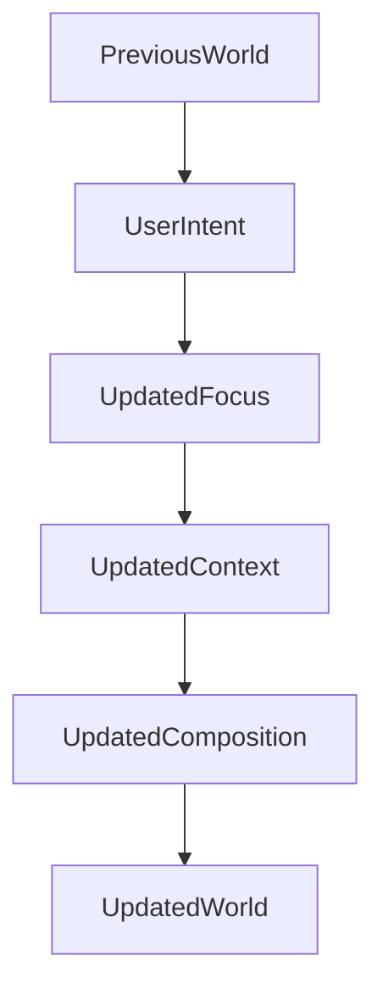

<!--
File: docs/design/language/mdl-004-interaction-model/02-continuity.md
Document: MDL-004
Chapter: 02
Title: Continuity
Status: Draft
Version: 0.2
-->

# Continuity

---

# Purpose

Continuity is the primary behavioural objective of the Mosaic Interaction Model.

Users should never feel that they are repeatedly leaving one interface and entering another.

Instead, they should experience one continuous entertainment world that naturally evolves around their current attention.

Every interaction defined by MDL should reinforce continuity.

---

# Definition

Within MDL, **Continuity** is defined as:

> **The preservation of the user's understanding as their World evolves.**

Continuity answers one question.

> **"Do I still understand where I am?"**

If the answer is yes...

The interaction has succeeded.

---

# Why Continuity Exists

Traditional applications organise themselves around destinations.

```
Home

↓

Series

↓

Season

↓

Episode

↓

Player
```

Each destination discards the previous one.

Users repeatedly reconstruct their mental model.

Mosaic intentionally avoids this behaviour.

Instead:

```
World

↓

World evolves

↓

World evolves

↓

World evolves
```

The user remains inside the same conceptual environment.

Only emphasis changes.

---

# The Illusion Of One World

The user should rarely feel that they have "gone somewhere."

Instead they should feel that:

- something became more important
- something became less important
- something new entered the World
- something completed
- something naturally moved aside

These changes should feel inevitable.

Not surprising.

---

# Continuity Before Navigation

Navigation is an implementation.

Continuity is a behavioural objective.

When contributors ask:

> "Where should this page live?"

they should instead ask:

> "How does the user's World naturally evolve to reveal this?"

This subtle distinction changes almost every interaction.

---

# Continuity Preserves Memory

People rapidly build spatial and conceptual memory.

Examples include:

- where information usually appears
- what currently matters
- how they reached their current state

Breaking continuity forces users to rebuild that understanding.

Every unnecessary rebuild increases cognitive effort.

The purpose of continuity is therefore preserving accumulated understanding.

---

# Small Changes

Minor changes should produce minor behavioural evolution.

Examples include:

```
Episode Progress

↓

Progress Updates

↓

Next Episode Gains Importance
```

The World barely changes.

Only local understanding evolves.

---

# Medium Changes

Changing Focus within the same Domain.

Example.

```
Frieren

↓

Fire Force
```

The Domain remains:

```
Anime
```

The World therefore changes moderately.

Users should recognise:

- familiar structure
- familiar relationships
- familiar interaction

Only the Focus has changed.

---

# Large Changes

Changing Domains.

Example.

```
Anime

↓

Books
```

Now:

- Relationships change
- Information changes
- Expressions change
- Composition changes

The behavioural transition should therefore feel more substantial.

Importantly...

The World still remains continuous.

The user has not "launched another application."

---

# Behavioural Weight

Every interaction possesses behavioural weight.

Weight is determined by conceptual distance.

Not implementation.

Examples.

| Transition | Behavioural Weight |
|------------|-------------------|
| Progress Update | Minimal |
| Episode → Episode | Low |
| Series → Series | Medium |
| Anime → Books | High |
| Entertainment → Administration | Very High |

Future specifications use behavioural weight when defining interaction and composition behaviour.

---

# Progressive Evolution

Continuity should favour gradual evolution.

Poor.

```
Everything changes.

↓

User understands nothing.
```

Better.

```
One thing changes.

↓

User understands.

↓

Next thing changes.

↓

User understands.

↓

World evolves.
```

The objective is preserving orientation throughout the interaction.

---

# State Preservation

Continuity requires preserving meaningful state.

Examples include:

- scroll position
- reading progress
- playback progress
- expanded information
- selected Focus

Users should rarely need to reconstruct work they have already completed.

---

# Good Examples

## Example 01

Playback Ends.

Instead of:

```
Player closes.

↓

Homepage.
```

Mosaic behaves:

```
Playback Ends.

↓

Progress Updates.

↓

Next Episode Becomes Focus.

↓

Composition Evolves.
```

The user never loses their place.

---

## Example 02

Reading Ends.

Instead of:

```
Book closes.

↓

Library.
```

Mosaic behaves:

```
Book Complete.

↓

Series Progress Updates.

↓

Next Book Gains Importance.

↓

Relationships Expand.
```

Again...

The World evolves.

---

# Anti-patterns

## Hard Navigation

Replacing one complete experience with another.

---

## Context Loss

The user returns to an unrelated interface after completing an activity.

---

## Behaviour Reset

The interface forgets:

- Focus
- Context
- Progress

without reason.

---

## Arbitrary Movement

Elements move without conceptual justification.

Understanding decreases.

---

# Continuity Across Devices

Continuity should extend beyond a single device.

Example.

User begins:

```
Reading

↓

Tablet
```

Later continues:

```
Phone
```

The World should feel identical.

Presentation changes.

Continuity remains.

Future implementation should preserve conceptual continuity even when interaction models differ between platforms.

---

# Modules

Modules should preserve continuity.

Module information should naturally enter the existing World.

It should never create:

- separate workflows
- separate navigation
- separate interaction models

The platform owns continuity.

Modules participate within it.

---

# Conceptual Model



Nothing is discarded.

Understanding accumulates.

---

# Design Consequences

Prioritising continuity results in:

- calmer interfaces
- stronger trust
- reduced cognitive effort
- better long-term learnability
- fewer unnecessary transitions

Continuity should therefore be considered one of the defining behavioural characteristics of Mosaic.

---

# Summary

Continuity is the preservation of understanding.

Users should feel they remain inside one evolving World rather than repeatedly travelling between disconnected interfaces.

When continuity succeeds...

Navigation becomes less important.

Understanding becomes effortless.

---

# Review Status

**Status**

Draft

**Next File**

`03-focus-transitions.md`
