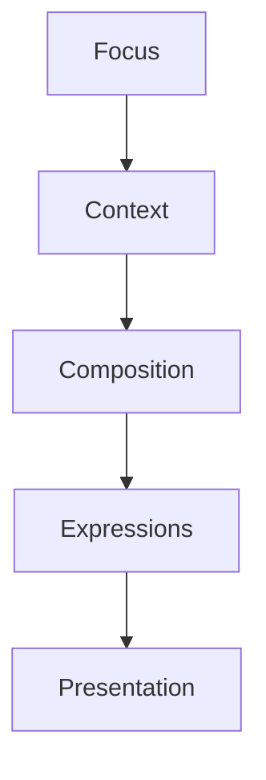

<!--
File: docs/design/language/mdl-004-interaction-model/03-focus-transitions.md
Document: MDL-004
Chapter: 03
Title: Focus Transitions
Status: Draft
Version: 0.2
-->

# Focus Transitions

---

# Purpose

Focus is the centre of every Mosaic experience.

Consequently, changing Focus is one of the most important interactions within the platform.

This chapter defines how Focus should evolve.

It intentionally avoids discussing animation.

Instead, it defines the behavioural expectations that every implementation should communicate.

---

# Definition

A **Focus Transition** is defined as:

> **The behavioural process by which the user's primary attention moves from one subject to another.**

A Focus Transition does not necessarily imply navigation.

It simply indicates that something else has become the centre of the user's current World.

---

# Why Focus Transitions Exist

Traditional applications frequently interpret every selection as navigation.

```
Select

↓

New Page
```

Mosaic instead interprets selection as changing importance.

```
Select

↓

Focus Changes

↓

World Reorganises
```

The distinction is subtle.

It fundamentally changes how the platform behaves.

---

# Focus Never Teleports

One of the fundamental behavioural rules of Mosaic is:

> **Focus should never appear to teleport.**

Users should always understand:

- what was previously important
- what is becoming important
- why the change occurred

The transition should preserve understanding.

Not merely update interface.

---

# Behavioural Sequence

Every Focus Transition should conceptually follow the same sequence.

```text
Current Focus

↓

User Intent

↓

Focus Validation

↓

Context Update

↓

Composition Re-evaluation

↓

Presentation Update
```

Every later interaction model builds upon this sequence.

---

# Explicit Focus

Some transitions are initiated directly by the user.

Examples include:

- selecting a film
- opening a book
- choosing another series
- beginning playback

These transitions possess the strongest confidence.

The platform should respond immediately.

---

# Implicit Focus

Other transitions occur naturally.

Examples include:

- playback completes
- reading reaches the next chapter
- music playlist advances
- the next episode begins automatically

The platform should update Focus only when the user's intent remains clear.

Implicit transitions should never surprise the user.

---

# Interrupted Focus

Users frequently interrupt themselves.

Examples include:

```
Watching

↓

Pause

↓

Browse Cast

↓

Resume Watching
```

The Focus has not fundamentally changed.

The user remains inside the same entertainment experience.

Temporary exploration should therefore preserve the original Focus wherever practical.

---

# Browsing Is Not Focus

One of the most important distinctions within Mosaic is:

Browsing does not necessarily indicate Focus.

Example.

```
Watching Frieren

↓

Browse Breaking Bad

↓

Return
```

The platform should avoid assuming that simply opening another item permanently changes the user's Focus.

Intent matters more than clicks.

---

# Focus Confidence

Future implementations should associate every Focus with a confidence level.

Example.

| Behaviour | Confidence |
|-----------|-----------:|
| Active playback | Very High |
| Active reading | Very High |
| Explicit selection | High |
| Browsing metadata | Medium |
| Hovering artwork | Low |
| Passive recommendation exposure | None |

The platform should avoid changing Focus based on weak signals.

This protects continuity.

---

# Same-Domain Transitions

Changing Focus within the same Domain should feel evolutionary.

Example.

```
Anime

↓

Frieren

↓

Fire Force
```

Shared concepts remain.

Examples include:

- relationships
- timeline
- artwork hierarchy
- interaction model

The World evolves gently.

---

# Cross-Domain Transitions

Changing Focus between Domains represents a more significant conceptual shift.

Example.

```
Anime

↓

Books
```

Different information becomes important.

Different Expressions may become active.

Composition changes more substantially.

Despite this...

The user should still feel they remain inside the same World.

---

# Returning Focus

Returning to a previous Focus should feel familiar.

The platform should preserve meaningful state.

Examples include:

- playback position
- reading progress
- expanded relationships
- current composition

Returning should never feel like beginning again.

---

# Losing Focus

Sometimes the platform genuinely has no meaningful Focus.

Examples include:

- first launch
- empty library
- onboarding

During these situations the platform should establish a Focus naturally.

Examples include:

- onboarding flow
- current collection
- recent activity

The absence of Focus should never produce an empty experience.

---

# Good Examples

## Example 01

Current Focus

```
Frieren
```

User selects:

```
Episode 15
```

The Focus evolves naturally.

Everything continues to relate to Frieren.

---

## Example 02

Current Focus

```
Reading Book
```

User opens:

```
Author Profile
```

The platform should understand that this is supporting exploration.

Not abandonment of the book.

---

## Example 03

Playback completes.

The platform naturally transitions Focus towards:

```
Next Episode
```

The World continues.

Nothing resets.

---

# Anti-patterns

## Every Click Changes Focus

Treating every interaction as a new primary activity.

Users rapidly lose continuity.

---

## Focus Resets

Completing playback immediately returns the user to an unrelated homepage.

The current journey is abandoned.

---

## Predictive Focus

Popularity or recommendations replace the user's existing Focus.

The platform begins directing attention instead of supporting it.

---

## Forgotten Focus

Returning to Mosaic after a short absence forces users to rediscover where they were.

The platform has failed to preserve continuity.

---

# Relationship To Composition

Focus does not directly determine presentation.

Instead:



Changing Focus influences every subsequent stage.

Presentation simply communicates the resulting changes.

---

# Summary

Focus represents the current centre of the user's entertainment World.

Transitions should feel like shifts in attention.

Not changes of application.

Users should always understand:

- what changed
- why it changed
- how it relates to what came before

When Focus behaves consistently, the rest of Mosaic naturally becomes easier to understand.

---

# Review Status

**Status**

Draft

**Next File**

`04-context-transitions.md`
