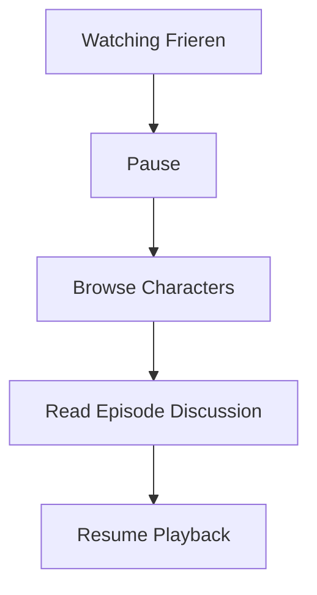
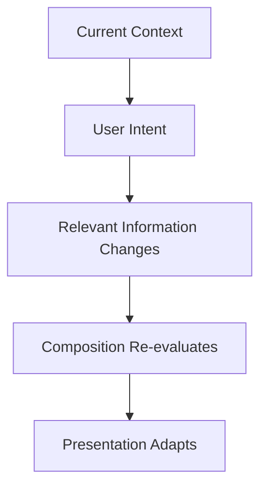
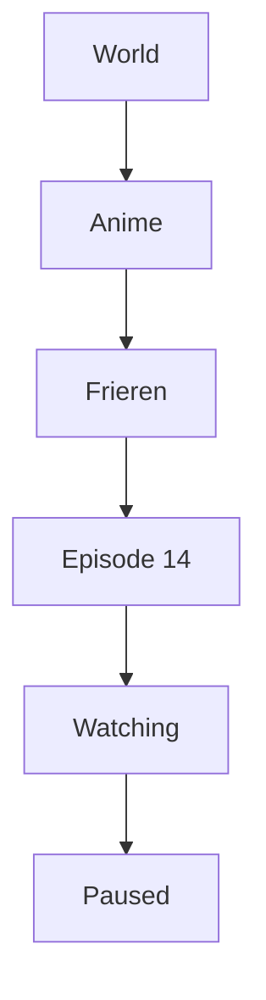
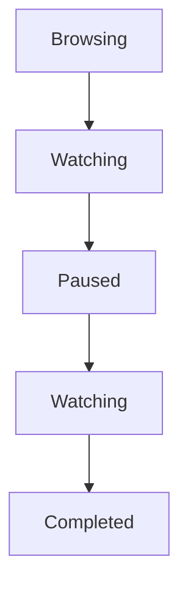
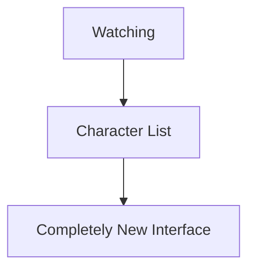
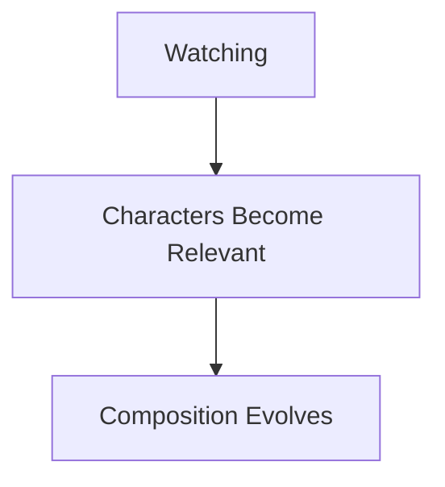
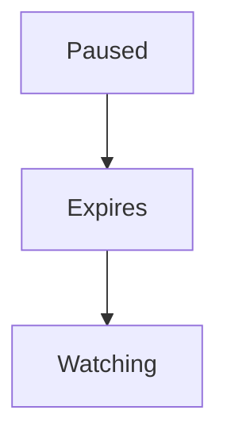
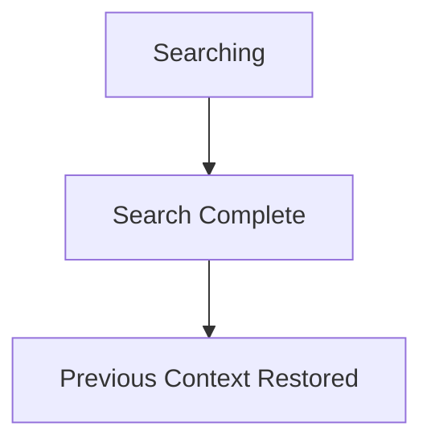
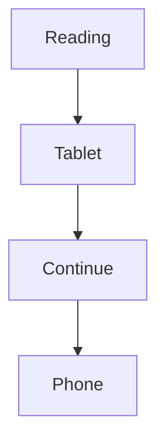
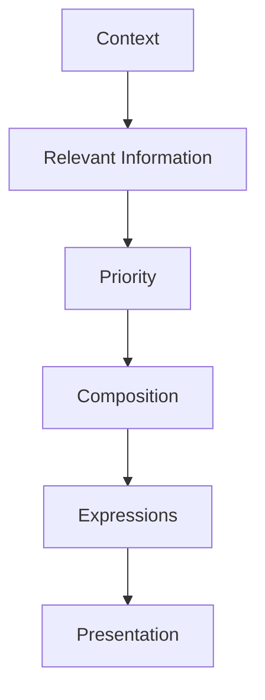

<!--
File: docs/design/language/mdl-004-interaction-model/04-context-transitions.md
Document: MDL-004
Chapter: 04
Title: Context Transitions
Status: Draft
Version: 0.4
-->

# Context Transitions

---

# Purpose

While **Focus** defines what currently matters, **Context** explains why it matters.

A Focus Transition changes the subject of attention.

A Context Transition changes the user's relationship with that subject.

This distinction is fundamental to the Mosaic Interaction Model.

The same Focus may produce many different Contexts without ever requiring the user to leave their World.

---

# Definition

A **Context Transition** is defined as:

> **A behavioural change that alters the relevance of information without necessarily changing the user's Focus.**

Context changes continuously.

Focus changes relatively infrequently.

The Interaction Model therefore expects Context Transitions to occur far more often than Focus Transitions.

---

# Why Context Transitions Exist

Entertainment is rarely a single activity.

Consider the following sequence.



The Focus remains:

```

Frieren
```

However, the Context evolves repeatedly.

Treating each Context as navigation would fragment the experience.

Instead, Mosaic understands that the user is simply exploring different aspects of the same World.

---

# Behavioural Sequence

Every Context Transition follows the same conceptual sequence.



Notice that Focus remains unchanged.

---

# Context Is Layered

Multiple Contexts may coexist.

Example.



Each layer provides additional understanding.

The deepest Context generally has the strongest influence over the current Composition.

---

# Context Evolves Continuously

Context naturally changes during interaction.

Examples include:



No navigation is required.

The World simply evolves.

---

# Temporary Contexts

Some Contexts exist only briefly.

Examples include:

- searching
- filtering
- comparing
- sharing
- viewing metadata

Temporary Contexts should never permanently replace the user's underlying activity.

Once completed, the previous Context should naturally resume.

---

# Persistent Contexts

Other Contexts may remain active for extended periods.

Examples include:

- binge watching
- reading a long novel
- listening to an album
- exploring a franchise

Persistent Contexts should accumulate understanding over time.

The platform should become increasingly helpful rather than repeatedly restarting the experience.

---

# Context Changes Priority

Context directly influences informational priority.

Example.

Current Context

```

Watching
```

Priority becomes:

- playback
- subtitles
- next episode

Changing Context.

```

Browsing Characters
```

Priority naturally shifts towards:

- cast
- relationships
- voice actors
- appearances

Nothing about the World has changed.

Only relevance has.

---

# Context Does Not Reset Composition

One of the Platform foundation behavioural rules of Mosaic is:

> **Context should evolve the existing Composition whenever practical.**

Poor behaviour.



Preferred behaviour.



The user remains oriented.

---

# Context Informs Discovery

Discovery should emerge from Context.

Example.

Current Context.

```

Reading Dune
```

Useful discoveries include:

- sequels
- audiobook
- Frank Herbert
- film adaptations

The platform is not recommending unrelated books.

It is deepening the current Context.

---

# Context Expiration

Every Context possesses a natural lifetime.

Examples.



or



Context should rarely linger longer than necessary.

Expired Context should gracefully return control to the broader World.

---

# Context Across Devices

Context should persist across platforms.

Example.



The device changes.

The Context remains.

Users should never need to manually reconstruct what they were doing.

---

# Good Examples

## Example 01

Current Context

```

Watching Episode
```

User opens:

```

Subtitles
```

Playback remains central.

The subtitle interface appears temporarily.

Closing subtitles naturally restores the previous Context.

---

## Example 02

Current Context

```

Reading Book
```

User views:

```

Character Glossary
```

Reading remains the dominant activity.

The glossary enriches rather than replaces the experience.

---

## Example 03

Current Context

```

Series Overview
```

User begins playback.

The Context naturally becomes:

```

Watching Episode
```

Composition adapts accordingly.

---

# Anti-patterns

## Full Navigation

Every Context Transition behaves like opening another application.

The World fragments.

---

## Context Loss

Returning from supporting information unexpectedly resets the user's current activity.

---

## Overreaction

Minor Context changes trigger complete recomposition.

Users lose continuity.

---

## Persistent Temporary States

Temporary Contexts remain active after they are no longer useful.

The platform appears confused.

---

# Context Resolution

Future runtime systems should determine Context using multiple signals.

Potential inputs include:

- active playback
- explicit user actions
- elapsed time
- interaction history
- active device
- available media

MDL intentionally avoids prescribing the implementation.

It prescribes only the expected behaviour.

---

# Relationship To Composition

Context determines informational relevance.

Composition determines how that relevance is communicated.



Changing Context should therefore influence composition naturally rather than forcing abrupt interface replacement.

---

# Summary

Context Transitions are the most common behavioural changes within Mosaic.

Unlike Focus Transitions, they rarely change what the user cares about.

Instead, they change:

- what information is relevant
- what deserves emphasis
- what should quietly move into the background

The World remains.

The Focus usually remains.

Only understanding evolves.
