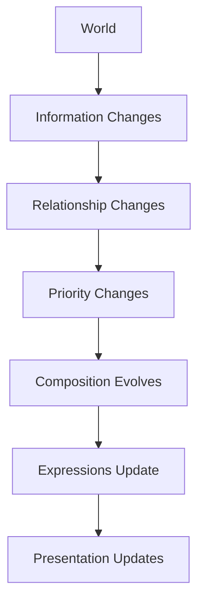

<!--
File: design/mdl/MDL-004 Interaction Model/05-composition-evolution.md
Document: MDL-004
Chapter: 05
Title: Composition Evolution
Status: Draft
Version: 0.1
-->

# Composition Evolution

---

# Purpose

Composition is not static.

It is a living representation of the user's current World.

As the World evolves, the Composition should evolve with it.

This chapter defines how compositions change over time without fragmenting the user's understanding.

Unlike traditional page-based applications, Mosaic does not replace compositions.

It continuously refines them.

---

# Definition

A **Composition Evolution** is defined as:

> **The continuous reorganisation of a Composition as the user's World changes.**

Composition evolution exists to preserve understanding while reflecting new information.

The objective is not visual novelty.

The objective is continuity.

---

# Why Composition Evolves

The user's World is constantly changing.

Examples include:

- playback progressing
- an episode completing
- a chapter finishing
- an album ending
- new information arriving
- plugins contributing knowledge
- relationships becoming relevant

If Composition remained static, the interface would rapidly become less useful.

If Composition changed too aggressively, users would lose orientation.

Composition Evolution exists to balance these two extremes.

---

# The Behavioural Model

Composition should evolve using the following sequence.

```text
World Changes

↓

Information Changes

↓

Relationship Importance Changes

↓

Composition Re-evaluates

↓

Expressions Re-evaluate

↓

Presentation Updates
```

Notice that Presentation remains the final concern.

Composition evolves conceptually before anything visual changes.

---

# Evolution Is Continuous

Compositions should evolve gradually.

Poor.

```
Old Composition

↓

New Composition
```

Preferred.

```
Old Composition

↓

Information Changes

↓

Priority Changes

↓

Composition Evolves

↓

Understanding Preserved
```

The user should rarely feel that an interface has been replaced.

---

# Evolution Is Local

Whenever practical, changes should remain local.

Example.

Playback reaches 95%.

Only:

- progress
- remaining runtime
- next episode

need additional emphasis.

The entire interface should not reorganise simply because one value changed.

Local evolution preserves stability.

---

# Progressive Evolution

Large behavioural changes should occur through multiple small evolutions.

Example.

Episode Ends.

Instead of:

```
Player Closes

↓

Everything Changes
```

Prefer.

```
Playback Ends

↓

Progress Completes

↓

Timeline Expands

↓

Next Episode Gains Priority

↓

Playback Controls Reduce

↓

Composition Settles
```

Each individual change is understandable.

Together they communicate a complete behavioural transition.

---

# Stable Anchors

Every Composition should contain stable anchors.

Anchors provide orientation while other elements evolve.

Examples include:

- Domain Navigation
- Search
- Current Focus
- Global Playback

Anchors should move rarely.

Their stability allows the rest of the interface to remain adaptive without becoming disorienting.

---

# Adaptive Elements

Other parts of the Composition are intentionally adaptive.

Examples include:

- related information
- recommendations
- timeline
- metadata
- extension contributions

These elements should respond naturally to changing Context.

The distinction between Anchors and Adaptive Elements allows Mosaic to feel dynamic without becoming unstable.

---

# Composition Density

Evolution may change information density.

Example.

Watching.

```
Sparse

↓

High Focus
```

Browsing.

```
Denser

↓

Exploration
```

The Composition should adapt according to user intent rather than arbitrary screen templates.

Density is therefore an output of Context.

Not a predefined layout.

---

# Composition Compression

When available space becomes limited:

The Composition should compress gracefully.

Compression should occur in the following order.

1. Low Priority Information
2. Supporting Relationships
3. Secondary Metadata
4. Decorative Information

Core understanding should always remain visible.

Compression should never remove the user's ability to understand their current World.

---

# Composition Expansion

As space or relevance increases:

The Composition should expand naturally.

Expansion should reveal:

- additional relationships
- richer metadata
- deeper exploration
- broader context

Expansion should never introduce unrelated information simply because additional space exists.

---

# Evolution Triggers

The following events should normally trigger Composition Evolution.

## User Driven

- selecting media
- beginning playback
- finishing playback
- searching
- filtering
- changing Domain

---

## System Driven

- episode released
- metadata updated
- plugin contribution
- relationship discovered
- download completed

---

## Temporal

- countdown completed
- scheduled release
- reading session resumed
- long inactivity

Every trigger should produce understandable behavioural evolution.

---

# Composition Memory

A Composition should remember meaningful user state.

Examples include:

- expanded sections
- current Focus
- reading position
- playback position
- selected relationships

Users should rarely feel they are repeatedly reconstructing the same interface.

Composition should accumulate understanding rather than continually forgetting it.

---

# Plugin Behaviour

Plugins should never directly manipulate Composition.

Instead they contribute:

- Information
- Relationships

The Composition Engine decides:

- importance
- priority
- grouping
- emphasis

This preserves one coherent behavioural model regardless of installed extensions.

---

# Good Examples

## Example 01

Airing Episode

```
Tomorrow

↓

Today

↓

Now Available
```

The Timeline naturally gains priority.

The rest of the Composition remains stable.

---

## Example 02

Book Finished.

Progress completes.

Series continuation becomes more important.

Author information expands.

The World continues naturally.

---

## Example 03

Music Album Ends.

Playback controls reduce.

Suggested continuation appears.

Current artist remains the conceptual centre.

The Composition evolves rather than restarting.

---

# Anti-patterns

## Complete Recomposition

Every update rebuilds the entire interface.

Users lose orientation.

---

## Static Composition

Information never adapts regardless of changing Context.

The interface becomes progressively less useful.

---

## Priority Inversion

Low-value information unexpectedly dominates the Composition.

Understanding decreases.

---

## Plugin Recomposition

Extensions rearrange interface independently of the Composition Engine.

The behavioural model fragments.

---

# Composition Evolution Model



This sequence should remain consistent throughout every Mosaic client.

---

# Summary

Composition Evolution allows Mosaic to remain alive without becoming unpredictable.

The World evolves.

The Composition reflects that evolution.

Users should never feel that they are repeatedly entering new interfaces.

Instead, they should feel that their entertainment World quietly reorganises itself around what now matters.

---

# Review Status

**Status**

Draft

**Next File**

`06-movement.md`
