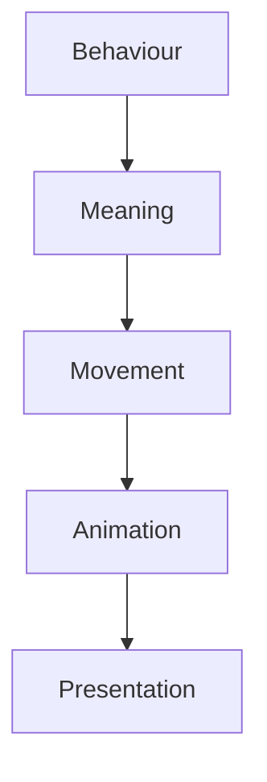

<!--
File: docs/design/language/mdl-004-interaction-model/06-movement.md
Document: MDL-004
Chapter: 06
Title: Movement
Status: Draft
Version: 0.2
-->

# Movement

---

# Purpose

Movement is the physical manifestation of behavioural change.

It exists to communicate the evolution of the user's World.

Within the Mosaic Design Language, movement is not decoration.

It is explanation.

If Composition determines **what changed**, movement communicates **how that change occurred**.

---

# Definition

Within MDL, **Movement** is defined as:

> **The visual communication of behavioural change while preserving the user's understanding of their World.**

Movement is a communication system.

It is not an animation system.

Animation is an implementation.

Movement is intent.

---

# Why Movement Exists

Every interaction changes something.

Examples include:

- Focus changes
- Context changes
- Relationships become important
- Information becomes available
- Composition evolves

Without movement the interface appears to change instantaneously.

Users must reconstruct understanding from scratch.

Movement preserves continuity by explaining:

- what changed
- where it changed
- why it changed

---

# Behaviour Before Motion

Movement should always communicate behaviour that already exists.

Incorrect process.

```
Animation

↓

Behaviour
```

Correct process.

```
Behaviour

↓

Movement

↓

Animation
```

Animation implements movement.

Movement implements behaviour.

Behaviour implements the Mental Model.

---

# The Purpose Of Movement

Movement exists for four reasons.

## Preserve Continuity

Users should understand where things came from.

---

## Explain Change

Users should understand why something changed.

---

## Reinforce Hierarchy

Important changes deserve greater emphasis than insignificant ones.

---

## Reduce Cognitive Effort

Movement should reduce interpretation rather than increase it.

---

# Movement Is Directional

Movement should always possess direction.

Direction communicates relationship.

Examples.

```
Focus

↓

Expands
```

```
Supporting Information

↓

Moves Aside
```

```
Completed Information

↓

Leaves Composition
```

Direction provides meaning.

Random movement provides none.

---

# Movement Is Intentional

Every visible movement should answer a question.

Examples.

Question.

```
Why did this move?
```

Answer.

```
Focus changed.
```

Question.

```
Why did this disappear?
```

Answer.

```
It is no longer relevant.
```

Question.

```
Why did this appear?
```

Answer.

```
New information became important.
```

If no meaningful answer exists...

The movement should not exist.

---

# Conceptual Weight

Movement should reflect conceptual weight rather than visual distance.

Example.

```
Episode 14

↓

Episode 15
```

Small conceptual change.

Small movement.

---

Example.

```
Anime

↓

Books
```

Large conceptual change.

Larger movement.

---

Example.

```
Playback

↓

Administration
```

Very large conceptual change.

The platform should clearly communicate that the user has entered a fundamentally different mode.

---

# Stable Objects

Objects should preserve identity wherever practical.

Users should recognise:

```
Current Progress

↓

Current Progress
```

rather than

```
Old Progress

↓

Destroyed

↓

New Progress
```

The object remains.

Only its state changes.

This greatly improves long-term learnability.

---

# Local Movement

Movement should normally remain local.

Changing:

```
Progress
```

should not cause:

- Search
- Navigation
- Hero
- Timeline

to animate unnecessarily.

Only objects participating in the behavioural change should move.

Local movement reduces visual noise.

---

# Hierarchical Movement

Movement should follow hierarchy.

Examples.

Primary Focus moves first.

Supporting information follows.

Background information moves last.

This naturally reinforces importance without additional interface elements.

---

# Arrival

New information should arrive naturally.

Poor.

```
Information

↓

Instantly Appears
```

Preferred.

```
Information Becomes Relevant

↓

Composition Creates Space

↓

Information Joins
```

Users should understand why something has entered their World.

---

# Departure

Likewise...

Information should leave naturally.

Poor.

```
Information

↓

Disappears
```

Preferred.

```
Information Becomes Less Relevant

↓

Priority Reduces

↓

Leaves Composition
```

Departure should feel like completion.

Not deletion.

---

# Movement And Time

Movement should communicate temporal progression.

Examples.

```
Watching

↓

Completed

↓

Continue

↓

Next Episode
```

The interface should communicate that one experience has naturally progressed into another.

Users should never feel abruptly returned to the beginning.

---

# Module Behaviour

Modules never define movement.

Modules contribute:

- Information
- Relationships

The platform determines:

- arrival
- departure
- emphasis
- continuity

This ensures one coherent behavioural language regardless of installed modules.

---

# Good Examples

## Example 01

Episode completes.

Progress fills.

Timeline advances.

Next episode gains emphasis.

Playback controls reduce.

The World continues.

---

## Example 02

User opens Cast.

Character information expands naturally around the current Focus.

Playback remains recognisable.

The user understands they are exploring rather than navigating away.

---

## Example 03

New episode releases overnight.

The next morning.

Timeline quietly gains emphasis.

Nothing else unnecessarily changes.

The World has evolved.

---

# Anti-patterns

## Decorative Motion

Movement exists because it looks impressive.

Understanding does not improve.

---

## Teleportation

Objects disappear.

New objects appear elsewhere.

Identity is lost.

---

## Simultaneous Motion

Everything moves together.

Hierarchy disappears.

Users no longer know where to look.

---

## Performance Before Understanding

Movement is removed simply because it is technically expensive.

Understanding decreases.

Optimisation should preserve behavioural meaning wherever possible.

---

# Behavioural Model



Animation is the final implementation detail.

Behaviour always remains the primary concern.

---

# Summary

Movement is the behavioural language of Mosaic.

It communicates:

- continuity
- hierarchy
- evolution
- understanding

Movement should never exist because animation is possible.

It exists because users deserve to understand how their World has changed.

---

# Review Status

**Status**

Draft

**Next File**

`07-user-flow.md`
