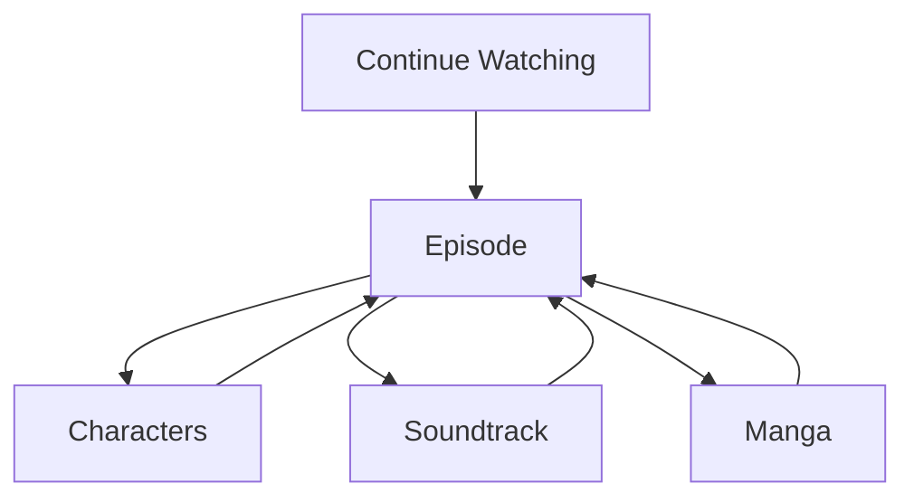

<!--
File: design/mdl/MDL-004 Interaction Model/07-user-flow.md
Document: MDL-004
Chapter: 07
Title: User Flow
Status: Draft
Version: 0.1
-->

# User Flow

---

# Purpose

Traditional software describes users as moving through interfaces.

The Mosaic Interaction Model intentionally rejects this perspective.

Users do not move through Mosaic.

They move through **their entertainment**.

The platform simply follows.

This chapter defines how user flow should be understood throughout the Mosaic Design Language.

---

# Definition

Within MDL, **User Flow** is defined as:

> **The continuous progression of a user's intent through their entertainment World.**

Notice that the definition does not mention:

- pages
- screens
- routes
- navigation

Those are implementation concerns.

The flow being modelled is the user's thinking.

Not the application's structure.

---

# Why User Flow Exists

People rarely describe their evening like this.

```
Open Homepage

↓

Navigate Library

↓

Open Series

↓

Open Season

↓

Play Episode
```

Instead they describe it like this.

```
Continue Frieren.
```

or

```
Read another chapter.
```

or

```
Listen to that soundtrack again.
```

The software journey is invisible.

Only the entertainment journey matters.

Mosaic therefore models the latter.

---

# Intent

Every user flow begins with intent.

Intent answers:

> **What is the user trying to achieve?**

Examples include:

- Continue watching
- Continue reading
- Discover something related
- Resume listening
- Explore a franchise
- Manage a collection

Everything else exists to support that intent.

---

# The Flow Model

Every interaction should conceptually follow the same behavioural flow.

```text
Intent

↓

World

↓

Focus

↓

Context

↓

Composition

↓

Understanding

↓

Entertainment
```

Notice that the user never "arrives" at a page.

They arrive at understanding.

---

# User Goals

Every user flow should optimise one of four goals.

## Continue

Resume an existing experience.

Examples:

- Continue Watching
- Continue Reading
- Resume Playback

This should represent the lowest-friction flow in the platform.

---

## Explore

Deepen the current experience.

Examples:

- Cast
- Author
- Soundtrack
- Manga
- Timeline

Exploration should remain closely connected to the current Focus.

---

## Discover

Find something new.

Discovery should emerge naturally from:

- relationships
- current interests
- current Context

Discovery should never interrupt ongoing entertainment.

---

## Manage

Perform administration.

Examples include:

- downloads
- users
- plugins
- libraries

Management intentionally behaves differently from entertainment.

It should remain calm, structured and predictable.

---

# Flow Types

The Interaction Model recognises four behavioural flow types.

| Flow | Behaviour |
|-------|-----------|
| Continue | Lowest friction |
| Explore | Expand understanding |
| Discover | Widen the World |
| Manage | Configure the platform |

The interface should always understand which flow the user is currently following.

---

# Flow Continuity

A user should be capable of leaving a flow...

...and naturally returning.

Example.

```
Watching

↓

Pause

↓

Browse Cast

↓

Resume Watching
```

The browsing flow should never destroy the playback flow.

Instead it should temporarily branch from it.

---

# Branching

User flow should branch naturally.



Notice that every branch naturally returns to the current entertainment experience.

This prevents fragmentation.

---

# Dead Ends

Dead ends should be considered design failures.

Example.

```
Open Actor

↓

Nothing Else
```

The user's journey stops.

Instead:

```
Actor

↓

Other Films

↓

Related Directors

↓

Current Focus
```

Every flow should naturally lead somewhere meaningful.

---

# Flow Memory

Mosaic should remember meaningful user flow.

Examples include:

- last reading position
- current episode
- expanded relationships
- current search
- unfinished exploration

Returning users should feel as though they have resumed a conversation rather than started a new one.

---

# Friction

Every transition within a user flow introduces friction.

Examples include:

- additional clicks
- unnecessary confirmations
- repeated searches
- repeated navigation
- repeated context switching

The objective of Mosaic is to remove as much of this friction as possible without removing user understanding.

---

# Flow Priority

When multiple flows are possible, they should normally be prioritised in the following order.

1. Continue
2. Explore
3. Discover
4. Manage

This ordering reflects the philosophy established in MDL-001.

Helping users continue what they already chose is generally more valuable than encouraging unrelated discovery.

---

# Good Examples

## Continue

```
Open Mosaic

↓

Continue Watching

↓

Playback
```

Minimal friction.

---

## Explore

```
Current Episode

↓

Voice Actor

↓

Other Roles

↓

Return
```

The exploration remains connected to the original experience.

---

## Discover

```
Current Book

↓

Related Author

↓

Another Series
```

Discovery grows naturally from existing interest.

---

# Anti-patterns

## Forced Navigation

The user repeatedly returns to a homepage before continuing.

---

## Flow Reset

Small interruptions completely restart the entertainment journey.

---

## Promotional Diversion

The platform redirects the user away from their current intent.

---

## Management Dominance

Administrative workflows become more visible than entertainment workflows.

---

# Relationship To Other Specifications

User Flow builds directly upon:

- World
- Focus
- Context
- Composition

It intentionally avoids introducing new concepts.

Instead, it explains how existing concepts work together over time.

---

# Summary

Users do not flow through interfaces.

They flow through experiences.

Mosaic should therefore optimise the journey through entertainment rather than the journey through software.

When contributors discuss user flow, they should always begin by asking:

> **What is the user trying to continue?**

Not:

> **Which screen should they visit next?**

---

# Review Status

**Status**

Draft

**Next File**

`08-temporal-behaviour.md`
