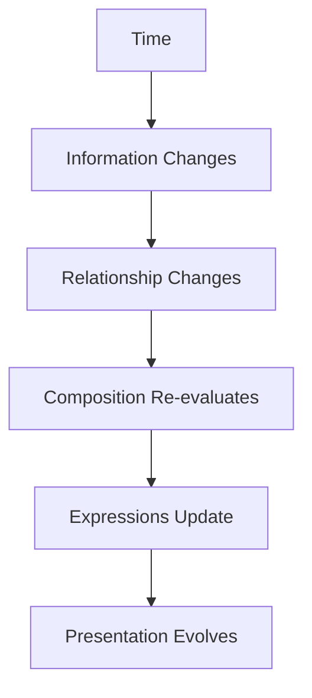

<!--
File: design/mdl/MDL-004 Interaction Model/08-temporal-behaviour.md
Document: MDL-004
Chapter: 08
Title: Temporal Behaviour
Status: Draft
Version: 0.1
-->

# Temporal Behaviour

---

# Purpose

The previous chapters described how the user's World evolves in response to interaction.

This chapter introduces a second dimension.

**Time.**

Unlike traditional applications, Mosaic should not only react to user input.

It should also react to the natural passage of time.

Time is considered a first-class behavioural input.

The user's World changes even while they are not actively interacting with the application.

The Interaction Model must therefore define how Mosaic behaves before, during and after those changes occur.

---

# Definition

Within MDL, **Temporal Behaviour** is defined as:

> **The behavioural changes produced by the passage of time rather than direct user interaction.**

Examples include:

- episode releases
- countdown completion
- scheduled events
- reading inactivity
- playback completion
- background metadata updates

Temporal behaviour allows Mosaic to remain alive without becoming intrusive.

---

# Why Time Matters

Entertainment naturally unfolds through time.

Examples include:

- episodes air
- books are completed
- albums release
- concerts are announced
- downloads finish
- subtitles become available

Traditional applications generally wait for users to discover these changes.

Mosaic should instead quietly integrate them into the user's World.

The World should appear to evolve naturally.

---

# Time Is Not A Notification

One of the most important distinctions within MDL is that temporal behaviour is **not** equivalent to notifications.

Example.

Poor behaviour.

```
Episode Released

↓

Notification

↓

Dismiss
```

Preferred behaviour.

```
Episode Released

↓

Timeline Evolves

↓

Continue Watching Gains Priority

↓

World Updates
```

The user discovers the change naturally.

Not because the platform demanded attention.

---

# Temporal States

Every meaningful piece of Information exists within time.

Examples include:

```
Future

↓

Present

↓

Past
```

Example.

```
Episode

↓

Announced

↓

Airing Tomorrow

↓

Available

↓

Watched

↓

Completed
```

The Information remains identical.

Its temporal state evolves.

---

# Behaviour Before Availability

Before something becomes available, Mosaic should reduce uncertainty.

Example.

```
Next Episode

↓

Tomorrow
```

Questions naturally answered include:

- When?
- How long?
- What happens next?

The platform should reduce anxiety caused by uncertainty rather than merely reporting availability after the fact.

---

# Behaviour At Availability

When Information becomes available:

The World should evolve naturally.

Examples include:

- Timeline updates
- Continue Watching changes
- Progress resumes
- Composition re-evaluates

The objective is not to celebrate the event.

The objective is to integrate it.

---

# Behaviour After Completion

Completion should never feel like termination.

Poor.

```
Episode Ends

↓

Finished
```

Preferred.

```
Episode Ends

↓

Progress Updates

↓

Relationships Expand

↓

Next Episode Gains Priority

↓

World Continues
```

Completion represents continuity.

Not conclusion.

---

# Passive Evolution

Many changes should occur without requiring user interaction.

Examples include:

- new episode releases
- metadata refresh
- artwork updates
- relationship discovery
- plugin synchronisation

Users should simply discover a richer World the next time they return.

The platform should avoid unnecessarily exposing background activity.

---

# Active Evolution

Some temporal changes occur while the user is actively engaged.

Examples include:

- playback reaches credits
- chapter completes
- countdown expires
- download finishes

These changes should be incorporated smoothly into the existing experience.

The platform should never appear startled by events it could reasonably anticipate.

---

# Inactivity

Time also affects inactivity.

After extended absence:

The platform should assume continuity rather than abandonment.

Example.

User returns after six months.

Instead of presenting:

- every change
- every recommendation
- every update

Mosaic should begin with the user's previous World.

Only after the user's Focus changes should additional areas of the World become emphasised.

The platform resumes the conversation.

It does not begin a new one.

---

# Temporal Confidence

Future runtime systems may associate confidence with temporal events.

Examples.

| Event | Confidence |
|--------|-----------:|
| Scheduled Episode Release | Very High |
| Playback Completion | Very High |
| Metadata Refresh | High |
| Community Update | Medium |
| External Recommendation | Low |

Higher-confidence events should produce stronger behavioural adaptation.

Lower-confidence events should remain peripheral.

---

# Temporal Rhythm

The platform should develop a natural rhythm.

```
Preparation

↓

Availability

↓

Continuation

↓

Completion

↓

Preparation
```

This rhythm should become recognisable across every entertainment domain.

Television.

Books.

Music.

Films.

The behavioural pattern remains consistent.

Only the Information changes.

---

# Plugins

Plugins should contribute temporal Information.

Examples.

Anime Plugin.

```
Episode

↓

Tomorrow
```

Music Plugin.

```
Concert

↓

Next Month
```

Book Plugin.

```
Next Volume

↓

Publishing Soon
```

The plugin contributes temporal knowledge.

The platform decides:

- timing
- emphasis
- composition
- presentation

---

# Anti-patterns

## Notification First

Time always produces alerts.

The interface becomes demanding.

---

## Time Ignorance

The World never evolves until manually refreshed.

The platform feels static.

---

## Temporal Reset

Users returning after absence lose continuity.

The platform behaves as though it has forgotten them.

---

## Information Flood

Every historical change is presented simultaneously.

Users become overwhelmed.

---

# Temporal Behaviour Model



Time should influence understanding.

Not merely trigger interface updates.

---

# Summary

Time is one of the primary behavioural inputs to Mosaic.

The platform should quietly evolve alongside the user's entertainment.

Users should never feel they must constantly monitor the platform.

Instead, they should trust that their World will naturally become richer with time.

---

# Review Status

**Status**

Draft

**Next File**

`09-interaction-states.md`
