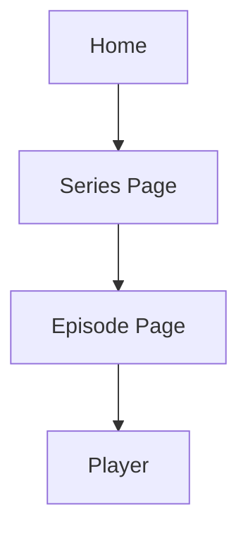
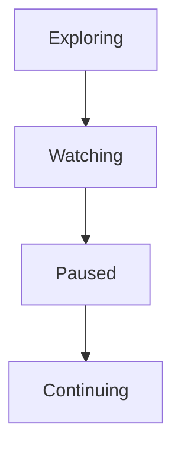
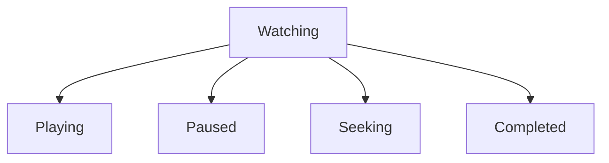
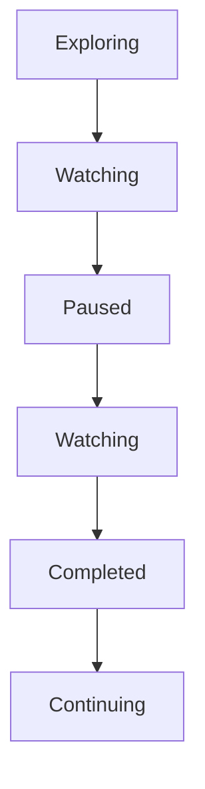
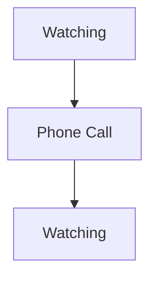
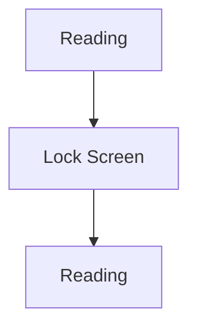
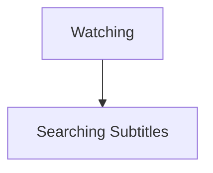
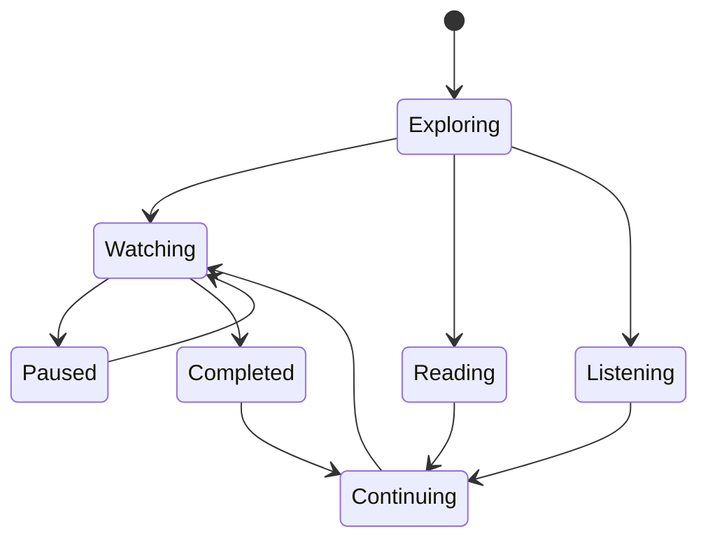

<!--
File: docs/design/language/mdl-004-interaction-model/09-interaction-states.md
Document: MDL-004
Chapter: 09
Title: Interaction States
Status: Draft
Version: 0.4
-->

# Interaction States

---

# Purpose

Every interaction within Mosaic exists within a behavioural state.

Unlike traditional applications, where state is frequently represented by interface elements such as pages, dialogs or navigation, Mosaic models state as part of the user's evolving World.

Interaction States define **what the user is currently trying to accomplish**.

They do not define **what interface they are looking at**.

Understanding this distinction is essential to maintaining behavioural continuity across every Mosaic client.

---

# Definition

Within MDL, an **Interaction State** is defined as:

> **The current behavioural mode of the user's World.**

Interaction States describe intent.

They do not describe interface.

Examples include:

- Watching
- Reading
- Listening
- Exploring
- Searching
- Managing

The same interface may represent multiple Interaction States over time.

Likewise, the same Interaction State may appear differently on different devices.

---

# Why Interaction States Exist

Traditional software frequently models state like this.



Each state corresponds directly to interface.

Mosaic intentionally models behaviour instead.



The interface merely communicates those behavioural states.

---

# Behaviour Before Interface

Interaction States should always describe behaviour.

Never implementation.

Poor examples.

- Dialog Open
- Drawer Expanded
- Sidebar Hidden

Good examples.

- Exploring
- Watching
- Reading
- Comparing
- Continuing

The first describes software.

The second describes people.

---

# Primary States

The following Interaction States are considered foundational.

## Exploring

Purpose:

Understanding possibilities.

Typical behaviours:

- browsing
- comparing
- learning
- discovering

Exploration should expand understanding without abandoning the current World.

---

## Watching

Purpose:

Consuming video.

Primary emphasis:

- playback
- progress
- next episode

Everything unrelated should quietly reduce emphasis.

---

## Reading

Purpose:

Consuming written content.

Primary emphasis:

- chapter
- reading position
- bookmarks
- continuation

The interface should become significantly quieter.

---

## Listening

Purpose:

Consuming audio.

Primary emphasis:

- playback
- queue
- progress
- currently playing

Artwork remains important.

Interface chrome should recede.

---

## Continuing

Purpose:

Resuming an existing experience.

This is considered the lowest-friction state within Mosaic.

Users should require minimal conscious interaction before returning to entertainment.

---

## Managing

Purpose:

Administration.

Examples include:

- modules
- users
- libraries
- storage

Management intentionally follows different behavioural priorities.

Entertainment should remain adaptive.

Management should remain predictable.

---

# Transitional States

Some states exist only briefly.

Examples include:

- Loading
- Synchronising
- Preparing Playback
- Searching
- Authenticating

These states should communicate progress.

They should never become destinations.

The objective is to move through them rather than remain within them.

---

# Nested States

Interaction States may contain additional states.

Example.



The parent state remains:

```

Watching
```

Nested states should not fundamentally alter the user's understanding of their World.

---

# State Ownership

Every Interaction State owns:

- behavioural expectations
- information priority
- composition emphasis
- interaction affordances

Interaction States intentionally do **not** own:

- colours
- materials
- animation
- typography

Those belong to the Design System.

---

# State Transitions

Interaction States should transition naturally.

Example.



Every transition should reinforce continuity.

The user should understand why the state changed.

---

# State Persistence

Some Interaction States should survive interruption.

Examples include:



or



Temporary interruptions should not destroy the user's current journey.

---

# State Restoration

Returning to Mosaic should restore meaningful behavioural state whenever practical.

Examples include:

- playback
- reading
- exploration
- searches
- filters

The user should feel as though the platform remembered the conversation.

Not restarted it.

---

# State Priority

Only one primary Interaction State should normally exist at a time.

Secondary states may exist beneath it.

Example.



The dominant state remains:

```

Watching
```

This hierarchy prevents competing behavioural priorities.

---

# Modules

Modules should never introduce entirely new primary Interaction States.

Instead they should enrich existing states.

Example.

A Manga module should strengthen:

```

Reading
```

rather than creating:

```

Manga Mode
```

The behavioural language remains coherent across the ecosystem.

---

# Anti-patterns

## Interface States

Treating interface conditions as behavioural states.

Examples.

- Dialog Open
- Card Expanded
- Modal Visible

These describe implementation.

Not user behaviour.

---

## Competing States

The interface simultaneously behaves as though the user is:

- Watching
- Managing
- Discovering
- Configuring

The platform loses behavioural clarity.

---

## Forgotten State

Returning users begin from a generic homepage.

Their previous behavioural state has been discarded.

Continuity is broken.

---

# Behaviour Model



States describe behaviour.

Presentation communicates those behaviours.

---

# Summary

Interaction States define **what the user is doing**.

Not:

- what page they are on
- what component is visible
- what technology is active

The interface should continuously reinforce behavioural state while allowing implementation to evolve independently.

Interaction States therefore become one of the primary mechanisms through which Mosaic preserves continuity.
