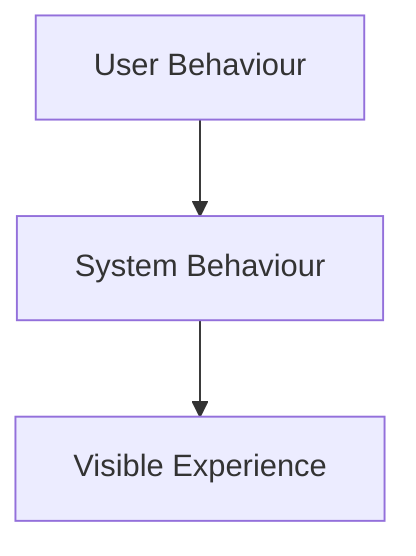
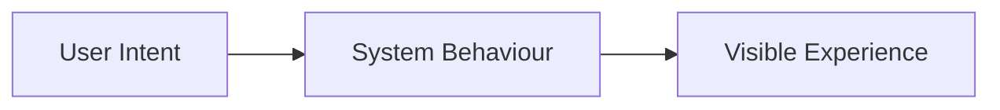
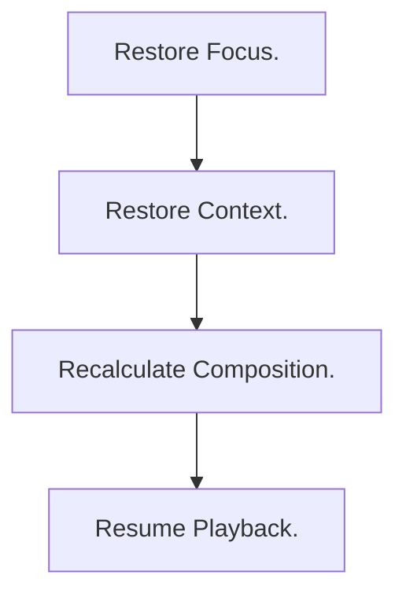
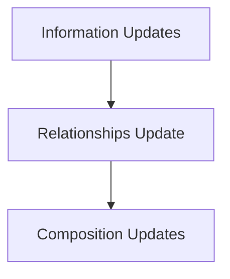
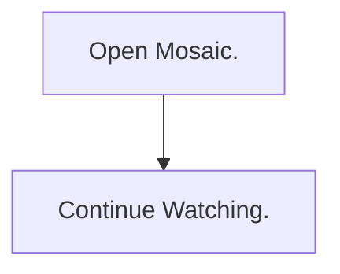
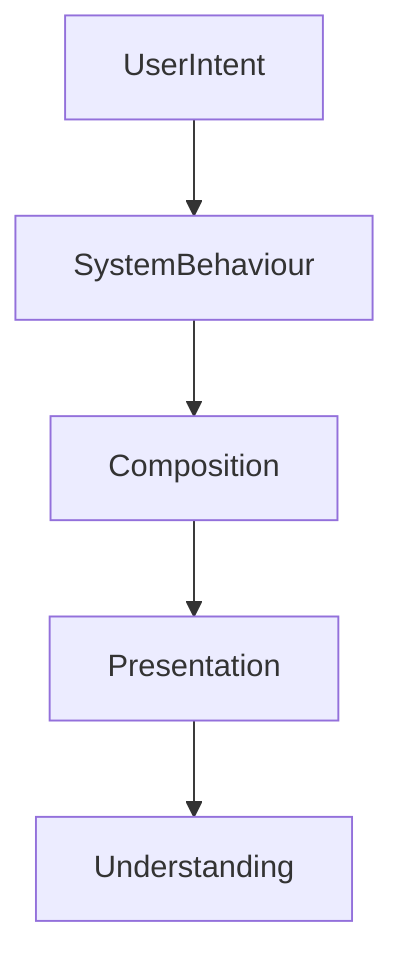

<!--
File: docs/design/language/mdl-004-interaction-model/10-user-vs-system-behaviour.md
Document: MDL-004
Chapter: 10
Title: User Behaviour vs System Behaviour
Status: Draft
Version: 0.4
-->

# User Behaviour vs System Behaviour

---

# Purpose

The Interaction Model distinguishes between two fundamentally different kinds of behaviour.

The first is **user behaviour**.

The second is **system behaviour**.

Confusing these two models is one of the most common causes of poor interaction design.

Systems frequently optimise their own behaviour rather than supporting the behaviour of the person using them.

Mosaic intentionally reverses this relationship.

The platform exists to support user behaviour.

It does not expect users to adapt to system behaviour.

---

# Two Behavioural Models

Every interaction within Mosaic can be viewed from two perspectives.



User behaviour describes intent.

System behaviour describes implementation.

Visible experience is simply the translation between the two.

---

# User Behaviour

User behaviour answers questions such as:

- What am I trying to do?
- Why am I here?
- What do I expect next?
- What information do I need?

Examples include:

```

Continue watching.

Continue reading.

Find the next episode.

Explore this author.

Resume listening.
```

Notice that none of these describe software.

They describe intention.

---

# System Behaviour

System behaviour answers questions such as:

- Which data changed?
- Which composition should update?
- Which information became relevant?
- Which relationships require recalculation?
- Which Expressions should be regenerated?

These behaviours belong entirely to the platform.

Users should rarely become aware they exist.

---

# The Translation Layer

One of Mosaic's primary responsibilities is translating user behaviour into system behaviour.



Users should never need to understand the intermediate step.

---

# Behavioural Ownership

User Behaviour owns:

- intention
- goals
- expectations
- understanding

System Behaviour owns:

- computation
- composition
- prioritisation
- rendering
- synchronisation

The platform should never expose System Behaviour simply because it is technically convenient.

---

# Good Translation

Example.

User Behaviour.

```

Continue watching.
```

System Behaviour.



Visible Experience.

```

Episode resumes.
```

The user never sees the intermediate behaviour.

---

# Poor Translation

User Behaviour.

```

Continue watching.
```

Visible Experience.

```

Metadata refreshing...

Provider synchronising...

Relationship graph rebuilding...

Loading modules...
```

The platform has leaked implementation.

The user's intent has been interrupted by system concerns.

---

# Behaviour Should Be Invisible

The best system behaviour is behaviour users never consciously notice.

For example.

A new episode releases overnight.

System Behaviour.



User Behaviour.



The platform quietly prepared the experience.

The user simply experiences continuity.

---

# Behavioural Timing

Not every system behaviour should immediately become visible.

Good examples.

- metadata refresh
- artwork updates
- relationship indexing
- module synchronisation

These should generally occur in the background.

The visible experience should only change when those changes become meaningful to the current World.

---

# Behavioural Interruptions

System behaviour should interrupt the user only when:

- immediate action is required
- data loss is possible
- security requires confirmation
- understanding would otherwise be reduced

Everything else should remain in the background.

This reflects the Companion philosophy established in [MDL-001](../mdl-001-vision/index.md).

---

# Behavioural Consistency

Different implementations may perform very different internal work.

Desktop.

```

Local Database
```

Television.

```

Streaming API
```

Mobile.

```

Offline Cache
```

Despite these differences...

The user should experience the same behaviour.

The Interaction Model therefore governs experience rather than implementation.

---

# Modules

Modules should contribute capability.

They should never redefine behavioural expectations.

For example.

Anime Module.

System Behaviour.

```

Episode Released
```

Platform Behaviour.

```

Composition Updates
```

User Behaviour.

```

Continue Watching.
```

Every module should reinforce the same behavioural language.

---

# Anti-patterns

## System First

The platform exposes technical operations before supporting the user's intent.

---

## Technical Language

Users encounter implementation concepts such as:

- cache
- provider
- refresh
- synchronisation

when attempting ordinary entertainment tasks.

---

## Behaviour Fragmentation

Different modules introduce different interaction expectations.

Users must continually relearn behaviour.

The Companion disappears.

---

## Behavioural Surprises

The system performs visible changes without understandable user benefit.

Trust decreases.

---

# Behavioural Priority

When system behaviour and user behaviour conflict:

User behaviour always takes priority.

Examples.

System wants:

```

Refresh metadata.
```

User wants:

```

Continue reading.
```

The platform should continue reading.

Metadata can wait.

Supporting entertainment always takes precedence over maintaining the platform.

---

# Behaviour Model



Notice that the user never interacts directly with the system model.

Only with understanding.

---

# Summary

The Interaction Model intentionally separates:

- what the user is trying to achieve

from

- what the platform must do internally.

This separation allows Mosaic to remain:

- calm
- predictable
- trustworthy

while still supporting increasingly sophisticated engineering beneath the surface.

Users should remember their entertainment.

Not the behaviour of the software supporting it.
