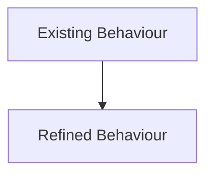
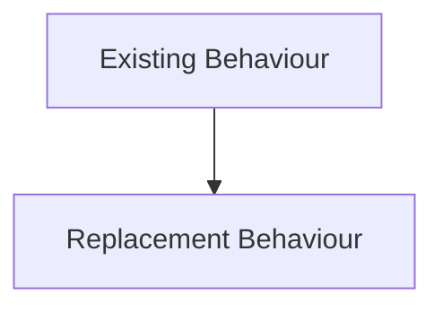
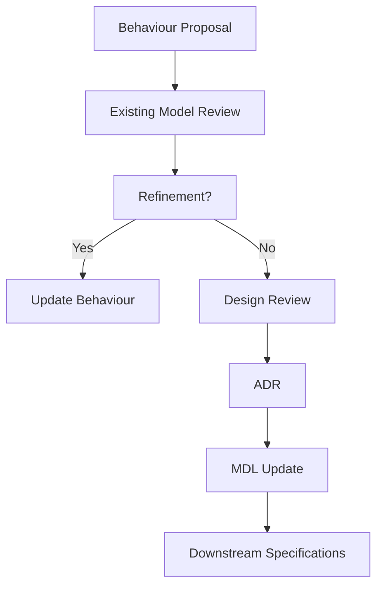

<!--
File: docs/design/language/mdl-004-interaction-model/11-governance.md
Document: MDL-004
Chapter: 11
Title: Interaction Model Governance
Status: Draft
Version: 0.4
-->

# Interaction Model Governance

---

# Purpose

The Interaction Model defines how Mosaic behaves.

Unlike implementation, behaviour becomes part of the user's long-term memory.

Changing interaction is therefore significantly more expensive than changing presentation.

This chapter defines how behavioural changes should be proposed, reviewed and maintained throughout the lifetime of Mosaic.

The objective of governance is not to prevent evolution.

It is to ensure that behavioural evolution remains coherent.

---

# Behaviour Is Product Identity

Users rarely remember exact colours.

They rarely remember typography.

They rarely remember spacing.

They almost always remember:

- how a product behaves
- whether it felt predictable
- whether it respected their attention
- whether it became easier over time

Behaviour is therefore considered a primary part of the Mosaic identity.

Changing behaviour should be treated with the same care as changing the product vision.

---

# Behavioural Stability

Interaction behaviour should remain significantly more stable than implementation.

Expected lifetime.

| Layer | Expected Lifetime |
|--------|-------------------|
| Rendering | Weeks to Months |
| Components | Months |
| Motion Implementation | Months |
| Interaction Behaviour | Years |
| Mental Model | Decades |
| Vision | Decades |

A new framework should never require a new interaction model.

---

# What Requires Review

The following changes require formal Interaction Model review.

- New interaction patterns.
- New behavioural states.
- Changes to Focus behaviour.
- Changes to Context behaviour.
- Changes to behavioural continuity.
- Changes to navigation philosophy.
- Changes to interaction hierarchy.

These changes affect every Mosaic client.

---

# What Does Not Require Review

The following normally belong to MDS rather than MDL.

- Animation timing.
- Motion curves.
- Easing.
- Typography.
- Colour.
- Materials.
- Visual transitions.
- Responsive layouts.

These concern presentation.

Not behaviour.

---

# Behavioural Review Questions

Every proposed behavioural change should answer the following questions.

## Question One

Does this strengthen continuity?

---

## Question Two

Does this preserve understanding?

---

## Question Three

Does this reduce friction?

---

## Question Four

Does this reinforce the Companion philosophy?

---

## Question Five

Would users naturally predict this behaviour after using Mosaic for several weeks?

Behaviour should become increasingly predictable over time.

---

# Behavioural Drift

One of the greatest long-term risks to Mosaic is behavioural drift.

Behavioural drift occurs when:

- different clients behave differently
- modules introduce competing interaction models
- exceptions accumulate
- new features ignore established behaviour
- navigation begins replacing continuity

Behavioural drift is more damaging than visual inconsistency because it weakens user trust.

---

# Platform Consistency

Every Mosaic client should reinforce the same behavioural language.

Examples include:

Desktop.

Mobile.

Television.

Tablet.

Future devices.

Presentation may differ.

Behaviour should remain recognisable.

Users should never need to relearn:

- Focus
- Context
- Composition
- Interaction States

because they changed device.

---

# Module Governance

Modules participate in the Interaction Model.

They do not redefine it.

Modules may contribute:

- Information
- Relationships
- Capabilities

They should never independently define:

- navigation
- behavioural hierarchy
- interaction states
- continuity rules
- movement philosophy

Behaviour belongs to the platform.

---

# Behavioural Regression

Every significant behavioural change should be considered a regression risk.

Examples include:

- users becoming disoriented
- continuity weakening
- navigation increasing
- interaction becoming less predictable

Future behavioural testing should therefore evaluate:

- orientation
- continuity
- understanding
- cognitive effort

rather than visual correctness alone.

---

# Behavioural Evolution

Behaviour should evolve through refinement.

Preferred.

Avoid.

unless there is compelling evidence that the original model no longer supports the Vision.

---

# Interaction Debt

Technical debt affects implementation.

Interaction debt affects understanding.

Examples include:

- inconsistent navigation
- competing behavioural models
- duplicated interaction patterns
- unnecessary confirmations
- unpredictable focus changes

Interaction debt should be treated as a first-class architectural concern.

Removing behavioural inconsistency often improves user experience more than introducing new functionality.

---

# Governance Workflow

The preferred outcome is refinement.

Replacement should remain rare.

---

# Success Criteria

The Interaction Model succeeds when:

- behaviour feels consistent across every client
- users instinctively predict platform behaviour
- modules naturally inherit platform interaction
- contributors solve behavioural problems using existing concepts
- new interaction patterns become increasingly rare

The strongest interaction model is one users eventually stop consciously noticing.

---

# Architectural Decisions

| ADR | Decision |
|------|----------|
| ADR-038 | Behaviour is considered part of the long-term product identity. |
| ADR-039 | Behavioural consistency has higher priority than visual consistency. |
| ADR-040 | Modules participate in platform behaviour rather than defining independent interaction models. |
| ADR-041 | Behaviour should evolve through refinement rather than replacement. |
