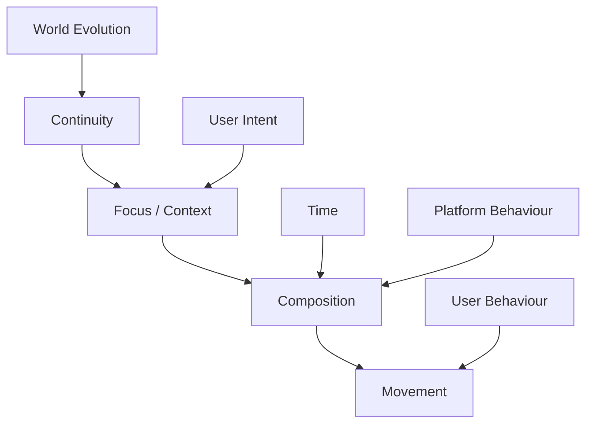

<!--
File: docs/design/language/mdl-004-interaction-model/12-adrs.md
Document: MDL-004
Chapter: 12
Title: Architectural Decision Records
Status: Draft
Version: 0.2
-->

# Architectural Decision Records

---

# Purpose

The Architectural Decision Records (ADRs) contained within MDL-004 document the significant behavioural decisions that define how Mosaic behaves over time.

Unlike the ADRs contained within:

- MDL-001 (Vision)
- MDL-002 (Principles)
- MDL-003 (Mental Model)

these decisions describe **behaviour**.

They explain why Mosaic behaves differently from traditional media applications.

Future contributors should use these ADRs to understand the behavioural intent behind the Interaction Model before proposing alternative interaction patterns.

Architecture Decision Records are intended to capture significant architectural decisions together with their context and consequences so future contributors understand not only *what* was decided but *why*.  [Google Cloud Documentation](https://docs.cloud.google.com/architecture/architecture-decision-records?hl=en)

---

# Decision Format

Decision format, lifecycle and review expectations are governed by **MDG-001 — Documentation Authority Guide**.

This chapter records decisions specific to this specification and avoids redefining the shared ADR process.

# ADR-058

## Title

Model Interaction As World Evolution

### Status

Accepted

### Context

Traditional applications generally model interaction as navigation between independent destinations.

Founder discovery consistently described entertainment as a continuous experience rather than a sequence of pages.

### Decision

Interaction is defined as the continuous evolution of the user's World.

Navigation becomes one implementation of behavioural change rather than the primary behavioural model.

### Consequences

Future interaction systems should prioritise continuity over relocation.

---

# ADR-059

## Title

Preserve Continuity Above Navigation

### Status

Accepted

### Context

Users rapidly construct mental maps while using software.

Frequent page replacement forces those maps to be rebuilt repeatedly.

### Decision

Continuity becomes the primary behavioural objective.

Navigation should preserve orientation whenever practical.

### Consequences

Future interaction systems should favour:

- evolution
- continuity
- progressive change

over abrupt replacement.

---

# ADR-060

## Title

Separate Focus Transitions From Context Transitions

### Status

Accepted

### Context

Early exploration treated Focus and Context as identical interaction events.

Practical examples demonstrated that users frequently change Context without changing Focus.

### Decision

Focus and Context transitions become independent behavioural concepts.

### Consequences

Composition may evolve significantly while preserving the same Focus.

This produces calmer interactions.

---

# ADR-061

## Title

Treat Movement As Behavioural Communication

### Status

Accepted

### Context

Many modern interfaces use animation as decoration.

Founder workshops consistently described movement as a mechanism for preserving understanding.

### Decision

Movement exists only to communicate behavioural change.

Animation becomes an implementation concern.

### Consequences

Future motion systems should explain behaviour rather than entertain users.

---

# ADR-062

## Title

Composition Evolves Rather Than Rebuilds

### Status

Accepted

### Context

Traditional interfaces frequently discard one layout before constructing another.

This weakens continuity.

### Decision

Compositions should evolve progressively.

Information should gain or lose emphasis naturally.

### Consequences

Users should rarely feel they have entered an entirely new interface.

---

# ADR-063

## Title

Interaction Begins With User Intent

### Status

Accepted

### Context

Many interaction models begin with interface events such as clicks, taps or gestures.

These are implementation details.

### Decision

Interaction begins when user intent changes.

Interface events merely communicate that intent to the platform.

### Consequences

Future interaction systems remain implementation independent.

The same behavioural model can support:

- desktop
- television
- mobile
- voice
- future interaction paradigms

without modification.

---

# ADR-064

## Title

Treat Time As A Behavioural Input

### Status

Accepted

### Context

Entertainment changes continuously even when the user is absent.

Traditional software often ignores this until manually refreshed.

### Decision

Time becomes a first-class behavioural input.

World evolution may therefore occur independently from direct user interaction.

### Consequences

Future systems should support:

- scheduled evolution
- release events
- background preparation
- passive updates

while preserving the user's understanding.

---

# ADR-065

## Title

Separate User Behaviour From System Behaviour

### Status

Accepted

### Context

Internal engineering behaviour frequently leaks into user experience.

Examples include:

- provider refresh
- cache rebuilding
- synchronisation
- indexing

### Decision

System behaviour should remain internal.

Only user behaviour should become part of the Interaction Model.

### Consequences

Users continue experiencing:

- continuity
- trust
- predictability

without understanding implementation.

---

# ADR-066

## Title

Modules Participate In Behaviour Rather Than Define Behaviour

### Status

Accepted

### Context

Allowing modules to define independent interaction models fragments product identity.

### Decision

Modules contribute:

- Information
- Relationships
- Capability

The platform remains responsible for:

- behaviour
- continuity
- movement
- interaction states

### Consequences

Every module naturally feels like part of the same product.

---

# ADR Relationships

These decisions intentionally reinforce one another.

No behavioural decision should be interpreted independently from the others.

---

# Future ADRs

Future Interaction Model ADRs are expected to cover:

- Shared experiences
- Multi-user interaction
- Collaborative viewing
- Cross-device continuity
- External player integration
- Adaptive interaction heuristics
- Ambient interaction

These concepts intentionally remain outside the scope of MDL-004 Version 0.1.

---

# ADR Governance

Behavioural ADRs should change infrequently.

Changes should occur only when:

- user research demonstrates behavioural confusion,
- the Mental Model evolves,
- multiple specifications repeatedly conflict,
- significant architectural evidence supports an alternative.

Implementation convenience is not sufficient justification for modifying interaction behaviour.

Behaviour should remain significantly more stable than implementation.

---

# Summary

The ADRs contained within MDL-004 define the behavioural identity of Mosaic.

Future implementations should treat these decisions as long-term behavioural constraints rather than implementation suggestions.

Together they establish how the user's World evolves while preserving continuity, trust and understanding.

---

# Review Status

**Status**

Draft

**Next File**

`13-contributor-guidance.md`
