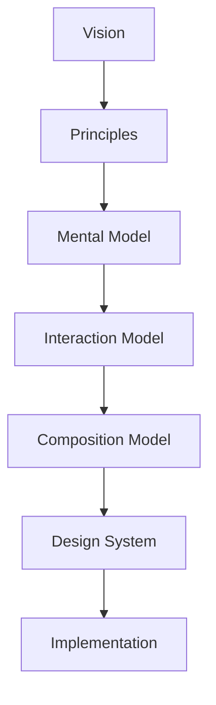
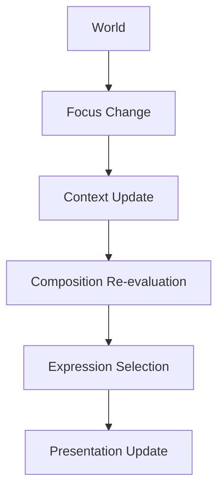

<!--
File: docs/design/language/mdl-004-interaction-model/index.md
Document: MDL-004
Status: Draft
Version: 0.4
-->

# MDL-004 — Interaction Model

> *Understanding explains the world. Interaction explains how the world changes.*

---

# Purpose

[MDL-001](../mdl-001-vision/index.md) established **why** Mosaic exists.

[MDL-002](../mdl-002-principles/index.md) established **how** design decisions are made.

[MDL-003](../mdl-003-mental-model/index.md) established **how Mosaic understands the world**.

MDL-004 defines **how that world behaves over time**.

Where the Mental Model describes concepts, the Interaction Model describes behaviour.

It explains:

- how Focus changes
- how Context evolves
- how Composition adapts
- how movement communicates understanding
- how continuity is preserved
- how users travel through their World without leaving it

---

# Relationship to Previous Specifications



The Interaction Model assumes the concepts introduced by the Mental Model already exist.

Its responsibility is to define how those concepts evolve during interaction.

---

# Scope

This specification defines:

- Behaviour
- Continuity
- Focus transitions
- Context transitions
- Temporal interaction
- Adaptive composition
- User flow
- Interaction hierarchy

This specification intentionally does **not** define:

- Motion timing
- Animation curves
- Materials
- Components
- Typography
- Layout
- Rendering

Those concerns belong to MDS.

---

# Guiding Question

MDL-004 exists to answer one question.

> **How should Mosaic behave?**

Not:

> How should it look?

---

# Behaviour Statement

Users should never feel they have navigated between disconnected pages.

Instead they should feel that:

> **Their World has naturally reorganised itself around what now matters.**

Everything within this specification reinforces that single idea.

---

# Primary Behaviour Model

The Interaction Model introduces the following behavioural pipeline.



Interaction is therefore defined as:

> **The continuous evolution of the user's World.**

---

# Expected Outcome

After reading MDL-004, contributors should understand:

- how Mosaic changes over time
- why movement exists
- why compositions evolve
- how continuity is preserved
- how interaction differs from navigation
- why adaptive behaviour exists

without discussing implementation.

---

# Repository Structure

```

design/

└── mdl/

    └── MDL-004 Interaction Model/

        README.md

        00-document-control.md

        01-what-is-an-interaction-model.md

        02-continuity.md

        03-focus-transitions.md

        04-context-transitions.md

        05-composition-evolution.md

        06-movement.md

        07-user-flow.md

        08-temporal-behaviour.md

        09-interaction-states.md

        10-user-vs-system-behaviour.md

        11-governance.md

        12-adrs.md

        13-contributor-guidance.md

        references.md

        glossary.md
```

---

# Dependencies

Required reading:

- [MDL-001 — Mosaic Design Language Vision](../mdl-001-vision/index.md)
- [MDL-002 — Principles](../mdl-002-principles/index.md)
- [MDL-003 — Mental Model](../mdl-003-mental-model/index.md)

Downstream specifications:

- [MDL-005 — Composition Model](../mdl-005-composition-model/index.md)
- [MDP-001 — Adaptive Composition Runtime](../../../engineering/architecture/mdp-001-adaptive-composition-runtime/index.md)
- [MDS-005 — Motion System](../../system/mds-005-motion-system/index.md)
- [MDS-008 — Component Library](../../system/mds-008-component-library/index.md)
