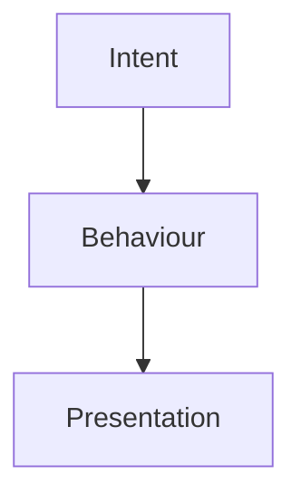
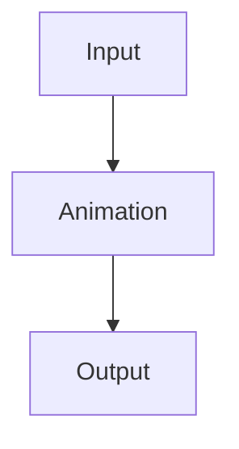

<!--
File: docs/design/language/mdl-004-interaction-model/references.md
Document: MDL-004
Title: References
Status: Draft
Version: 0.4
-->

# References

---

# Purpose

This document records the references and architectural influences that informed **MDL-004 — Interaction Model**.

The purpose of these references is to provide architectural context for contributors rather than implementation requirements.

MDL is intentionally opinionated.

External references inform the design language.

They do not define it.

---

# Reading Order

Contributors should approach references in the following order.

1. MDL Specifications
2. Product Behaviour
3. Human Factors
4. Motion & Interaction
5. Systems Architecture

The Mosaic Design Language always remains the authoritative source.

---

# Internal References

## [MDL-001 — Mosaic Design Language Vision](../mdl-001-vision/index.md)

Provides:

- Product vision
- Companion philosophy
- Immersion
- Long-term goals

Every behavioural decision defined by MDL-004 should reinforce the vision established by [MDL-001](../mdl-001-vision/index.md).

---

## [MDL-002 — Principles](../mdl-002-principles/index.md)

Provides:

- Behavioural decision framework
- Design governance
- Principle hierarchy

MDL-004 should be interpreted as the behavioural implementation of [MDL-002](../mdl-002-principles/index.md).

---

## [MDL-003 — Mental Model](../mdl-003-mental-model/index.md)

Provides:

- World
- Focus
- Context
- Information
- Relationships
- Composition
- Expressions

MDL-004 intentionally assumes these concepts already exist.

It defines how they evolve over time.

---

## Future Specifications

The following specifications depend directly upon the Interaction Model.

- [MDL-005 — Composition Model](../mdl-005-composition-model/index.md)
- [MDP-001 — Adaptive Composition Runtime](../../../engineering/architecture/mdp-001-adaptive-composition-runtime/index.md)
- [MDS-005 — Motion System](../../system/mds-005-motion-system/index.md)
- [MDP-001 — Adaptive Composition Runtime](../../../engineering/architecture/mdp-001-adaptive-composition-runtime/14-adaptive-tile-model.md)
- [MDS-008 — Component Library](../../system/mds-008-component-library/index.md)

These specifications should extend behaviour rather than redefine it.

---

# Human Factors

## Mental Models

The Interaction Model assumes users continually build expectations about system behaviour.

Interaction should reinforce those expectations.

Unexpected behaviour should remain rare.

---

## Cognitive Load

Reducing cognitive effort remains one of the primary behavioural objectives.

Behaviour should minimise:

- orientation effort
- context switching
- uncertainty
- unnecessary decision making

---

## Spatial Memory

The Interaction Model intentionally preserves:

- continuity
- object permanence
- behavioural consistency

Users should rarely need to reconstruct understanding after every interaction.

---

# Interaction Design

The following themes significantly influenced MDL-004.

## Continuity

Interfaces should evolve rather than restart.

---

## Progressive Disclosure

Information should become available as it becomes useful.

---

## Direct Manipulation

Users should feel that they are interacting with their World rather than operating software.

---

## Behaviour Before Animation

Motion communicates behaviour.

It should never invent behaviour.

---

# Systems Thinking

MDL-004 intentionally models interaction as a system rather than isolated events.

Key ideas include:

- continuous evolution
- state transitions
- behavioural hierarchy
- conceptual consistency

Future implementations should preserve these ideas regardless of technology.

---

# Behavioural Architecture

The Interaction Model intentionally separates:

rather than:

This distinction allows future client implementations to evolve independently while preserving a consistent behavioural language.

---

# Design Systems

The organisation of MDL draws inspiration from mature design systems that separate:

- philosophy
- principles
- conceptual models
- behaviour
- implementation

rather than treating interaction as a collection of component states.

Behaviour should remain platform-independent wherever practical.

---

# Software Architecture

Although MDL intentionally avoids implementation, the following architectural ideas influenced its structure.

- Separation of Concerns
- Event-Driven Systems
- State Machines
- Architecture Decision Records
- Documentation as Code

These influenced documentation organisation rather than behavioural philosophy.

---

# Mosaic-Specific Influences

The Interaction Model emerged directly from founder discovery workshops.

Major behavioural discoveries included:

- Worlds evolve rather than reset.
- Focus changes are more important than navigation.
- Context changes are more common than Focus changes.
- Movement exists to preserve understanding.
- Composition evolves continuously.
- Modules participate in behaviour rather than defining it.

These discoveries distinguish the Mosaic Interaction Model from traditional page-based applications.

---

# Normative References

Required reading before implementing MDL-004.

- [MDL-001 — Mosaic Design Language Vision](../mdl-001-vision/index.md)
- [MDL-002 — Principles](../mdl-002-principles/index.md)
- [MDL-003 — Mental Model](../mdl-003-mental-model/index.md)

---

# Informative References

Future contributors may also wish to review:

- [MDL-005 — Composition Model](../mdl-005-composition-model/index.md)
- [MDP-001 — Adaptive Composition Runtime](../../../engineering/architecture/mdp-001-adaptive-composition-runtime/index.md)
- [MDS-005 — Motion System](../../system/mds-005-motion-system/index.md)
- [MDP-001 — Adaptive Composition Runtime](../../../engineering/architecture/mdp-001-adaptive-composition-runtime/14-adaptive-tile-model.md)

These documents describe how the behavioural concepts established by MDL-004 become implementation.

---

# Living Document

This reference list should remain intentionally concise.

References should only be added when they materially influence:

- behavioural architecture
- interaction philosophy
- governance
- terminology

The purpose of this document is to preserve architectural reasoning rather than provide an exhaustive bibliography.

---

# Completion

This concludes **MDL-004 — Interaction Model**.

The next specification in the Mosaic Design Language is:

> **[MDL-005 — Composition Model](../mdl-005-composition-model/index.md)**

Where MDL-004 defines **how the user's World behaves**, [MDL-005](../mdl-005-composition-model/index.md) defines **how that World is organised into meaningful, adaptive compositions**.

[MDL-005](../mdl-005-composition-model/index.md) formalises concepts including:

- hierarchy
- adaptive composition
- anchors
- priorities
- density
- breathing space
- composition solving
- information organisation

It establishes the conceptual bridge between interaction and the Mosaic Design System.
