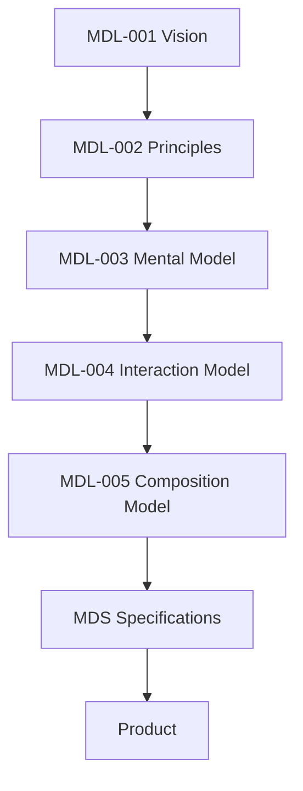

<!--
File: docs/design/language/mdl-005-composition-model/00-document-control.md
Document: MDL-005
Title: Composition Model
Status: Draft
Version: 0.4
-->

# Document Control

---

# Document Information

| Property | Value |
|----------|-------|
| Document ID | MDL-005 |
| Title | Mosaic Design Language — Composition Model |
| Classification | Internal |
| Status | Draft |
| Version | 0.4 |
| Owner | AdamNi-7080 |
| Parent Specifications | [MDL-001 — Mosaic Design Language Vision](../mdl-001-vision/index.md), [MDL-002 — Principles](../mdl-002-principles/index.md), [MDL-003 — Mental Model](../mdl-003-mental-model/index.md), [MDL-004 — Interaction Model](../mdl-004-interaction-model/index.md) |
| Repository | `/design/mdl/MDL-005 Composition Model/` |

---

# Purpose

MDL-005 defines how understanding becomes organisation.

The Mental Model defines:

> What exists.

The Interaction Model defines:

> How it changes.

The Composition Model defines:

> How it should be organised so people understand it.

Composition therefore represents the first specification where abstract understanding becomes a structured experience.

This distinction is fundamental to the Mosaic Design Language.

---

# Authority

The Composition Model governs:

- Information Hierarchy
- Visual Priority
- Structural Relationships
- Spatial Organisation
- Persistent Depth Relationships
- Cross-Plane Visibility
- Adaptive Density
- Composition Behaviour
- Layout Intent

The Composition Model intentionally does **not** govern:

- Materials
- Colours
- Typography
- Motion Curves
- Rendering Technologies
- Components

Those concerns belong to the Mosaic Design System.

---

# Relationship To MDL

The Composition Model intentionally sits between behaviour and presentation.

Everything beneath MDL-005 assumes that Composition has already determined:

- importance
- hierarchy
- grouping
- emphasis

Presentation merely communicates those decisions.

---

# Design Intent

Most interface systems begin with layout.

Rows.

Columns.

Grids.

Cards.

Containers.

Mosaic intentionally does not.

Composition begins with understanding.

The question is never:

> "Where should this card go?"

The question is:

> **"What deserves attention?"**

Only once that question has been answered should presentation become relevant.

---

# Behavioural Scope

This specification governs:

- Hierarchy
- Priority
- Hero
- Anchors
- Adaptive Composition
- Density
- Breathing Space
- Composition Solving

Future MDS specifications implement these concepts visually.

MDL defines them conceptually.

---

# Reader Expectations

Before reading this specification contributors should already understand:

- the Vision
- the Design Principles
- the Mental Model
- the Interaction Model

MDL-005 intentionally assumes familiarity with those concepts.

It extends them.

It does not redefine them.

---

# Stability

Composition should remain significantly more stable than presentation.

Expected lifetime.

| Artefact | Expected Lifetime |
|----------|-------------------|
| Components | Months |
| Layout Implementation | Months |
| Materials | Months |
| Composition | Years |
| Mental Model | Decades |

This stability allows Mosaic to evolve visually without changing how information is organised.

---

# Success Criteria

MDL-005 succeeds when:

- users instinctively know where to look
- information naturally forms hierarchy
- compositions adapt without becoming confusing
- modules integrate without disrupting understanding
- different clients express the same composition consistently
- layered compositions remain spatially coherent when their projected regions overlap

Composition should become invisible.

Users should remember understanding.

Not layout.
