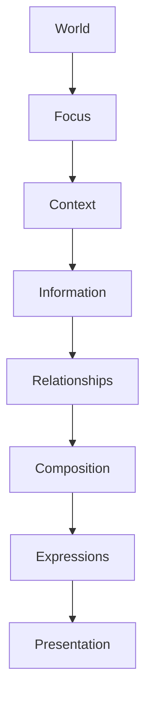

<!--
File: design/mdl/MDL-005 Composition Model/01-what-is-a-composition.md
Document: MDL-005
Chapter: 01
Title: What Is A Composition?
Status: Draft
Version: 0.1
-->

# What Is A Composition?

---

# Purpose

Before discussing hierarchy, priority or adaptive layouts, contributors must first understand what Mosaic means by the word **Composition**.

Within Mosaic, Composition is **not** another name for layout.

Nor is it another name for a screen.

Composition is a conceptual model.

It exists independently from interface technology.

Understanding this distinction is essential because almost every future MDS specification depends upon it.

---

# Definition

Within MDL, a **Composition** is defined as:

> **The intentional organisation of understanding into a coherent experience.**

Notice what this definition intentionally avoids.

A Composition is **not**:

- a page
- a screen
- a layout
- a dashboard
- a collection of components

Those are all implementations.

Composition exists before any of them.

---

# Why Composition Exists

Traditional applications organise interface.

Mosaic organises understanding.

This difference is subtle.

It changes everything.

Traditional thinking:

```
Layout

↓

Place Widgets

↓

Display Data
```

Mosaic thinking:

```
Understanding

↓

Determine Importance

↓

Create Composition

↓

Render Interface
```

The layout becomes the consequence of understanding.

Not its starting point.

---

# A Composition Is A Story

Every Composition should answer four questions immediately.

1. What currently matters?

2. Why does it matter?

3. What can I do next?

4. Where can I naturally continue?

If users cannot answer those questions within a few seconds, the Composition has failed.

---

# Composition Is Temporary

A Composition is never permanent.

It exists only to communicate the current state of the user's World.

As the World changes:

- Focus changes.
- Context changes.
- Relationships evolve.
- Information becomes available.

The Composition should evolve naturally alongside them.

The World remains.

The Composition changes.

---

# Composition Is Intentional

Nothing exists inside a Composition accidentally.

Every element should justify its presence.

Questions contributors should ask include:

- Why is this visible?
- Why now?
- Why here?
- Why not somewhere else?
- What understanding does it improve?

If those questions cannot be answered, the element probably does not belong.

---

# Composition Is Not Layout

This distinction cannot be overstated.

Layout answers:

> Where should something appear?

Composition answers:

> Why should something appear?

Many different layouts may correctly express the same Composition.

Likewise...

The same layout may communicate many different Compositions depending upon hierarchy and emphasis.

---

# Composition Is Behaviour

Composition should be viewed as behaviour rather than geometry.

Example.

User begins playback.

Behaviour:

```
Playback becomes primary.

↓

Timeline reduces.

↓

Progress increases.

↓

Related media becomes secondary.
```

The Composition has changed.

Nothing in this description references:

- rows
- columns
- spacing
- grids

Those belong to presentation.

---

# Composition Is Hierarchical

Every Composition naturally produces hierarchy.

Examples include:

Primary

↓

Supporting

↓

Contextual

↓

Peripheral

Hierarchy should emerge from:

- Focus
- Context
- Relationships

Never from arbitrary layout decisions.

---

# Composition Is Editorial

Composition is fundamentally an editorial activity.

Editors decide:

- what belongs
- what does not
- what deserves emphasis
- what should wait

Composition performs the same role.

Adding more information rarely improves a Composition.

Choosing the correct information almost always does.

---

# One Composition

Every experience should possess one dominant Composition.

Poor.

```
Hero

Trending

Downloads

News

Statistics

Plugins

Friends

Updates
```

Everything competes.

Nothing leads.

Preferred.

```
Current Focus

↓

Continue

↓

Relevant Information

↓

Related Exploration
```

One clear story.

One clear hierarchy.

---

# Composition Is Independent From Device

Composition belongs to understanding.

Not hardware.

Desktop.

Television.

Tablet.

Mobile.

Future devices.

All should communicate the same Composition.

Only presentation changes.

---

# Composition Is Independent From Components

Components communicate Composition.

They do not define it.

Example.

```
Hero
```

is not a component.

It is a role within a Composition.

Future MDS specifications may implement that role using:

- Tiles
- Shelves
- Posters
- Voice
- Projection

The Composition remains unchanged.

---

# Composition Is Independent From Motion

Motion explains Composition.

It does not create it.

If all animation were removed...

Users should still understand:

- hierarchy
- emphasis
- priority

Motion should reinforce understanding.

Never replace it.

---

# Good Examples

## Continue Watching

The Composition immediately communicates:

- current progress
- next episode
- current Focus

Supporting information naturally surrounds that journey.

Everything reinforces continuation.

---

## Reading

The Composition communicates:

- current chapter
- progress
- bookmarks
- related works

The user immediately understands where they are.

---

## Discovering

The Composition shifts naturally towards:

- relationships
- exploration
- connected works

Discovery becomes an extension of the current World.

Not a replacement for it.

---

# Anti-patterns

## Dashboard Composition

Attempting to expose every available capability simultaneously.

Understanding collapses.

---

## Equal Weight

Everything appears equally important.

Users must invent their own hierarchy.

---

## Layout Driven

Rows and columns determine hierarchy.

Meaning becomes secondary.

---

## Static Composition

Composition never changes despite changing Context.

The platform gradually becomes less relevant.

---

# Conceptual Model



Composition represents the final conceptual decision before communication begins.

---

# Litmus Test

Contributors should be able to remove every visual style from a Composition and still answer:

- What matters?
- Why?
- What should I do next?

If not...

The Composition depends upon presentation rather than understanding.

---

# Summary

Composition is the organisation of understanding.

It is not interface.

It is not layout.

It is not implementation.

A successful Composition allows users to instinctively understand their current World before consciously interpreting the interface.

Everything else within MDL-005 builds upon this definition.

---

# Review Status

**Status**

Draft

**Next File**

`02-hierarchy.md`
