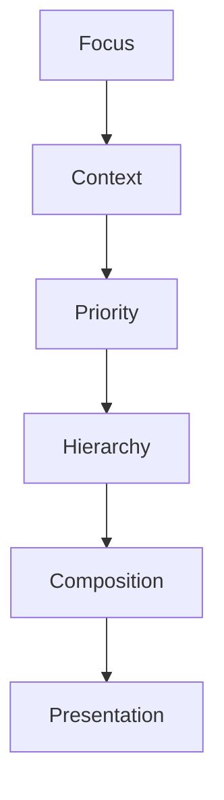

<!--
File: design/mdl/MDL-005 Composition Model/02-hierarchy.md
Document: MDL-005
Chapter: 02
Title: Hierarchy
Status: Draft
Version: 0.1
-->

# Hierarchy

---

# Purpose

Hierarchy is the primary mechanism through which a Composition communicates understanding.

Without hierarchy, every piece of information competes equally for attention.

Users are forced to construct their own understanding.

With hierarchy, the Composition communicates understanding before conscious thought occurs.

Hierarchy therefore exists to answer one question.

> **"What should the user notice first?"**

---

# Definition

Within MDL, **Hierarchy** is defined as:

> **The intentional ordering of attention according to the user's current World.**

Hierarchy is determined by:

- Focus
- Context
- Relationships
- User Intent

Hierarchy is **not** determined by:

- available screen space
- arbitrary layout
- implementation convenience
- visual decoration

Presentation communicates hierarchy.

It does not create it.

---

# Why Hierarchy Exists

Every Composition contains more information than users can process simultaneously.

Hierarchy reduces cognitive effort by establishing an order of attention.

Instead of asking:

> "Where should the user look?"

contributors should ask:

> **"What deserves attention?"**

The answer naturally produces hierarchy.

---

# Hierarchy Is Meaning

Hierarchy is fundamentally semantic.

The following two interfaces may contain identical information.

```
Interface A

Movie

Progress

Cast

Runtime

Genre

Reviews
```

```
Interface B

Movie

Progress

↓

Next Episode

↓

Related Works

↓

Everything Else
```

The second communicates understanding.

The first communicates inventory.

Hierarchy transforms information into experience.

---

# Hierarchy Emerges

Hierarchy should emerge naturally from the Mental Model.

```
World

↓

Focus

↓

Context

↓

Information

↓

Relationships

↓

Hierarchy

↓

Composition
```

Notice that hierarchy does not begin with interface.

It begins with understanding.

---

# The Four Levels

Every Composition should naturally organise information into four conceptual levels.

## Primary

Answers:

> **What matters now?**

Examples include:

- Current Focus
- Active Playback
- Continue Reading

Only one Primary concept should normally exist.

---

## Supporting

Answers:

> **What helps me continue?**

Examples include:

- Progress
- Timeline
- Next Episode
- Chapter Position
- Queue

Supporting information exists because it directly strengthens the Primary concept.

---

## Contextual

Answers:

> **Why does this matter?**

Examples include:

- Cast
- Author
- Studio
- Soundtrack
- Reviews
- Similar Works

Context enriches understanding.

It should not compete with continuation.

---

## Peripheral

Answers:

> **What else exists?**

Examples include:

- Recently Added
- Collections
- Administrative Information
- Background Statistics

Peripheral information should remain available without competing for attention.

---

# One Primary Hierarchy

Every Composition should possess exactly one dominant hierarchy.

Poor.

```
Trending

Continue Watching

Recently Added

Downloads

Recommendations

Collections
```

Everything competes.

Nothing leads.

Preferred.

```
Continue Watching

↓

Next Episode

↓

Timeline

↓

Relationships

↓

Collections
```

The user's attention naturally flows through the Composition.

---

# Hierarchy Is Dynamic

Hierarchy should evolve continuously.

Example.

Before playback.

```
Episode

↓

Synopsis

↓

Runtime
```

During playback.

```
Playback

↓

Progress

↓

Remaining Time
```

After playback.

```
Next Episode

↓

Progress

↓

Related Works
```

The information remains largely identical.

Its hierarchy changes.

---

# Hierarchy Is Relative

Importance is always relative.

Example.

```
Runtime
```

Before playback.

Useful.

During playback.

Almost irrelevant.

Likewise.

```
Cast
```

While exploring.

Important.

While watching.

Peripheral.

Hierarchy should therefore remain contextual rather than absolute.

---

# Hierarchy Across Domains

Hierarchy should remain conceptually consistent across every entertainment domain.

Television.

```
Current Episode

↓

Progress

↓

Next Episode
```

Books.

```
Current Chapter

↓

Progress

↓

Next Chapter
```

Music.

```
Current Track

↓

Playback

↓

Queue
```

Different information.

Identical hierarchy.

This consistency strengthens the Mental Model.

---

# Hierarchy Is Behaviour

Hierarchy should change before presentation changes.

Example.

```
Episode Released

↓

Priority Increases

↓

Hierarchy Changes

↓

Presentation Updates
```

The behavioural decision precedes the interface.

Future Composition Engines should preserve this ordering.

---

# Good Examples

## Watching

```
Primary

Playback

↓

Supporting

Progress

↓

Contextual

Characters

↓

Peripheral

Collections
```

---

## Reading

```
Primary

Current Chapter

↓

Supporting

Bookmarks

↓

Contextual

Author

↓

Peripheral

Library
```

---

## Exploring

```
Primary

Current Focus

↓

Supporting

Relationships

↓

Contextual

Metadata

↓

Peripheral

History
```

The behavioural pattern remains identical.

---

# Anti-patterns

## Equal Importance

Every item receives identical emphasis.

The user must invent hierarchy.

---

## Decorative Hierarchy

Hierarchy created solely through colour or animation.

Meaning should exist before presentation.

---

## Static Hierarchy

Hierarchy never changes despite changing Context.

The interface gradually becomes irrelevant.

---

## Multiple Primaries

Several competing concepts all attempt to become the centre of attention.

The Composition loses clarity.

---

# Hierarchy Model



Hierarchy translates priority into understanding.

Presentation merely communicates it.

---

# Relationship To Priority

Hierarchy and Priority are closely related.

They are not identical.

Priority answers:

> **How important is this?**

Hierarchy answers:

> **How should that importance be communicated?**

Priority is an internal decision.

Hierarchy is an organisational decision.

This distinction becomes important in the next chapter.

---

# Summary

Hierarchy organises understanding.

It allows users to instinctively know:

- what matters
- why it matters
- what deserves attention next

without consciously interpreting the interface.

Hierarchy should emerge from the user's World.

Never from arbitrary interface structure.

---

# Review Status

**Status**

Draft

**Next File**

`03-priority.md`
