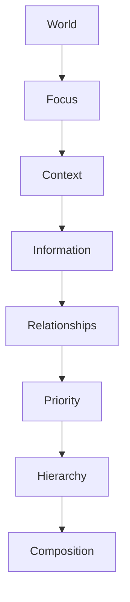

<!--
File: docs/design/language/mdl-005-composition-model/03-priority.md
Document: MDL-005
Chapter: 03
Title: Priority
Status: Draft
Version: 0.2
-->

# Priority

---

# Purpose

Hierarchy determines **how understanding is organised**.

Priority determines **why one piece of information deserves more attention than another**.

Priority is one of the Platform foundation behavioural inputs to the Composition Model.

Without Priority, every Composition becomes arbitrary.

With Priority, hierarchy emerges naturally from the user's World.

Priority therefore answers one question.

> **"How important is this information right now?"**

---

# Definition

Within MDL, **Priority** is defined as:

> **The relative importance of Information within the user's current World.**

Priority is dynamic.

It changes as:

- Focus changes
- Context changes
- Relationships evolve
- Time passes
- User intent changes

Priority is never fixed.

---

# Why Priority Exists

A World contains significantly more Information than can be communicated simultaneously.

Example.

```
Current Episode

Cast

Reviews

Genres

Runtime

Artwork

Next Episode

Characters

Soundtrack

Studio

Progress

Collections

History
```

Every item is useful.

Not every item is equally important.

Priority allows Mosaic to determine:

- what deserves immediate attention
- what should remain visible
- what may quietly recede
- what should remain available but peripheral

---

# Priority Exists Before Hierarchy

Priority should always be determined before hierarchy.

```
World

↓

Focus

↓

Context

↓

Information

↓

Relationships

↓

Priority

↓

Hierarchy

↓

Composition
```

Hierarchy communicates Priority.

It should never invent it.

---

# Priority Is Contextual

Priority is not an inherent property of Information.

It is a property of the current experience.

Example.

```
Runtime
```

Browsing a film.

Medium Priority.

Watching the film.

Low Priority.

Likewise.

```
Next Episode
```

Before finishing the current episode.

Low Priority.

After finishing.

Very High Priority.

The Information remains identical.

Priority changes.

---

# Priority Levels

The Composition Model defines four conceptual priority levels.

## Critical

Information required immediately.

Examples.

- Active playback
- Reading position
- Current Focus

A Composition should rarely contain more than one or two Critical concepts.

---

## High

Information directly supporting the current activity.

Examples.

- Progress
- Timeline
- Next Episode
- Queue
- Continue Reading

High Priority information should remain easily discoverable.

---

## Medium

Information enriching the current experience.

Examples.

- Cast
- Author
- Reviews
- Related Works
- Studio

Medium Priority should support exploration.

It should not interrupt continuation.

---

## Low

Information valuable only in specific situations.

Examples.

- Technical metadata
- Collections
- Administrative information
- Historical statistics

Low Priority information should remain accessible without competing for attention.

---

# Priority Is Relative

Priority should always be evaluated relative to the current World.

Example.

```
Watching

↓

Playback

Critical

↓

Reviews

Medium
```

Later.

```
Browsing Reviews

↓

Reviews

High

↓

Playback

Low
```

Nothing changed except the user's intent.

Priority naturally followed.

---

# Priority Is Temporal

Time influences Priority.

Example.

```
Episode

↓

Releases

Tomorrow
```

Priority:

Medium.

```
Episode

↓

Available

Now
```

Priority:

High.

```
Episode

↓

Watched
```

Priority:

Low.

Temporal behaviour therefore continuously influences Priority without changing the underlying Information.

---

# Priority Is Behaviour

Priority is a behavioural decision.

It should never be determined purely by presentation.

Poor.

```
Large Tile

↓

Must Be Important
```

Correct.

```
Important

↓

Receives Larger Expression
```

Presentation reflects Priority.

It does not determine it.

---

# Priority And Modules

Modules should never assign visual priority.

Instead they contribute Information.

The platform evaluates Priority using:

- current Focus
- current Context
- existing Relationships
- temporal relevance
- user intent

This ensures every module behaves consistently.

---

# Priority Compression

When space becomes limited:

Priority determines what compresses first.

The preferred order is:

1. Low
2. Medium
3. High
4. Critical

Critical information should disappear only when no alternative exists.

Compression should preserve understanding before preserving completeness.

---

# Priority Expansion

When more space becomes available:

Priority determines what expands first.

Expansion order:

1. Critical
2. High
3. Medium
4. Low

Additional space should reveal deeper understanding.

Not unrelated information.

---

# Good Examples

## Watching

```
Critical

Playback

↓

High

Progress

↓

High

Next Episode

↓

Medium

Characters

↓

Low

Collections
```

---

## Reading

```
Critical

Current Chapter

↓

High

Bookmarks

↓

Medium

Author

↓

Low

Reading Statistics
```

---

## Exploring

```
Critical

Current Focus

↓

High

Relationships

↓

Medium

Metadata

↓

Low

Administration
```

Priority adapts naturally to intent.

---

# Anti-patterns

## Fixed Priority

Information always appears with identical importance.

The Composition becomes inflexible.

---

## Popularity Priority

Trending information overrides the user's current World.

Platform goals replace user goals.

---

## Visual Priority

Colour, animation or size artificially create importance without conceptual justification.

Meaning should always precede presentation.

---

## Unlimited High Priority

Everything attempts to become important.

Hierarchy collapses.

Understanding decreases.

---

# Priority Model



Priority is the bridge between understanding and organisation.

---

# Relationship To Hero

The Hero is not manually chosen.

It naturally emerges from Priority.

The highest-priority concept within the current Composition generally becomes the Hero.

This relationship is formalised in the next chapter.

---

# Summary

Priority determines the importance of Information within the user's current World.

It is dynamic.

It is contextual.

It is behavioural.

Hierarchy communicates Priority.

Composition organises it.

Presentation expresses it.

This separation allows Mosaic to remain adaptive while preserving a stable conceptual model.

---

# Review Status

**Status**

Draft

**Next File**

`04-hero.md`
