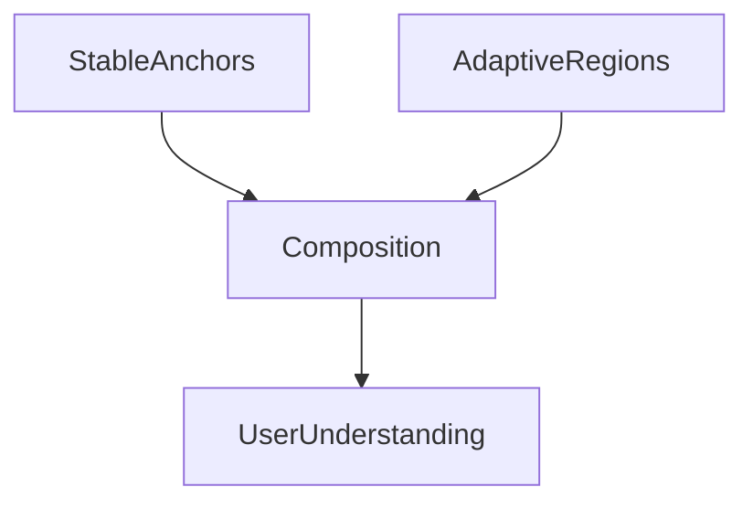

<!--
File: docs/design/language/mdl-005-composition-model/05-anchors.md
Document: MDL-005
Chapter: 05
Title: Anchors
Status: Draft
Version: 0.2
-->

# Anchors

---

# Purpose

If the Hero establishes the centre of gravity within a Composition, **Anchors** establish stability.

Without Anchors, adaptive interfaces become disorientating.

Everything moves.

Nothing feels reliable.

With Anchors, the Composition may evolve significantly while users retain a strong sense of orientation.

Anchors are therefore the mechanism through which Mosaic balances adaptability with predictability.

---

# Definition

Within MDL, an **Anchor** is defined as:

> **A stable conceptual region whose primary responsibility is preserving orientation while the surrounding Composition evolves.**

Notice the wording.

An Anchor is **not**:

- a fixed component
- a fixed location
- a fixed piece of interface

It is a stable point of understanding.

Presentation may differ.

Purpose does not.

---

# Why Anchors Exist

Adaptive interfaces naturally introduce movement.

Movement improves understanding only while users continue recognising where they are.

Anchors provide that recognition.

They answer questions such as:

- Where am I?
- Am I still inside the same World?
- Has everything changed?
- What stayed the same?

Without Anchors, users repeatedly reconstruct their mental model.

With Anchors, users simply observe the World evolving.

Stable anchor points are widely recognised as one of the primary mechanisms for preserving users' spatial memory while interfaces adapt.  [uxmatters.com](https://www.uxmatters.com/mt/archives/2026/05/designing-stable-user-interfaces.php)

---

# Stability Before Position

Anchors should be understood conceptually rather than geometrically.

Poor definition.

```
Navigation

Always Left
```

Better definition.

```
Navigation

Always Stable
```

Whether Navigation appears:

- left
- bottom
- television overlay
- voice interface

its behavioural role remains identical.

The Anchor survives.

Presentation changes.

---

# Types Of Anchors

Every Composition should naturally contain several Anchor types.

---

## Navigation Anchor

Purpose:

Maintain orientation within the user's World.

Responsibilities:

- Domains
- Global navigation
- Current location

The Navigation Anchor should move rarely.

---

## Focus Anchor

Purpose:

Continuously communicate the current Focus.

Examples include:

- Current Series
- Current Book
- Current Album

Even while surrounding information evolves, users should immediately recognise what currently matters.

---

## Playback Anchor

Purpose:

Preserve continuity during consumption.

Examples include:

- playback controls
- progress
- current chapter

Playback should remain behaviourally stable while surrounding Composition adapts.

---

## Search Anchor

Purpose:

Provide predictable access to discovery.

Search should never become difficult to locate simply because Context changed.

---

## Identity Anchor

Purpose:

Communicate whose World is currently being experienced.

Future capabilities such as:

- Family Worlds
- Shared Worlds
- Child Worlds

will rely heavily upon Identity Anchors.

---

# Anchors And Adaptation

Anchors intentionally resist change.

Everything else remains adaptive.

Conceptually.

```
Anchors

↓

Stable

Adaptive Regions

↓

Flexible
```

The adaptive parts of the Composition evolve around the Anchors.

Not the reverse.

---

# Anchors And Behaviour

Anchors should change only when behaviour genuinely changes.

Example.

Watching.

```
Playback

↓

Stable
```

Browsing metadata.

Playback should remain recognisable.

Changing Domains.

Navigation remains stable.

Current Focus changes.

Anchors preserve understanding while adaptive information reorganises.

---

# Anchors Across Devices

Anchors should preserve behavioural identity rather than position.

Desktop.

```
Navigation

Left
```

Mobile.

```
Navigation

Bottom
```

Television.

```
Navigation

Overlay
```

The behavioural role remains identical.

Only presentation changes.

This distinction is fundamental.

---

# Anchors And Composition

Anchors exist outside ordinary hierarchy.

Hierarchy answers:

> What deserves attention?

Anchors answer:

> What should remain understandable?

An Anchor may therefore possess lower visual priority while remaining behaviourally critical.

---

# Anchors And Hero

Hero and Anchor intentionally solve different problems.

| Hero | Anchor |
|-------|---------|
| Communicates attention | Preserves orientation |
| Dynamic | Stable |
| Emerges from Priority | Exists independently of Priority |
| Frequently changes | Rarely changes |

Both are required.

Without Hero...

Nothing leads.

Without Anchors...

Everything drifts.

---

# Good Examples

## Watching

Stable.

- Navigation
- Playback
- Search

Adaptive.

- Timeline
- Related Works
- Cast
- Recommendations

Users remain oriented while information evolves.

---

## Reading

Stable.

- Reading Progress
- Search
- Current Book

Adaptive.

- Author
- Notes
- Related Series
- Characters

Again...

Stability and adaptation coexist.

---

## Domain Change

Changing from:

```
Anime

↓

Books
```

The Navigation Anchor remains recognisable.

The adaptive Composition reorganises.

Users understand they changed Domain.

Not product.

---

# Anti-patterns

## Everything Moves

Every element repositions during adaptation.

Users lose spatial memory.

---

## No Stable Regions

The interface possesses no reliable reference points.

Every interaction requires reconstruction.

---

## Decorative Anchors

Large visual regions possessing no behavioural responsibility.

Anchors exist to preserve understanding.

Not symmetry.

---

## Anchors Competing With Hero

Stable elements continually compete with current Focus.

Orientation begins overwhelming attention.

---

# Behavioural Model



Anchors preserve.

Adaptive regions evolve.

Together they produce understandable interaction.

---

# Relationship To Future Specifications

Future specifications should treat Anchors as first-class behavioural concepts.

Examples include:

- MDS Composition Engine
- Adaptive Layout Solver
- Motion System
- Responsive Behaviour
- Accessibility

Every future adaptive system should preserve Anchors before optimising presentation.

---

# Summary

Anchors are the stable reference points within the user's World.

They allow Mosaic to become highly adaptive without becoming unpredictable.

The more adaptive the platform becomes...

The more valuable Anchors become.

They are the quiet constants that allow everything else to evolve naturally.

---

# Review Status

**Status**

Draft

**Next File**

`06-adaptive-composition.md`
