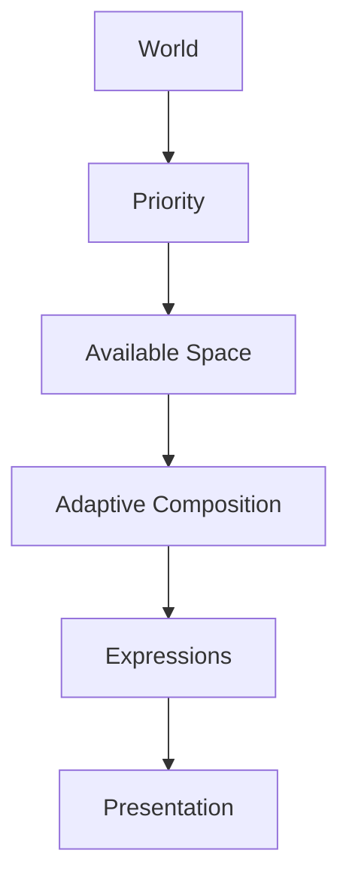

<!--
File: design/mdl/MDL-005 Composition Model/06-adaptive-composition.md
Document: MDL-005
Chapter: 06
Title: Adaptive Composition
Status: Draft
Version: 0.1
-->

# Adaptive Composition

---

# Purpose

A Composition should never be considered a fixed arrangement of interface elements.

The user's World is constantly evolving.

Devices differ.

Contexts change.

Relationships emerge.

Space changes.

Plugins contribute new information.

Adaptive Composition exists to ensure that the organisation of understanding evolves naturally without requiring contributors to design every possible state individually.

Unlike responsive layout systems, Adaptive Composition does **not** begin with screen size.

It begins with understanding.

---

# Definition

Within MDL, **Adaptive Composition** is defined as:

> **The ability of a Composition to continuously reorganise itself while preserving understanding.**

Adaptation should always preserve:

- hierarchy
- continuity
- orientation
- intent

Adaptation should never feel random.

---

# Why Adaptive Composition Exists

Traditional interfaces often behave like templates.

```
Desktop Layout

↓

Tablet Layout

↓

Phone Layout
```

Every device receives a different layout.

Mosaic intentionally adopts a different approach.

```
One Composition

↓

Many Presentations
```

The Composition remains conceptually identical.

Presentation adapts.

This distinction allows the user's World to remain recognisable regardless of device.

---

# Adaptation Begins With Meaning

Adaptive Composition should never ask:

> **"How much space do we have?"**

Instead it asks:

> **"What currently deserves attention?"**

Only after hierarchy has been established should available space influence presentation.

Meaning therefore precedes geometry.

---

# Inputs

Adaptive Composition evaluates the following conceptual inputs.

```text
World

↓

Focus

↓

Context

↓

Priority

↓

Relationships

↓

Available Space

↓

Composition
```

Notice that available space appears almost at the end.

The user's World remains the primary input.

---

# Adaptation Triggers

Adaptive Composition should respond naturally to changes in:

## User Behaviour

Examples include:

- beginning playback
- completing playback
- changing Focus
- changing Domain
- opening supporting information

---

## Time

Examples include:

- new episode released
- countdown completed
- metadata updated
- scheduled event

---

## Device

Examples include:

- phone
- tablet
- television
- desktop

---

## Environment

Future implementations may also adapt according to:

- orientation
- accessibility preferences
- available display area
- viewing distance

These are implementation inputs.

They should never override the user's World.

---

# Adaptive Rules

Adaptive Composition should follow several behavioural rules.

---

## Rule One

Preserve understanding.

Understanding should never decrease simply because adaptation occurred.

---

## Rule Two

Preserve hierarchy.

Primary concepts should remain primary.

Supporting concepts should remain supporting.

---

## Rule Three

Preserve continuity.

Users should understand why adaptation occurred.

---

## Rule Four

Adapt locally before globally.

Small changes should produce small adaptations.

---

## Rule Five

Reduce before removing.

Compression should always be preferred over disappearance.

---

# Adaptation Strategies

Adaptive Composition possesses several conceptual strategies.

---

## Compression

Information communicates less while remaining present.

Example.

Timeline.

```
10 Episodes

↓

3 Episodes

↓

1 Episode
```

The concept survives.

Its expression changes.

---

## Expansion

Additional understanding becomes available.

Example.

Progress.

```
Percentage

↓

Percentage + Chapter

↓

Percentage + Chapter + Remaining Time
```

The same concept simply becomes richer.

---

## Reordering

Priority changes.

The Composition reorganises.

No information is lost.

---

## Grouping

Related Information combines into larger conceptual units.

Grouping reduces cognitive effort while preserving understanding.

---

## Progressive Disclosure

Information remains available.

It simply waits until it becomes useful.

This should always be preferred over immediate overload.

---

# Compression Hierarchy

When adaptation becomes necessary, concepts should compress in the following order.

```
Low Priority

↓

Medium Priority

↓

Supporting Information

↓

High Priority

↓

Critical Information
```

Critical understanding should remain visible for as long as possible.

---

# Expansion Hierarchy

As additional space becomes available:

```
Critical

↓

Supporting

↓

Contextual

↓

Peripheral
```

The user's understanding should deepen naturally.

Not broaden randomly.

---

# Device Independence

Adaptive Composition intentionally separates:

```
Composition

↓

Presentation
```

Desktop.

```
Large Hero

Expanded Timeline

Rich Relationships
```

Mobile.

```
Compact Hero

Condensed Timeline

Progressive Relationships
```

Television.

```
Immersive Hero

Minimal Navigation

Large Artwork
```

The Composition remains identical.

Only expression changes.

---

# Plugins

Extensions should not adapt themselves.

Instead they contribute:

- Information
- Relationships

The platform evaluates:

- hierarchy
- priority
- available space
- accessibility

This guarantees one coherent adaptive system across the entire platform.

---

# Good Examples

## Phone

Limited space.

Timeline compresses.

Relationships progressively disclose.

Current Focus remains obvious.

---

## Desktop

Additional space.

Timeline expands.

Relationships deepen.

Artwork grows.

The World becomes richer.

---

## Television

Distance increases.

Typography enlarges.

Peripheral information compresses.

Hero becomes dominant.

The same Composition adapts naturally.

---

# Anti-patterns

## Responsive Templates

Creating unrelated layouts for every device.

The user's World fragments.

---

## Random Adaptation

Information appears and disappears unpredictably.

Understanding decreases.

---

## Priority Reversal

Less important information becomes dominant simply because additional space exists.

Meaning has been replaced by geometry.

---

## Plugin Layout

Extensions independently adapting interface.

Adaptive behaviour becomes inconsistent.

---

# Adaptive Behaviour Model



Adaptation should always preserve the conceptual model.

Presentation changes.

Understanding does not.

---

# Summary

Adaptive Composition allows one conceptual experience to exist across many different devices and situations.

Adaptation should always strengthen understanding.

Never weaken it.

Users should recognise their World immediately regardless of:

- screen size
- device
- orientation
- accessibility preferences

Adaptive Composition therefore represents one of the defining architectural capabilities of Mosaic.

---

# Review Status

**Status**

Draft

**Next File**

`07-density.md`
