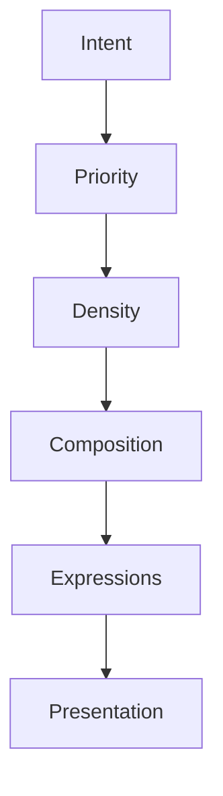

<!--
File: docs/design/language/mdl-005-composition-model/07-density.md
Document: MDL-005
Chapter: 07
Title: Density
Status: Draft
Version: 0.2
-->

# Density

---

# Purpose

Density describes **how much understanding should be communicated at one time**.

Within traditional user interface design, density is frequently treated as a visual concern.

Examples include:

- spacing
- margins
- compact mode
- comfortable mode

Within the Mosaic Design Language, density is **not** a visual property.

Density is a property of the Composition.

It determines how much understanding should be communicated before presentation begins.

---

# Definition

Within MDL, **Density** is defined as:

> **The amount of conceptual information intentionally communicated within a Composition.**

Density describes understanding.

Not pixels.

Not spacing.

Not screen size.

---

# Why Density Exists

The amount of information appropriate for one situation is rarely appropriate for another.

Examples.

Watching a film.

The user typically needs:

- playback
- progress
- subtitles
- next episode

Everything else should quietly recede.

Exploring a franchise.

The user now expects:

- relationships
- chronology
- cast
- soundtrack
- adaptations
- production

The Composition naturally becomes denser.

The difference is driven by intent.

Not available space.

---

# Density Is Behaviour

Density should emerge from the user's current activity.

Poor.

```
Desktop

↓

Dense

Phone

↓

Sparse
```

Preferred.

```
Watching

↓

Sparse

Exploring

↓

Dense
```

The behavioural state determines density.

Presentation simply communicates it.

---

# Sparse Composition

Sparse compositions intentionally communicate very little.

Their purpose is clarity.

Characteristics include:

- one obvious Hero
- minimal competing information
- generous breathing space
- strong hierarchy
- low cognitive effort

Examples include:

- playback
- reading
- listening
- continuing

Sparse compositions should help users disappear into entertainment.

---

# Moderate Composition

Moderate density balances:

- continuation
- exploration
- understanding

Examples include:

- series overview
- current season
- artist profile
- author profile

Most everyday interactions should naturally occupy this level.

---

# Rich Composition

Rich compositions support investigation.

Examples include:

- franchise exploration
- collections
- relationship browsing
- administration
- metadata editing

Rich compositions intentionally communicate more understanding.

However...

Hierarchy should remain obvious.

Rich does **not** mean cluttered.

---

# Density Is Relative

The same information may contribute to different density levels depending upon Context.

Example.

```
Reviews
```

Watching.

Low relevance.

Exploring.

High relevance.

The information remains unchanged.

Density changes.

---

# Density Is Adaptive

Density should naturally increase and decrease over time.

Example.

```
Playback Begins

↓

Sparse

↓

Playback Ends

↓

Moderate

↓

Exploration Begins

↓

Rich
```

The user should never consciously notice this transition.

They should simply feel that the platform continues supporting their current intent.

---

# Density And Space

Available space influences expression.

It does **not** determine density.

Example.

Television.

Large display.

Current activity.

```
Watching
```

The Composition should remain sparse.

Additional space should strengthen clarity.

Not introduce unrelated information.

Likewise.

Phone.

Limited display.

Current activity.

```
Exploring
```

The Composition should remain rich.

Information should compress.

Not disappear arbitrarily.

Meaning remains stable.

Expression adapts.

---

# Density And Priority

Density should always respect Priority.

```
Critical

↓

High

↓

Medium

↓

Low
```

Increasing density should reveal progressively lower-priority information.

Reducing density should hide lower-priority understanding first.

Priority therefore governs density.

Never the reverse.

---

# Density And Breathing Space

Sparse compositions naturally contain more breathing space.

Rich compositions naturally contain less.

However...

Breathing space should never disappear completely.

Every Composition requires visual rhythm.

Without rhythm...

Understanding becomes difficult regardless of information quality.

---

# Density Across Domains

Every entertainment domain should support the same density model.

Television.

```
Playback

↓

Sparse
```

Books.

```
Reading

↓

Sparse
```

Anime.

```
Franchise Exploration

↓

Rich
```

Music.

```
Artist Discovery

↓

Rich
```

Different media.

Identical behavioural expectations.

---

# Good Examples

## Playback

```
Hero

↓

Playback

↓

Progress

↓

Timeline
```

Nothing more.

The Composition remains intentionally quiet.

---

## Series Overview

```
Hero

↓

Continue

↓

Timeline

↓

Relationships

↓

Cast

↓

Reviews
```

The Composition communicates significantly more understanding.

Yet hierarchy remains clear.

---

## Administration

```
Navigation

↓

Current Task

↓

Configuration

↓

Diagnostics
```

Rich information.

Strong organisation.

No unnecessary decoration.

---

# Anti-patterns

## Artificial Density

Adding information simply because additional space exists.

Understanding decreases.

---

## Responsive Density

Changing density purely because screen size changed.

Behaviour becomes inconsistent.

---

## Maximum Density

Displaying every available concept simultaneously.

The Composition becomes a catalogue.

Not an experience.

---

## Decorative Density

Using visual effects to imply richness without increasing understanding.

Complexity increases.

Meaning does not.

---

# Density Model



Density emerges from intent.

Presentation communicates density.

Not the other way around.

---

# Relationship To Future Specifications

Future specifications should treat Density as a conceptual property.

Examples include:

- Composition Engine
- Tile Framework
- Material System
- Motion System
- Responsive Behaviour

Density should influence every one of these systems.

None of them should redefine it.

---

# Summary

Density describes how much understanding should be communicated.

Not how tightly information is arranged.

Sparse compositions optimise immersion.

Rich compositions optimise exploration.

The correct density is always determined by the user's current World.

Never by the available pixels.

---

# Review Status

**Status**

Draft

**Next File**

`08-breathing-space.md`
