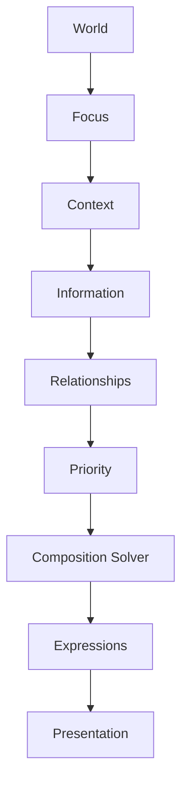

<!--
File: docs/design/language/mdl-005-composition-model/09-composition-solving.md
Document: MDL-005
Chapter: 09
Title: Composition Solving
Status: Draft
Version: 0.2
-->

# Composition Solving

---

# Purpose

Previous chapters defined what a Composition is and how it should behave.

This chapter introduces one of the most important concepts within the Mosaic Design Language.

The **Composition Solver**.

Unlike traditional layout engines, the Composition Solver does not solve geometry.

It solves understanding.

Its responsibility is to determine the best possible Composition for the user's current World before any visual layout occurs.

This chapter represents the conceptual foundation for the future **MDS Composition Engine**.

---

# Definition

Within MDL, **Composition Solving** is defined as:

> **The process of determining the optimal organisation of understanding for the user's current World.**

The Composition Solver answers one question.

> **Given everything we currently know, what should the user understand first?**

---

# Why A Solver Exists

Traditional interfaces frequently rely upon manually authored layouts.

Examples.

```
Home

↓

Fixed Sections

↓

Render
```

or

```
Screen

↓

Grid

↓

Populate Widgets
```

These systems assume every user requires the same organisation.

Mosaic intentionally rejects this assumption.

Every World is different.

Every Focus is different.

Every Context is different.

The Composition should therefore be solved.

Not hardcoded.

---

# Solving Understanding

The Composition Solver is **not** a layout algorithm.

It never asks:

- Which row?
- Which column?
- Which pixel?

Instead it asks:

- What matters?
- Why?
- What supports it?
- What can wait?
- What should disappear?

The output is understanding.

Presentation is solved afterwards.

---

# Inputs

The Composition Solver receives conceptual inputs.

```text
World

↓

Focus

↓

Context

↓

Information

↓

Relationships

↓

Priority

↓

Available Capabilities
```

Notice that layout information is intentionally absent.

The solver operates entirely within the conceptual domain.

---

# Outputs

The Composition Solver produces:

- Hero
- Hierarchy
- Priority Ordering
- Groupings
- Adaptive Density
- Expressions
- Behavioural Intent

These outputs are consumed later by the Design System.

The solver never creates interface directly.

---

# Solving Order

Every Composition should be solved using the same conceptual sequence.

```text
1.

Current World

↓

2.

Current Focus

↓

3.

Current Context

↓

4.

Relevant Information

↓

5.

Relationships

↓

6.

Priority

↓

7.

Composition

↓

8.

Expressions

↓

9.

Presentation
```

Skipping stages weakens understanding.

---

# The Solver Never Guesses

The Composition Solver should never invent understanding.

It should only organise understanding that already exists.

Poor.

```
Maybe this is important.
```

Preferred.

```
Current Context indicates this is important.
```

Understanding should emerge from evidence.

Not assumption.

---

# Solving Is Deterministic

Given identical inputs...

The Composition Solver should always produce the same conceptual output.

Example.

```
World

↓

Frieren

↓

Watching

↓

Episode 15
```

Every client should produce the same Composition.

Presentation may differ.

Understanding must remain identical.

This deterministic behaviour is fundamental to preserving the Mosaic Mental Model across platforms.

---

# Solving Priority

Priority should be determined before solving Composition.

Example.

```
Episode

High

↓

Timeline

Medium

↓

Reviews

Low
```

The solver should never determine Priority.

Priority is an input.

Composition is the result.

---

# Solving Relationships

Relationships significantly influence Composition.

Example.

```
Episode

↓

Manga

↓

Author

↓

Next Episode
```

These relationships naturally suggest:

```
Continue

↓

Timeline

↓

Related Works
```

The solver should therefore prefer meaningful relationships over arbitrary ordering.

---

# Solving For Intent

The Composition Solver should optimise the user's current intent.

Example.

Intent.

```
Continue Watching
```

Preferred Composition.

```
Playback

↓

Progress

↓

Next Episode
```

Not.

```
Trending

↓

Collections

↓

Statistics
```

Intent always possesses higher authority than inventory.

---

# Solving Across Devices

The Composition Solver should remain device independent.

Desktop.

```
Composition

↓

Desktop Presentation
```

Phone.

```
Composition

↓

Phone Presentation
```

Television.

```
Composition

↓

TV Presentation
```

The solved understanding remains identical.

Only the presentation changes.

---

# Solving With Modules

Modules should never influence the solving process directly.

Modules contribute:

- Information
- Relationships

The platform determines:

- Priority
- Hierarchy
- Hero
- Expressions

This preserves one coherent behavioural language.

Modules strengthen the World.

They do not redesign it.

---

# Failure Conditions

A Composition should be considered unsolved when:

- multiple Heroes compete
- hierarchy is unclear
- unrelated information dominates
- understanding depends upon presentation
- users must consciously search for what matters

The solver has failed if users ask:

> "Where should I look?"

---

# Good Examples

## Watching

Inputs.

```
Current Episode

↓

Progress

↓

Next Episode

↓

Cast

↓

Reviews
```

Solved Composition.

```
Hero

↓

Progress

↓

Timeline

↓

Relationships

↓

Metadata
```

Understanding emerges naturally.

---

## Reading

Inputs.

```
Current Chapter

↓

Bookmarks

↓

Series

↓

Author

↓

Statistics
```

Solved Composition.

```
Hero

↓

Reading Progress

↓

Bookmarks

↓

Series

↓

Statistics
```

Again...

Understanding leads.

---

# Anti-patterns

## Layout Solving

Choosing positions before determining importance.

---

## Component Solving

Thinking in:

- cards
- shelves
- widgets

instead of understanding.

---

## Responsive Solving

Changing hierarchy because screen size changed.

Meaning should remain constant.

Only expression adapts.

---

## Module Solving

Modules determining:

- Hero
- Priority
- Hierarchy

The platform loses ownership of understanding.

---

# Conceptual Solver



The Composition Solver exists entirely before presentation.

Its output is understanding.

Not interface.

---

# Relationship To MDS

This chapter intentionally avoids implementation.

The future **MDS Composition Engine** will define:

- algorithms
- heuristics
- runtime solving
- optimisation
- caching
- adaptive rendering

MDL defines only the conceptual expectations.

MDS defines the implementation.

---

# Summary

Composition Solving is one of the defining architectural ideas of Mosaic.

Instead of manually arranging interface...

Mosaic first solves understanding.

Everything else becomes a consequence of that decision.

Users should therefore experience interfaces that feel naturally organised around their current World rather than manually designed around arbitrary layouts.

---

# Review Status

**Status**

Draft

**Next File**

`10-device-independence.md`
