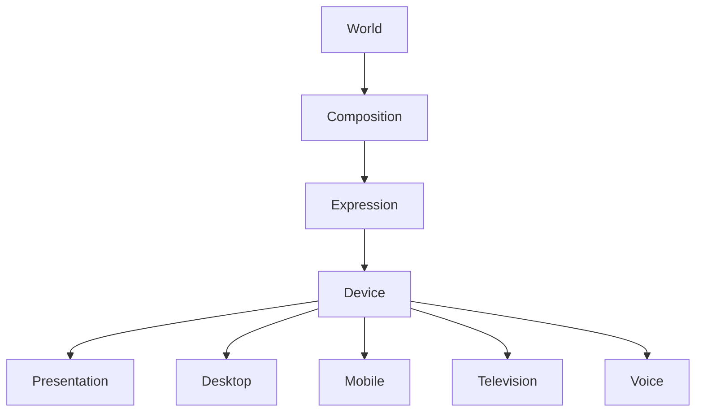

<!--
File: design/mdl/MDL-005 Composition Model/10-device-independence.md
Document: MDL-005
Chapter: 10
Title: Device Independence
Status: Draft
Version: 0.1
-->

# Device Independence

---

# Purpose

One of the primary goals of the Mosaic Design Language is to ensure that the user's entertainment World remains recognisable regardless of the device through which it is experienced.

This chapter formalises one of the core architectural promises of Mosaic.

> **The World never changes.**

> **Only its expression changes.**

Everything else within the Design Language exists to uphold this promise.

---

# Definition

Within MDL, **Device Independence** is defined as:

> **The ability for the same World, Composition and behavioural model to be expressed consistently across different interaction environments without redefining the user's understanding.**

Device Independence is not:

- responsive design
- adaptive layout
- mobile-first design

Those are implementation strategies.

Device Independence is a conceptual guarantee.

---

# Why Device Independence Exists

People no longer consume entertainment on a single device.

A single experience may begin on:

- a television

continue on:

- a tablet

resume on:

- a phone

and conclude on:

- a desktop

Users should never feel they have entered four different products.

They should simply feel that:

> **Their World followed them.**

---

# The World Is Constant

Every client should communicate the same underlying World.

```
World

↓

Focus

↓

Context

↓

Information

↓

Relationships
```

These concepts never change because the device changed.

Only their presentation changes.

---

# Expression Changes

The following layers may adapt according to device capabilities.

```
Expressions

↓

Presentation

↓

Components

↓

Layout

↓

Materials
```

The following layers should remain stable.

```
World

Focus

Context

Relationships

Priority

Composition
```

This separation preserves conceptual continuity.

---

# Device Classes

Future implementations may define device classes.

Examples include:

## Television

Characteristics:

- distance
- remote control
- large artwork
- immersive viewing

---

## Desktop

Characteristics:

- precision input
- large workspace
- multitasking

---

## Tablet

Characteristics:

- touch
- portability
- reading

---

## Mobile

Characteristics:

- one-handed interaction
- constrained space
- interruption

---

## Voice

Characteristics:

- no visual interface
- conversational output
- sequential interaction

Despite these differences...

The user's World remains identical.

---

# Behaviour Before Device

A common implementation mistake is:

```
Phone

↓

Design Experience
```

Instead:

```
User World

↓

Composition

↓

Expression

↓

Phone
```

The behavioural model should never be determined by hardware.

Hardware determines only how behaviour is communicated.

---

# The Hero

Every client should communicate the same Hero.

Examples.

Television.

```
Large Poster
```

Desktop.

```
Expanded Hero
```

Phone.

```
Compact Hero
```

Voice.

```
"Continue watching Frieren?"
```

The Hero remains conceptually identical.

Only its expression changes.

---

# Navigation

Navigation should preserve behavioural identity.

Desktop.

```
Sidebar
```

Mobile.

```
Bottom Navigation
```

Television.

```
Overlay
```

The Navigation Anchor remains behaviourally identical.

Only presentation differs.

---

# Density

Different devices should communicate the same density differently.

Example.

Rich Composition.

Desktop.

```
Many Expressions
```

Phone.

```
Fewer simultaneous Expressions

↓

Progressive Disclosure
```

The Composition remains rich.

The expression becomes more compact.

---

# Accessibility

Accessibility should also preserve Device Independence.

Examples include:

- reduced motion
- larger text
- screen readers
- high contrast

These adaptations should change presentation.

They should never redefine:

- hierarchy
- priority
- behaviour

Users should experience the same understanding regardless of accessibility preferences.

---

# Cross-Device Continuity

A user beginning an experience on one device should naturally continue on another.

Example.

```
Television

↓

Playback

↓

Phone

↓

Continue Watching
```

The platform should restore:

- Focus
- Context
- Progress
- Relationships

The user should never reconstruct their World simply because the device changed.

---

# Plugins

Extensions should remain entirely device independent.

Plugins contribute:

- Information
- Relationships

The platform determines:

- Expressions
- Presentation
- Components
- Layout

Plugins should therefore require no device-specific interface logic.

This significantly reduces ecosystem complexity.

---

# Anti-patterns

## Separate Products

Desktop and mobile behaving like unrelated applications.

---

## Device-Driven Behaviour

Interaction changes because screen size changed.

---

## Device-Specific Concepts

Introducing concepts that exist only on one platform.

The Mental Model fragments.

---

## Plugin UI

Extensions rendering completely different experiences on different devices.

The platform loses ownership of consistency.

---

# Behavioural Model



Notice that the device appears only after Expression selection.

Understanding always precedes hardware.

---

# Relationship To Future Specifications

Future MDS specifications should preserve this separation.

Examples include:

- Composition Engine
- Motion System
- Material System
- Component Library
- Runtime Adaptation

Every implementation should ask:

> **How should this device communicate the Composition?**

Never:

> **How should this device redefine the Composition?**

---

# Summary

Device Independence is one of the defining architectural promises of Mosaic.

Users should recognise:

- their World
- their Focus
- their Context
- their Composition

immediately...

regardless of whether they are using:

- a television
- a desktop
- a tablet
- a phone
- a future interaction device

The platform adapts.

The World remains constant.

---

# Review Status

**Status**

Draft

**Next File**

`11-governance.md`
