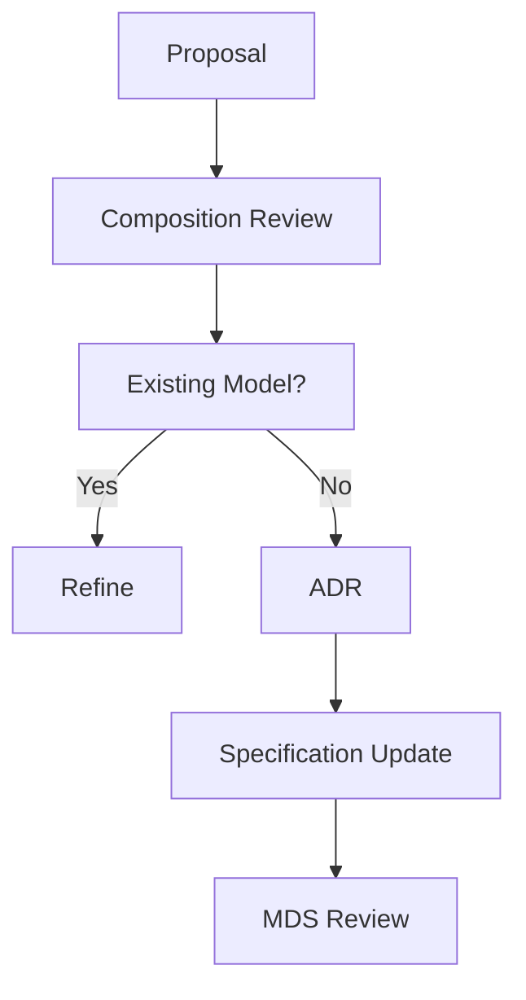

<!--
File: docs/design/language/mdl-005-composition-model/11-governance.md
Document: MDL-005
Chapter: 11
Title: Composition Model Governance
Status: Draft
Version: 0.2
-->

# Composition Model Governance

---

# Purpose

The Composition Model defines how understanding is organised.

Unlike presentation, which is expected to evolve regularly, composition represents long-lived product behaviour.

Changing composition changes how people think.

Consequently, changes to the Composition Model should be considered architectural decisions rather than visual refinements.

This chapter defines how Composition should evolve throughout the lifetime of Mosaic.

---

# Composition Is Product Architecture

Within Mosaic, Composition is treated as product architecture.

Presentation implements Composition.

It does not replace it.

Examples.

Presentation may change:

- Acrylic becomes another material.
- Typography evolves.
- Components are redesigned.
- New devices appear.

Composition should remain recognisable.

Users should continue understanding:

- what matters
- what changed
- where to continue

without relearning the platform.

---

# Stability

Expected lifespan.

| Artefact | Expected Lifetime |
|----------|-------------------|
| Components | Months |
| Materials | Months |
| Layouts | Months |
| Presentation | Months |
| Composition | Years |
| Mental Model | Decades |
| Vision | Decades |

Composition should therefore evolve deliberately rather than reactively.

---

# What Requires Review

The following changes require formal Composition review.

- New hierarchy models
- New priority systems
- Hero behaviour
- Anchor behaviour
- Adaptive composition rules
- Density model
- Composition solver behaviour
- Cross-device composition rules

These changes affect every Mosaic client.

---

# What Does Not Require Review

The following normally belong to MDS.

- Component redesign
- Material updates
- Motion tuning
- Typography
- Colours
- Spacing
- Responsive implementation
- Rendering optimisation

These concern expression.

Not composition.

---

# Composition Review Questions

Every proposed compositional change should answer the following questions.

## Question One

Does this strengthen understanding?

---

## Question Two

Does this reduce cognitive effort?

---

## Question Three

Does this preserve the user's World?

---

## Question Four

Does this reinforce hierarchy?

---

## Question Five

Would another contributor naturally solve this problem the same way after reading MDL?

If the answer is no...

The Composition Model probably requires refinement before implementation.

---

# Composition Drift

Composition drift occurs when multiple parts of the platform begin organising understanding differently.

Examples include:

- multiple hero strategies
- competing hierarchy systems
- different priority rules
- inconsistent grouping
- device-specific compositions

Composition drift is particularly dangerous because users rarely notice it consciously.

Instead they simply feel that the product has become harder to use.

---

# Composition Debt

Composition debt accumulates when:

- exceptions multiply
- hierarchy becomes inconsistent
- priority rules diverge
- unrelated concepts compete
- adaptive behaviour becomes unpredictable

Unlike technical debt...

Composition debt affects every interaction.

It should therefore be treated as a first-class architectural concern.

---

# Evolution

The Composition Model should evolve through refinement.

Preferred.

```
Existing Hierarchy

↓

Improved Hierarchy
```

Avoid.

```
Existing Hierarchy

↓

Alternative Hierarchy

↓

Special Case

↓

Exception
```

The platform should possess one compositional language.

Not several.

---

# Modules

Modules should strengthen Composition.

They should never redefine it.

Modules contribute:

- Information
- Relationships

The Composition Solver determines:

- Hero
- Priority
- Hierarchy
- Grouping
- Expressions

This separation ensures that every module naturally feels like part of the same World.

---

# Governance Workflow



The preferred outcome is refinement.

Introducing new compositional concepts should remain rare.

---

# Success Criteria

The Composition Model succeeds when:

- every client communicates the same hierarchy
- modules naturally integrate
- contributors rarely invent new composition concepts
- users instinctively know where to look
- adaptive behaviour feels inevitable rather than surprising

Composition should eventually become invisible.

Users should experience understanding rather than organisation.

---

# Architectural Decisions

| ADR | Decision |
|------|----------|
| ADR-067 | Composition is considered long-lived product architecture. |
| ADR-068 | Hierarchy and priority are platform responsibilities rather than presentation concerns. |
| ADR-069 | Composition should evolve through refinement rather than replacement. |
| ADR-070 | Modules contribute understanding rather than compositional behaviour. |

---

# Review Status

**Status**

Draft

**Next File**

`12-adrs.md`
