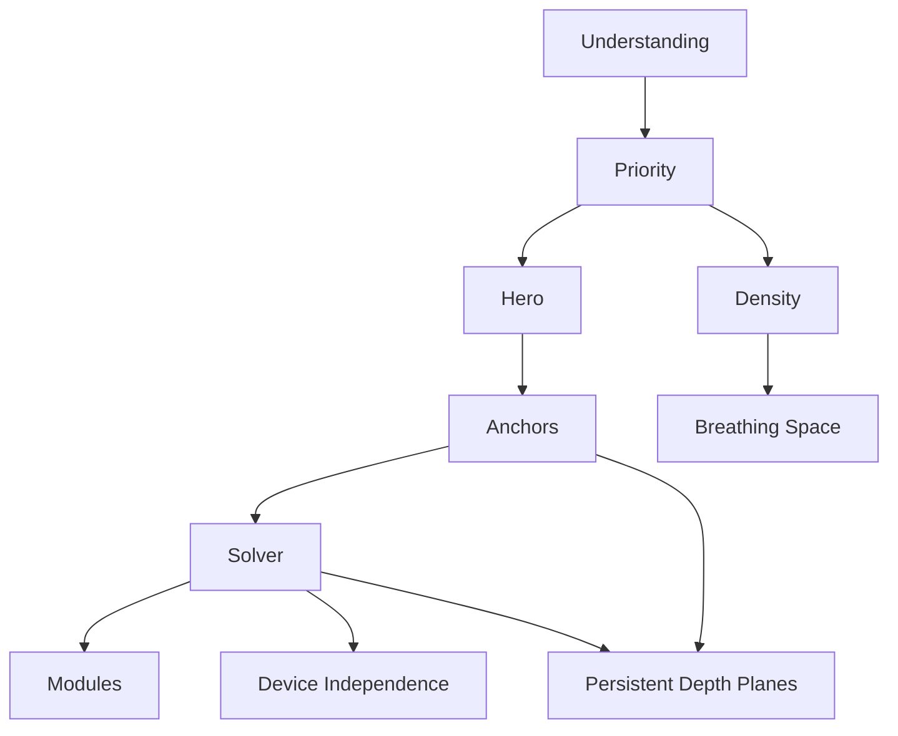

<!--
File: docs/design/language/mdl-005-composition-model/12-adrs.md
Document: MDL-005
Chapter: 12
Title: Architectural Decision Records
Status: Draft
Version: 0.4
-->

# Architectural Decision Records

---

# Purpose

The Architectural Decision Records (ADRs) contained within MDL-005 preserve the reasoning behind the Composition Model.

Where previous specifications established:

- Vision
- Principles
- Mental Model
- Interaction

MDL-005 establishes **how understanding is organised**.

These ADRs document why the Composition Model was designed the way it was, ensuring future contributors understand the architectural intent before proposing changes.

Composition is considered one of the defining architectural systems of Mosaic.

Its decisions should therefore remain traceable throughout the lifetime of the project.

---

# Decision Format

Decision format, lifecycle and review expectations are governed by **[MDG-001 — Documentation Authority Guide](../../../engineering/documentation/mdg-001-documentation-authority-guide/index.md)**.

This chapter records decisions specific to this specification and avoids redefining the shared ADR process.

# ADR-071

## Title

Composition Organises Understanding Rather Than Interface

### Status

Accepted

### Context

Traditional interface frameworks typically organise interface components directly.

This tightly couples understanding with implementation.

### Decision

Composition becomes a conceptual layer that organises understanding before presentation exists.

### Consequences

Presentation technologies may evolve independently while preserving identical conceptual organisation.

---

# ADR-072

## Title

Hierarchy Emerges From Priority

### Status

Accepted

### Context

Many design systems assign hierarchy manually.

This frequently produces inconsistent experiences.

### Decision

Hierarchy becomes a direct consequence of Priority.

Priority itself emerges from:

- Focus
- Context
- Relationships

### Consequences

Hierarchy naturally adapts as the user's World evolves.

No manual hierarchy management should normally be required.

---

# ADR-073

## Title

Hero Is An Emergent Concept

### Status

Accepted

### Context

Traditional interfaces frequently hardcode hero regions.

This weakens adaptability.

### Decision

The Hero becomes the highest-priority Expression within the current Composition.

### Consequences

Heroes evolve naturally.

They are never manually assigned.

Different clients remain conceptually identical despite differing visual implementations.

---

# ADR-074

## Title

Anchors Preserve Orientation

### Status

Accepted

### Context

Highly adaptive interfaces frequently become disorientating.

Founder workshops repeatedly identified the need for behavioural stability.

### Decision

Stable Anchors become first-class compositional concepts.

Anchors preserve orientation while surrounding information adapts.

### Consequences

Adaptive compositions remain understandable even as they evolve continuously.

---

# ADR-075

## Title

Density Is Behavioural Rather Than Visual

### Status

Accepted

### Context

Density is traditionally treated as spacing or compact mode.

This tightly couples understanding with presentation.

### Decision

Density becomes a conceptual property describing how much understanding should be communicated.

Presentation determines how density is expressed.

### Consequences

Rich and sparse compositions remain consistent across every supported platform.

---

# ADR-076

## Title

Composition Is Solved Rather Than Authored

### Status

Accepted

### Context

Static layouts cannot effectively represent continuously changing Worlds.

Founder workshops consistently favoured adaptive understanding over static screens.

### Decision

Composition becomes the output of a conceptual solving process.

The Composition Solver determines:

- hierarchy
- priority
- grouping
- Hero
- Expressions

### Consequences

Future runtime systems remain adaptive while preserving one coherent compositional language.

---

# ADR-077

## Title

Modules Contribute Knowledge Rather Than Layout

### Status

Accepted

### Context

Allowing modules to generate interface fragments inevitably fragments product identity.

### Decision

Modules contribute:

- Information
- Relationships

The platform remains solely responsible for:

- Composition
- Priority
- Hierarchy
- Expressions

### Consequences

Every module inherits the same compositional language.

The ecosystem scales without creating competing interface paradigms.

---

# ADR-078

## Title

Composition Is Device Independent

### Status

Accepted

### Context

Users increasingly consume entertainment across multiple devices.

Maintaining separate composition models would fragment understanding.

### Decision

Composition becomes device independent.

Only Presentation adapts.

### Consequences

Users experience one consistent World regardless of device.

---

# ADR-079

## Title

Breathing Space Is A Compositional Concept

### Status

Accepted

### Context

Whitespace is traditionally considered a visual concern.

Founder workshops consistently described empty space as supporting understanding rather than aesthetics.

### Decision

Breathing Space becomes part of Composition rather than visual styling.

### Consequences

Future Material Systems and Layout Engines should preserve conceptual rhythm before optimising visual density.

---

# ADR-195

## Title

Compose Persistent Depth Planes As One Spatial World

### Status

Accepted

### Context

Flat page and responsive-card metaphors cannot express artwork, information and supporting content occupying overlapping projected regions with stable depth relationships.

Treating depth only as a transition effect would also remove those relationships once motion settles.

### Decision

Composition Space contains persistent logical \(x\), \(y\) and \(z\) relationships between two-dimensional Expressions.

Each governed depth plane owns independent projected occupancy.

Expressions on the same plane share available space, while Expressions on different planes may overlap in \(x,y\).

Adaptive Composition should evolve like a layered spatial puzzle in which Expressions preserve identity while claiming and releasing plane-local capacity.

Lower-plane Expressions may establish Airspace Reserves that constrain settled cross-plane occlusion without prohibiting transit motion.

### Consequences

Artwork may occupy a complete lower plane while Information and episode Expressions solve shared space above it.

Depth remains meaningful after transitions and can drive occlusion, parallax, interaction priority and Material relationships without requiring mesh geometry.

---

# ADR Relationships

Every compositional decision reinforces the same objective.

Understanding before presentation.

---

# Future ADRs

Future Composition ADRs are expected to formalise:

- Composition Scoring
- Relationship Weighting
- Expression Selection
- Runtime Adaptation
- Multi-User Composition
- Shared Composition
- Predictive Composition
- Accessibility Composition

These intentionally remain outside MDL-005 Version 0.1.

---

# ADR Governance

Composition ADRs should change only when:

- repeated user research demonstrates misunderstanding,
- behavioural evolution requires conceptual refinement,
- the Mental Model changes,
- multiple specifications repeatedly conflict.

Presentation concerns should never trigger changes to the Composition Model.

---

# Summary

The ADRs within MDL-005 define one of the most distinctive architectural characteristics of Mosaic.

Rather than arranging interface...

Mosaic arranges understanding.

Every future implementation should preserve this distinction.

Doing so allows the platform to evolve visually while remaining conceptually stable for years to come.
