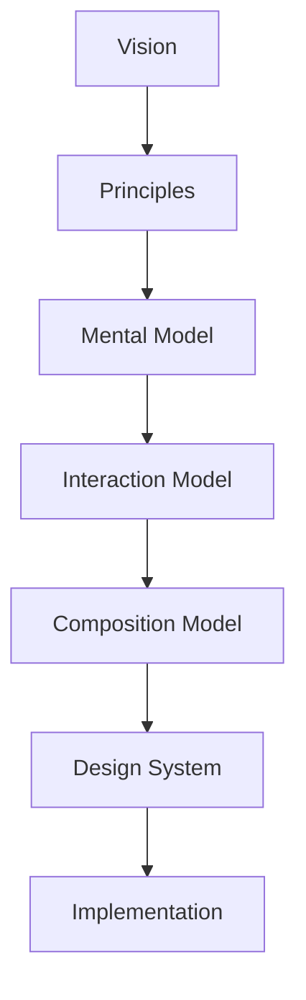
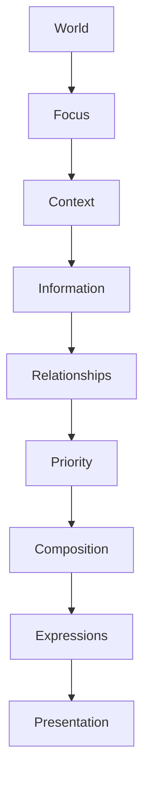

<!--
File: docs/design/language/mdl-005-composition-model/index.md
Document: MDL-005
Status: Draft
Version: 0.4
-->

# MDL-005 — Composition Model

> *Interaction explains how the world changes. Composition explains how the world is understood.*

> **Release applicability:** Mosaic v1 expresses these principles through governed client-side components. The mathematical spatial-puzzle model is preserved for the post-v1 Adaptive Composition Runtime.

---

# Purpose

[MDL-001](../mdl-001-vision/index.md) established **why** Mosaic exists.

[MDL-002](../mdl-002-principles/index.md) established **how** decisions are made.

[MDL-003](../mdl-003-mental-model/index.md) established **how Mosaic understands the user's world**.

[MDL-004](../mdl-004-interaction-model/index.md) established **how that world behaves**.

MDL-005 defines **how that world is organised into meaningful experiences**.

This specification introduces the Composition Model that transforms:

- World
- Focus
- Context
- Information
- Relationships

into coherent experiences that minimise cognitive effort.

Unlike traditional layout systems, Composition is not concerned with pixels.

It is concerned with meaning.

---

# Relationship to Previous Specifications



The Composition Model assumes:

- the World already exists,
- behaviour has already occurred,
- information has already been understood.

Its responsibility is to organise understanding.

---

# Scope

This specification defines:

- Composition
- Hierarchy
- Priority
- Anchors
- Hero
- Density
- Grouping
- Breathing Space
- Composition Solving
- Adaptive Composition
- Breathable Vertical Canvas
- Nested Horizontal Tile Content

This specification intentionally does **not** define:

- Components
- Tiles
- Materials
- Motion curves
- Typography
- Colours
- Tokens

Those belong to MDS.

Post-v1 normalised spatial Composition, Airspace and solver mathematics are preserved in the deferred [MDP-001 — Adaptive Composition Runtime](../../../engineering/architecture/mdp-001-adaptive-composition-runtime/index.md).

---

# Guiding Question

MDL-005 exists to answer one question.

> **How should understanding be organised?**

Not:

> Where should widgets go?

---

# Composition Statement

Users should never need to consciously search for what matters.

Composition should naturally communicate:

- what is important
- why it is important
- what changed
- what should happen next

without explanation.

---

# Primary Composition Pipeline



Composition therefore sits between understanding and interface.

---

# Expected Outcome

After reading MDL-005 contributors should understand:

- how hierarchy emerges
- why hero regions exist
- how adaptive layouts work
- how modules participate
- how compositions evolve
- how overlapping Expressions retain permanent depth relationships
- how future layout engines should reason

without discussing implementation.

---

# Repository Structure

```

design/

└── mdl/

    └── MDL-005 Composition Model/

        README.md

        00-document-control.md

        01-what-is-a-composition.md

        02-hierarchy.md

        03-priority.md

        04-hero.md

        05-anchors.md

        06-adaptive-composition.md

        07-density.md

        08-breathing-space.md

        09-composition-solving.md

        10-device-independence.md

        11-governance.md

        12-adrs.md

        13-contributor-guidance.md

        references.md

        glossary.md
```

---

# Dependencies

Required reading:

- [MDL-001 — Mosaic Design Language Vision](../mdl-001-vision/index.md)
- [MDL-002 — Principles](../mdl-002-principles/index.md)
- [MDL-003 — Mental Model](../mdl-003-mental-model/index.md)
- [MDL-004 — Interaction Model](../mdl-004-interaction-model/index.md)

Downstream specifications:

- [MDP-001 — Adaptive Composition Runtime](../../../engineering/architecture/mdp-001-adaptive-composition-runtime/index.md)
- [MDS-005 — Motion System](../../system/mds-005-motion-system/index.md)
- [MDP-001 — Adaptive Composition Runtime](../../../engineering/architecture/mdp-001-adaptive-composition-runtime/14-adaptive-tile-model.md)
- [MDS-008 — Component Library](../../system/mds-008-component-library/index.md)
