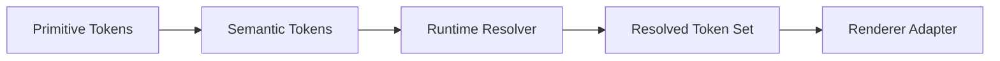

<!--
File: docs/design/system/mds-001-design-token-architecture/02-token-hierarchy.md
Document: MDS-001
Chapter: 02
Title: Token Hierarchy
Status: Draft
Version: 0.1
-->

# Token Hierarchy

---

# Purpose

This chapter defines which Mosaic artefacts are Design Tokens and which contextual concepts remain outside the token hierarchy.

The hierarchy must keep Platform-owned design decisions stable while allowing runtime adaptation and Module creativity through governed intent.

---

# Three Token States

Mosaic recognises three token states.



| State | Authority | Responsibility |
|-------|-----------|----------------|
| Primitive Token | Platform | Defines a foundational value without usage meaning. |
| Semantic Token | Platform | Defines stable design meaning and references permitted Primitive Tokens or other Semantic Tokens. |
| Resolved Token | Client | Materialises one Semantic Token for the current resolution context. |

Primitive and Semantic Tokens are authored.

Resolved Tokens are generated and immutable for one resolution cycle.

---

# Primitive Tokens

Primitive Tokens answer:

> **What foundational value exists?**

Examples include governed colours, dimensional scales, type metrics, motion curves and Material coefficients.

Primitive Tokens:

- contain no usage meaning
- are owned only by the Platform
- may be referenced by Semantic Tokens
- must not be consumed directly by Modules or ordinary components
- must not contain CSS, Flutter or other renderer terminology

---

# Semantic Tokens

Semantic Tokens answer:

> **Why does this design value exist?**

Examples include:

```text
Colour.Content.Primary
Colour.Status.Critical
Material.Hero
Motion.Focus.Enter
Typography.Content.Supporting
```

Semantic Tokens:

- form the stable public design API
- are owned only by the Platform
- preserve meaning across themes and clients
- may resolve differently without changing their meaning
- are the only authored token state ordinary consumers may request

---

# Resolved Tokens

Resolved Tokens answer:

> **What concrete value expresses this meaning now?**

A Resolved Token contains the concrete value selected for one Semantic Token after evaluation of Composition, domain intent, Focus, accessibility, capability and budget.

Resolved Tokens:

- are generated by the client
- remain immutable for one resolution cycle
- do not become a new semantic namespace
- may be cached by complete resolution context
- are translated into renderer-specific artefacts by adapters

---

# Resolver Inputs Are Not Tokens

The following concepts influence resolution but do not form token layers:

| Input | Owning authority |
|-------|------------------|
| Composition role and hierarchy | [MDP-001 — Adaptive Composition Runtime](../../../engineering/architecture/mdp-001-adaptive-composition-runtime/index.md) |
| Module domain intent | Module contract governed by MDS-001 |
| Component responsibility | [MDS-008 — Component Library](../mds-008-component-library/index.md) |
| Focus and current Context | Runtime Composition state |
| Accessibility requirements | Platform accessibility state |
| Renderer capability and current budget | Client runtime |

Treating these inputs as tokens would allow transient state or domain vocabulary to fragment the stable design API.

---

# Recipes And Profiles

A recipe or profile is a governed combination of Semantic Tokens and constrained inputs.

It is not another token layer.

Recipes may coordinate several systems, such as Colour, Material, Typography and Motion, while each underlying token retains its own authority.

Modules may request or compose permitted recipes but cannot create Primitive or Semantic Tokens.

---

# Presentation Outputs

CSS custom properties, Flutter values, SwiftUI environment values and shader uniforms are generated renderer artefacts.

They are not Design Tokens and must not become an authority for semantic meaning.

Renderer adapters may change without changing the token hierarchy.

---

# Dependency Rules

Permitted flow is:

```text
Primitive Token
    → Semantic Token
    → runtime resolution with governed inputs
    → Resolved Token
    → renderer artefact
```

The following are prohibited:

- Module intent creating Primitive or Semantic Tokens
- components consuming Primitive Tokens directly
- renderer artefacts redefining Semantic Tokens
- device categories selecting permanent token values
- runtime state creating new semantic meaning
- local overrides bypassing accessibility or Platform constraints

---

# Litmus Test

Ask:

> **Does this name describe a stable Platform design decision, or does it describe current domain and runtime state?**

Stable foundational values belong to Primitive Tokens.

Stable design meaning belongs to Semantic Tokens.

Current state belongs in the resolution context.

Concrete output belongs in a Resolved Token or renderer artefact.

---

# Summary

Mosaic has one Platform-owned authored hierarchy: Primitive Tokens and Semantic Tokens.

Clients generate Resolved Tokens from that hierarchy and the current governed context.

Composition, Modules, components and renderers participate without extending token ownership.
