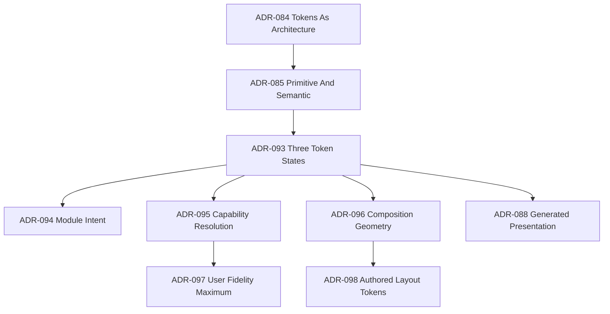

<!--
File: docs/design/system/mds-001-design-token-architecture/12-adrs.md
Document: MDS-001
Chapter: 12
Title: Architectural Decision Records
Status: Draft
Version: 0.1
-->

# Architectural Decision Records

---

# Purpose

These records explain the accepted architecture and retain superseded decisions for traceability.

Decision format, lifecycle and review expectations are governed by [MDG-001 — Documentation Authority Guide](../../../engineering/documentation/mdg-001-documentation-authority-guide/index.md).

---

# ADR-084

## Treat Design Tokens As Architectural Concepts

**Status:** Accepted

Design Tokens represent implementation-independent design decisions rather than framework variables.

Client technologies may change without changing semantic meaning.

---

# ADR-085

## Separate Primitive Tokens From Semantic Tokens

**Status:** Accepted

Primitive Tokens represent foundational values without usage meaning.

Semantic Tokens represent stable Platform design meaning.

Ordinary consumers request Semantic Tokens rather than Primitive Tokens.

---

# ADR-086

## Introduce Composition Tokens

**Status:** Superseded by ADR-093

The former architecture treated Composition roles as an independent token layer.

Composition roles are now governed resolver inputs owned by [MDP-001 — Adaptive Composition Runtime](../../../engineering/architecture/mdp-001-adaptive-composition-runtime/index.md).

---

# ADR-087

## Introduce Runtime Tokens

**Status:** Superseded by ADR-093

The former architecture treated generated runtime state as another token namespace.

Clients now generate immutable Resolved Tokens without creating runtime semantic names.

---

# ADR-088

## Generate Presentation Artefacts

**Status:** Accepted

CSS custom properties, Flutter values, SwiftUI environment values, shader uniforms and equivalent outputs are generated renderer artefacts.

They are not Design Tokens and cannot redefine meaning.

---

# ADR-089

## Components Consume Meaning Rather Than Values

**Status:** Amended by ADR-093

Components consume completed resolved semantic values or profiles.

They do not consume Primitive Tokens, decide Composition roles or own a component-token hierarchy.

---

# ADR-090

## Runtime Never Changes Meaning

**Status:** Accepted

Runtime resolution may change implementation, fidelity and technique.

It must preserve semantic, hierarchy, interaction and accessibility meaning.

---

# ADR-091

## Modules Participate Through Semantic Architecture

**Status:** Superseded by ADR-094

The original decision prevented Module-owned foundations but left Module token terminology ambiguous.

ADR-094 establishes intent mapping without Module Design Tokens.

---

# ADR-092

## Prefer Semantic Stability Over Implementation Stability

**Status:** Accepted

Token values, renderer techniques and adapters may evolve more frequently than the Semantic Token API.

---

# ADR-093

## Use Primitive, Semantic And Resolved Token States

**Status:** Accepted

### Context

The former six-layer chain mixed stable design authority with Composition, component and transient runtime responsibilities.

It encouraged device-category tokens and made it unclear whether Modules or components could extend the hierarchy.

### Decision

Mosaic recognises two authored Platform token states:

- Primitive Tokens
- Semantic Tokens

Clients generate an immutable Resolved Token Set from those tokens and governed runtime inputs.

Composition roles, Module intent, Focus, accessibility, capability and budget are resolver inputs rather than token layers.

Renderer values are generated outputs.

### Consequences

The public token API becomes smaller and more stable.

Composition and component specifications retain their own authority.

Runtime adaptation remains powerful without minting transient semantic names.

---

# ADR-094

## Modules Extend Domain Intent And Composition, Not Design Tokens

**Status:** Accepted

### Context

Modules need domain-specific expression and layouts without fragmenting the Mosaic brand.

### Decision

Modules may declare namespaced domain intent mapped to existing Platform semantics and may provide governed domain layout extension contracts.

They cannot create Primitive or Semantic Tokens, Material physics or renderer rules.

New cross-product semantic meaning requires Platform review.

### Consequences

Modules can express concepts such as `Calendar.Today` or `Sports.Live` while inheriting Platform appearance, accessibility and degradation behaviour.

The Mosaic shell and semantic language remain coherent.

---

# ADR-095

## Resolve From Capability And Budget Rather Than Device Category

**Status:** Accepted

### Context

Device labels do not reliably describe browser, GPU, compositor or current workload capability.

### Decision

Runtime resolution uses observable capability, measured cost and current budget.

Mobile, television, desktop and tablet categories do not select permanent token values or fidelity.

### Consequences

Clients with equivalent effective capability produce equivalent semantic fidelity regardless of product category.

---

# ADR-096

## Keep Geometry Outside The Public Token API

**Status:** Amended by ADR-098

### Context

Exposing spacing, padding, radius, width, height or density choices would allow Modules and components to bypass adaptive Composition.

### Decision

Composition provides semantic relationships and constraints.

The client-side Adaptive Layout implementation calculates concrete geometry using those constraints, private Platform primitives, available space, typography and accessibility.

Modules, components, users and SDUI do not select geometry tokens or final Presentation coordinates.

### Consequences

Domain layouts express invariants and valid modes rather than pixels.

Material clipping and component rendering consume completed geometry.

Private spacing, radius, type and geometric Primitive Tokens remain valid internal inputs and are not exposed as public semantic controls.

---

# ADR-097

## Treat User Refraction Quality As A Maximum

**Status:** Accepted

### Context

Users may prefer a calmer or less expensive Acrylic experience even when the renderer can support full fidelity.

### Decision

Users may select Automatic, Balanced or Essential as a maximum Refraction fidelity.

The preference may be synced or locally overridden for one client.

Accessibility, measured capability, current budget and Presentation deadlines may reduce below that maximum but never force a higher level.

### Consequences

Users gain meaningful control without manipulating blur, parallax or renderer techniques directly.

---

# ADR-098

## Expose Governed Semantic Layout Tokens For Authored Layout

**Status:** Accepted

### Context

Adaptive Composition correctly owns media-driven geometry, but Mosaic also supports documentation, administration, dashboards and conventional application pages authored with CSS or native layout systems.

Those consumers require stable spacing, typography and sizing values without taking ownership of Primitive Tokens or Material physics.

### Decision

Mosaic provides public Semantic Tokens for governed spatial relationships, typography roles and dimensional responsibilities.

Examples include `Space.Group`, `Type.Body`, `Type.Heading`, `Size.ControlMinimum` and `Size.ReadingMeasure`.

Adaptive Composition may continue to resolve geometry automatically.

Authored Layout may consume the public Semantic Tokens through CSS variables, Flutter values or equivalent renderer artefacts.

SDUI continues to send semantic intent rather than raw resolved measurements.

### Consequences

Media and conventional application experiences share one Design System.

Consumers gain practical layout tools without creating arbitrary scales, exposing private Primitive Tokens or controlling Refraction physics.

---

# Decision Relationships

