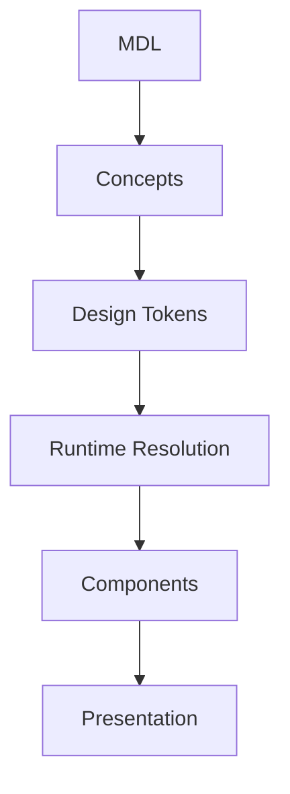
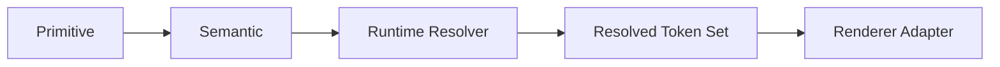

<!--
File: docs/design/system/mds-001-design-token-architecture/index.md
Document: MDS-001
Status: Draft
Version: 0.1
-->

# MDS-001 — Design Token Architecture

> *Tokens are not values. They are the language through which the Design System communicates intent.*

---

# Purpose

The Mosaic Design Language (MDL) establishes:

- Why Mosaic exists.
- How decisions are made.
- How the platform thinks.
- How the platform behaves.
- How understanding is organised.

MDS-001 begins the implementation layer.

It defines how those concepts become a machine-readable design system.

Unlike many design systems, MDS-001 is **not** simply a colour token document.

It defines the architectural hierarchy through which every future Mosaic client will express the same conceptual experience.

---

# Relationship to MDL



Tokens are the first implementation artefact.

Everything beneath MDS-001 depends upon them.

---

# Scope

This specification defines:

- Token philosophy
- Token hierarchy
- Token taxonomy
- Primitive and Semantic Token states
- Composition inputs
- Resolved Token model
- Token inheritance
- Token resolution
- Token lifecycle
- Versioning
- Module intent interaction
- public Semantic Tokens for Authored Layout

This specification intentionally does **not** define:

- Colours
- Typography values
- Motion curves
- Components
- Materials

Those are defined by later MDS specifications.

---

# Guiding Question

MDS-001 exists to answer one question.

> **How should design decisions become implementation?**

---

# Token Statement

Within Mosaic:

> **Tokens describe intent.**

They do not describe implementation.

For example.

Poor.

```

Blue500
```

Better.

```

Brand.Primary
```

Better still.

```

Surface.Hero
```

The further implementation moves from raw values towards meaning, the easier the system becomes to evolve.

---

# Primary Token Model

The Mosaic Design System separates authored Platform tokens from generated client output.



Composition, Module intent, Focus, accessibility, capability and budget enter the resolver as governed context rather than additional token layers.

Future chapters define every layer in detail.

---

# Expected Outcome

After reading MDS-001 contributors should understand:

- how tokens are organised
- why semantic tokens exist
- why Resolved Tokens exist
- how components consume tokens
- how Adaptive Composition and Authored Layout consume the same token system
- how Modules provide intent and consume existing Semantic Tokens without creating new tokens
- how future token systems should evolve

without discussing specific colour palettes or component implementations.

---

# Repository Structure

```

design/

└── mds/

    └── MDS-001 Design Token Architecture/

        README.md

        00-document-control.md

        01-what-is-a-design-token.md

        02-token-hierarchy.md

        03-primitive-tokens.md

        04-semantic-tokens.md

        05-composition-inputs.md

        06-resolved-tokens.md

        07-token-resolution.md

        08-token-inheritance.md

        09-token-versioning.md

        10-module-intent.md

        11-governance.md

        12-adrs.md

        13-contributor-guidance.md

        references.md

        glossary.md
```

---

# Dependencies

Required reading:

- [MDL-001 — Mosaic Design Language Vision](../../language/mdl-001-vision/index.md)
- [MDL-002 — Principles](../../language/mdl-002-principles/index.md)
- [MDL-003 — Mental Model](../../language/mdl-003-mental-model/index.md)
- [MDL-004 — Interaction Model](../../language/mdl-004-interaction-model/index.md)
- [MDL-005 — Composition Model](../../language/mdl-005-composition-model/index.md)

Downstream specifications:

- [MDS-002 — Colour System](../mds-002-colour-system/index.md)
- [MDS-003 — Material System](../mds-003-material-system/index.md)
- [MDS-004 — Typography System](../mds-004-typography-system/index.md)
- [MDS-005](../mds-005-motion-system/index.md) Motion
- [MDP-001 — Adaptive Composition Runtime](../../../engineering/architecture/mdp-001-adaptive-composition-runtime/index.md)
- [MDS-008 — Component Library](../mds-008-component-library/index.md)
