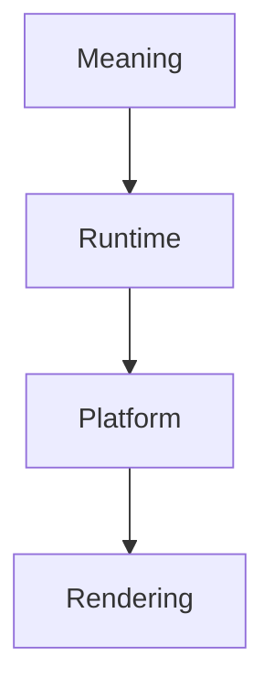

<!--
File: docs/design/system/mds-001-design-token-architecture/references.md
Document: MDS-001
Title: References
Status: Draft
Version: 0.1
-->

# References

---

# Purpose

This document records the architectural influences, design theories and implementation concepts that informed **MDS-001 — Design Token Architecture**.

Unlike implementation documentation, these references exist to explain the architectural reasoning behind the Design Token Architecture rather than prescribe implementation details.

The Mosaic Design System intentionally synthesises established Design System practices with the adaptive, runtime-first philosophy established throughout the MDL specifications.

---

# Reading Order

Contributors should approach references in the following order.

1. MDL Specifications
2. Design Token Architecture
3. Design Systems
4. Runtime Design
5. Cross-Platform Architecture
6. Implementation Specifications

The Mosaic Design Language remains the authoritative source.

External references provide context rather than authority.

---

# Internal References

## [MDL-001 — Mosaic Design Language Vision](../../language/mdl-001-vision/index.md)

Provides:

- Product philosophy
- Immersion
- Companion model
- Long-term product identity

Every token should ultimately reinforce the experience defined by the Vision.

---

## [MDL-002 — Principles](../../language/mdl-002-principles/index.md)

Provides:

- Design intent
- Behavioural priorities
- Design governance

Semantic Tokens should communicate these principles through implementation.

---

## [MDL-003 — Mental Model](../../language/mdl-003-mental-model/index.md)

Provides:

- World
- Focus
- Context
- Information
- Relationships

Token Resolution evaluates these runtime concepts without turning them into new token categories.

---

## [MDL-004 — Interaction Model](../../language/mdl-004-interaction-model/index.md)

Provides:

- Behaviour
- Continuity
- Adaptive evolution
- Interaction States

Resolved Tokens should reinforce behavioural consistency rather than introduce alternative interaction models.

---

## [MDL-005 — Composition Model](../../language/mdl-005-composition-model/index.md)

Provides:

- Hero
- Hierarchy
- Priority
- Density
- Composition

The Composition Engine supplies these concepts as governed inputs to Token Resolution.

---

# Future Specifications

The following specifications depend directly upon MDS-001.

- [MDS-002 — Colour System](../mds-002-colour-system/index.md)
- [MDS-003 — Material System](../mds-003-material-system/index.md)
- [MDS-004 — Typography System](../mds-004-typography-system/index.md)
- [MDS-005 — Motion System](../mds-005-motion-system/index.md)
- [MDP-001 — Adaptive Composition Runtime](../../../engineering/architecture/mdp-001-adaptive-composition-runtime/index.md)
- [MDP-001 — Adaptive Composition Runtime](../../../engineering/architecture/mdp-001-adaptive-composition-runtime/14-adaptive-tile-model.md)
- [MDS-008 — Component Library](../mds-008-component-library/index.md)

These specifications should consume the architecture defined here rather than redefining it.

---

# Design Tokens

The architecture of MDS-001 draws inspiration from modern token systems that distinguish between:

- physical values
- semantic meaning
- implementation

Mosaic extends this approach by evaluating Composition, Module intent, accessibility, capability and budget as governed resolution inputs while keeping the authored hierarchy Platform-owned.

---

# Runtime Design

Unlike traditional Design Systems, Mosaic assumes that:

- artwork changes
- Context changes
- Focus changes
- accessibility changes
- device capabilities change

The Design Token Architecture therefore treats runtime adaptation as a first-class architectural concern rather than an implementation detail.

---

# Cross-Platform Design

MDS intentionally separates:

This separation allows identical Design Tokens to generate implementations for:

- Web
- Flutter
- SwiftUI
- Jetpack Compose
- Future clients

without changing the architecture.

---

# Design Systems

The organisation of the Mosaic Design System was influenced by mature Design Systems that distinguish:

- Foundations
- Tokens
- Components
- Patterns
- Guidelines

Mosaic intentionally extends this model through:

- runtime adaptation
- composition solving
- artwork-driven atmosphere
- semantic hierarchy

These concepts distinguish Mosaic from traditional static Design Systems.

---

# Software Architecture

Several software architecture concepts influenced MDS-001.

Examples include:

- Separation of Concerns
- Layered Architecture
- Domain-Driven Design
- Documentation as Code
- Architecture Decision Records
- Platform Abstraction

These concepts informed documentation organisation rather than implementation technology.

---

# Mosaic-Specific Influences

The Design Token Architecture emerged directly from the preceding MDL specifications.

Key architectural discoveries include:

- Meaning should precede implementation.
- Components should consume intent rather than values.
- Runtime should adapt implementation rather than semantics.
- Composition should remain independent from presentation.
- Modules should inherit the Design System rather than redefining it.

These ideas collectively define the Mosaic Design System.

---

# Relationship To The Runtime

Future runtime systems are expected to implement concepts such as:

- Atmosphere generation
- Adaptive materials
- Theme resolution
- Capability-driven adaptation
- Accessibility adaptation

MDS-001 intentionally defines the architectural boundaries within which those systems operate.

Implementation details belong to future specifications.

---

# Normative References

Required reading before contributing to MDS-001.

- [MDL-001 — Mosaic Design Language Vision](../../language/mdl-001-vision/index.md)
- [MDL-002 — Principles](../../language/mdl-002-principles/index.md)
- [MDL-003 — Mental Model](../../language/mdl-003-mental-model/index.md)
- [MDL-004 — Interaction Model](../../language/mdl-004-interaction-model/index.md)
- [MDL-005 — Composition Model](../../language/mdl-005-composition-model/index.md)

These documents collectively define the conceptual foundation upon which the Design Token Architecture is built.

---

# Informative References

Future contributors may also wish to review:

- [MDS-002 — Colour System](../mds-002-colour-system/index.md)
- [MDS-003 — Material System](../mds-003-material-system/index.md)
- [MDP-001 — Adaptive Composition Runtime](../../../engineering/architecture/mdp-001-adaptive-composition-runtime/index.md)
- [MDS-008 — Component Library](../mds-008-component-library/index.md)

These specifications implement the token architecture defined within MDS-001.

---

# Living Document

This reference list should remain intentionally concise.

References should only be introduced when they materially influence:

- architectural layering
- runtime adaptation
- semantic modelling
- implementation boundaries

The purpose of this document is to preserve architectural reasoning rather than provide an exhaustive catalogue of design literature.

---

# Completion

This concludes **MDS-001 — Design Token Architecture**.

The next specification in the Mosaic Design System is:

> **[MDS-002 — Colour System](../mds-002-colour-system/index.md)**

Where MDS-001 defines **how design intent becomes machine-readable**, [MDS-002](../mds-002-colour-system/index.md) defines **how colour communicates meaning**.

It formalises:

- the Mosaic brand palette
- semantic colour architecture
- adaptive atmosphere
- artwork-derived colour generation
- accessibility-aware colour resolution
- light and dark themes
- runtime colour synthesis

It is here that the distinctive visual identity of Mosaic begins to emerge from the architectural foundations established by the MDL and MDS specifications.
