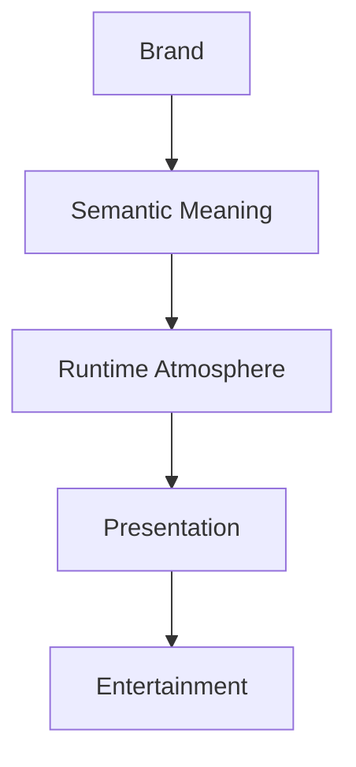

<!--
File: design/mds/MDS-002 Colour System/01-colour-philosophy.md
Document: MDS-002
Chapter: 01
Title: Colour Philosophy
Status: Draft
Version: 0.1
-->

# Colour Philosophy

---

# Purpose

Before defining palettes, themes or runtime colour systems, contributors must first understand what colour means within Mosaic.

Many Design Systems begin with colour values.

Mosaic intentionally does not.

It begins with philosophy.

Colour exists to strengthen the user's relationship with their entertainment.

It should never become the entertainment itself.

---

# Philosophy Statement

> **Colour should quietly support understanding while allowing entertainment to remain the emotional centre of the experience.**

Everything within the Mosaic Colour System derives from this statement.

---

# Colour Is Communication

Within Mosaic, colour is considered a communication system.

It communicates:

- hierarchy
- identity
- status
- atmosphere
- confidence

Colour should never exist purely for decoration.

If removing a colour changes nothing about understanding...

That colour probably does not belong.

---

# Three Responsibilities

The Mosaic Colour System intentionally separates colour into three independent responsibilities.

```text
Brand

↓

Semantic Meaning

↓

Atmosphere
```

Each responsibility answers a different question.

| Responsibility | Question |
|----------------|----------|
| Brand | "Who is speaking?" |
| Semantic | "What does this mean?" |
| Atmosphere | "How does this feel?" |

Keeping these responsibilities separate allows the system to evolve without conflict.

---

# Colour Exists In Service Of Content

The most important colour within Mosaic is often **not** a Mosaic colour.

It is the artwork.

Album covers.

Film posters.

Book covers.

Anime key visuals.

These already possess emotional identity.

Mosaic should respect that identity rather than competing with it.

The interface should frame artwork.

Not overpower it.

---

# Colour Is Secondary To Hierarchy

Hierarchy should remain understandable even if colour disappears.

Users should still understand:

- what matters
- what is secondary
- what is interactive
- what has changed

using:

- composition
- spacing
- typography
- movement

Colour reinforces understanding.

It should never become the only mechanism communicating it.

This principle ensures accessibility remains fundamental rather than optional.

---

# Colour Is Calm

Many applications use colour aggressively.

Examples include:

- promotional gradients
- high saturation
- competing accents
- constant emphasis

Mosaic intentionally adopts a calmer philosophy.

Most interface surfaces should remain restrained.

Colour should be introduced deliberately where it improves:

- orientation
- confidence
- understanding

Silence is as valuable in colour as it is in interaction.

---

# Brand Is Stable

The Mosaic brand should remain recognisable.

Regardless of:

- artwork
- media type
- accessibility
- runtime atmosphere

users should still recognise the application as Mosaic.

The Brand Palette therefore remains comparatively stable.

It communicates identity.

Not emotion.

---

# Atmosphere Is Adaptive

Emotion should come from the user's current entertainment.

Examples.

Watching:

```
Blade Runner 2049
```

The interface may become subtly cooler.

Watching:

```
Your Name
```

The interface may become subtly warmer.

Reading:

```
The Hobbit
```

The interface may become subtly earthy.

Importantly...

The atmosphere should feel like reflected light.

Not a recoloured application.

This distinction is one of the defining characteristics of Mosaic.

---

# Colour Should Never Surprise

Unexpected colour changes weaken trust.

Runtime adaptation should therefore be:

- gradual
- contextual
- understandable

Users should instinctively feel:

> "The interface reflects what I'm enjoying."

Not:

> "The interface changed colour."

Atmosphere should be perceived emotionally before it is noticed intellectually.

---

# Neutral First

Most of the interface should intentionally remain neutral.

Neutral surfaces provide three advantages.

1. Artwork becomes more expressive.
2. Accessibility becomes easier.
3. Runtime atmosphere becomes more effective.

The interface should therefore spend most of its time acting as a canvas.

Not as artwork.

---

# Accent With Purpose

Accent colours should communicate action.

Not decoration.

Examples include:

- primary actions
- current focus
- active playback
- selection
- progress

Accent should never become background.

Likewise...

Background should never compete with accent.

This preserves a strong visual hierarchy.

---

# Colour Evolves

Colour is expected to evolve over time.

The same semantic meaning may resolve differently depending upon:

- artwork
- theme
- accessibility
- display capabilities

However...

The conceptual meaning must remain stable.

Example.

```
Surface.Hero
```

may resolve differently in:

- Light Mode
- Dark Mode
- Runtime Atmosphere

The semantic role remains identical.

---

# Good Examples

## Example 01

Current artwork provides subtle cyan highlights.

The interface gently reflects those tones through acrylic materials.

Brand accents remain recognisable.

The artwork remains dominant.

---

## Example 02

Accessibility increases contrast.

Runtime atmosphere reduces intensity.

Semantic meaning remains identical.

The interface remains recognisably Mosaic.

---

## Example 03

The Hero surface adopts a warmer reflected tone from book artwork.

Surrounding surfaces remain neutral.

Attention naturally remains on the book cover.

---

# Anti-patterns

## Artwork Recolouring Everything

Every interface element adopts artwork colours.

Brand identity disappears.

Hierarchy weakens.

---

## Brand Everywhere

Every interface element uses the Mosaic brand colour.

Artwork becomes visually irrelevant.

---

## Colour As Hierarchy

Removing colour destroys understanding.

The Composition has become dependent upon colour.

---

## Decorative Gradients

Colour exists because it appears visually impressive.

No additional understanding is communicated.

---

# Philosophical Model



Brand establishes identity.

Semantic colour communicates meaning.

Atmosphere reflects entertainment.

The interface quietly supports the user's World.

---

# Relationship To Future Chapters

The remaining chapters formalise this philosophy into implementation.

They define:

- Brand Palette
- Semantic Colour Architecture
- Runtime Atmosphere
- Artwork Extraction
- Theme Resolution
- Accessibility

Every implementation decision should reinforce the philosophy established here.

---

# Summary

Colour is one of the quietest systems within Mosaic.

When successful, users should rarely think about it consciously.

Instead they should simply feel that:

- the interface belongs with their entertainment,
- the platform feels calm,
- the artwork feels more alive,
- and Mosaic always feels unmistakably like Mosaic.

That balance between identity, meaning and atmosphere is the defining objective of the Mosaic Colour System.

---

# Review Status

**Status**

Draft

**Next File**

`02-brand-colours.md`
