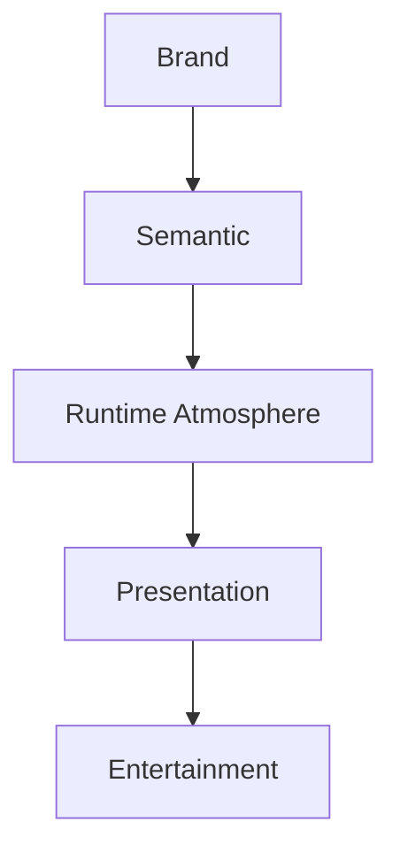

<!--
File: design/mds/MDS-002 Colour System/02-brand-colours.md
Document: MDS-002
Chapter: 02
Title: Brand Colours
Status: Draft
Version: 0.1
-->

# Brand Colours

---

# Purpose

The Mosaic Brand Palette establishes the permanent visual identity of the platform.

Unlike Runtime Atmosphere, which adapts to the user's entertainment, Brand Colours should remain immediately recognisable across every client, operating system and device.

Brand Colours answer one question.

> **"Am I using Mosaic?"**

They do **not** answer:

- what currently matters,
- what is interactive,
- what the current media feels like.

Those responsibilities belong to Semantic Colours and Runtime Atmosphere.

---

# Philosophy

The Mosaic Brand should be immediately recognisable.

However...

It should rarely dominate the interface.

Unlike many entertainment platforms whose identity depends upon overwhelming colour saturation:

- Netflix Red
- Spotify Green
- Plex Yellow
- Jellyfin Purple

Mosaic intentionally adopts a quieter philosophy.

Its brand should be:

- memorable
- modern
- restrained
- premium

The brand should support the user's entertainment.

Not compete with it.

---

# Brand Architecture

The Brand Palette consists of three conceptual layers.

```text
Core Brand

↓

Supporting Brand

↓

Accent Brand
```

Each layer performs one responsibility.

---

# Core Brand

Purpose.

Communicate Mosaic itself.

The Core Brand Colour appears in:

- application identity
- onboarding
- authentication
- splash screens
- installer
- branding assets

It should appear sparingly throughout the runtime interface.

The brand should remain recognisable because of restraint.

Not repetition.

---

# Supporting Brand

Supporting Brand Colours provide visual harmony around the Core Brand.

Examples include:

- gradients
- illustrations
- documentation
- diagrams
- empty states

Supporting colours should never become primary interaction colours.

Their purpose is identity.

Not hierarchy.

---

# Accent Brand

Accent Brand Colours provide subtle moments of recognition.

Examples include:

- loading indicators
- active installation
- progress
- onboarding confirmation
- branding moments

Accent Brand Colours should appear intentionally.

Users should associate these colours with Mosaic itself rather than entertainment content.

---

# Brand Neutrality

Most of the runtime interface should intentionally avoid strong brand colouring.

Example.

Instead of:

```
Entire Interface

↓

Brand Cyan
```

Prefer:

```
Neutral Interface

↓

Small Brand Moments
```

This approach creates two advantages.

1.

Artwork remains emotionally dominant.

2.

Brand moments become significantly more memorable.

---

# Brand Persistence

The Brand Palette should remain recognisable regardless of:

- Light Mode
- Dark Mode
- Runtime Atmosphere
- Device
- Accessibility

Semantic implementation may change.

Brand identity should not.

Users should instinctively recognise:

> Mosaic

even if they cannot consciously explain why.

---

# Brand And Atmosphere

One of the defining characteristics of Mosaic is the deliberate separation between:

Brand

and

Atmosphere.

Example.

```
Brand

↓

Stable Cyan Identity
```

Artwork.

```
Warm Orange Sunset
```

The Runtime Atmosphere should adopt:

- warm reflections
- warm acrylic
- warm lighting

while preserving:

- Brand identity
- Semantic hierarchy
- Accessibility

Atmosphere reflects entertainment.

Brand remains Mosaic.

---

# Brand And Hero

The Hero should almost never use the Brand Colour directly.

Instead:

Artwork provides emotional identity.

Brand provides product identity.

The Hero therefore becomes emotionally expressive without becoming visually inconsistent.

This distinction prevents the interface from competing with the media.

---

# Brand Across Products

Future Mosaic products should inherit the same Brand Architecture.

Examples include:

```
Mosaic Core

↓

Cyan
```

```
Mosaic Docs

↓

Different Supporting Palette

↓

Shared Brand Identity
```

```
Mosaic SDK

↓

Different Supporting Palette

↓

Shared Core Brand
```

Subsystems may evolve their own secondary palettes while remaining unmistakably part of the Mosaic ecosystem.

This approach creates a coherent family of products rather than isolated brands.

---

# Brand Tokens

Future Semantic Tokens are expected to expose:

```text
Brand.Primary

Brand.Secondary

Brand.Accent

Brand.Inverse
```

Applications should consume these Semantic Tokens.

They should never consume Primitive Brand Colours directly.

---

# Runtime Rules

Runtime systems must never redefine Brand Tokens.

Examples.

Allowed.

```
Artwork

↓

Atmosphere
```

Not allowed.

```
Artwork

↓

Brand.Primary
```

Brand belongs to Mosaic.

Atmosphere belongs to entertainment.

Maintaining this separation is a fundamental architectural rule.

---

# Accessibility

Brand Colours should always satisfy accessibility requirements.

Brand recognition should never depend upon:

- saturation
- contrast alone
- colour alone

Every branded interaction should remain understandable through:

- hierarchy
- typography
- composition
- iconography

Colour reinforces understanding.

It never replaces it.

---

# Good Examples

## Splash Screen

Neutral textured background.

Core Brand.

Subtle atmosphere.

No entertainment artwork.

The user immediately recognises Mosaic.

---

## Runtime

Artwork dominates.

Brand appears only through:

- active controls
- subtle progress
- focused actions

Identity remains.

Entertainment leads.

---

## Documentation

Brand becomes significantly more visible.

Entertainment artwork is absent.

Brand naturally assumes greater responsibility.

---

# Anti-patterns

## Brand Everywhere

Every surface adopts Brand Colours.

Artwork loses emotional impact.

---

## Brand Mutation

Artwork changes the Brand Palette.

Users stop recognising Mosaic.

---

## Marketing Interface

Large branded gradients dominate entertainment.

The interface begins competing with content.

---

## Colour Branding

Brand identity depends entirely upon one saturated colour.

Identity should emerge from the complete Design System.

Not one pigment.

---

# Conceptual Model



Brand always enters before Runtime.

Runtime should never overwrite Brand.

---

# Relationship To Future Specifications

Future specifications will formalise:

- exact palette values
- colour scales
- contrast ratios
- runtime blending
- acrylic interaction
- adaptive materials

This chapter defines only the architectural role of Brand Colours.

---

# Summary

The Mosaic Brand should feel confident rather than loud.

Recognisable rather than repetitive.

Premium rather than promotional.

The strongest brand is not the one users notice constantly.

It is the one they recognise instantly.

Brand provides identity.

Artwork provides emotion.

The Colour System exists to ensure those two ideas remain beautifully separate.

---

# Review Status

**Status**

Draft

**Next File**

`03-semantic-colours.md`
