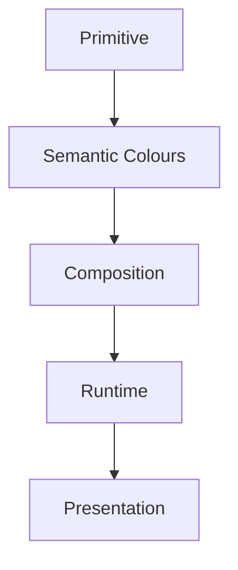

<!--
File: docs/design/system/mds-002-colour-system/03-semantic-colours.md
Document: MDS-002
Chapter: 03
Title: Semantic Colours
Status: Draft
Version: 0.2
-->

# Semantic Colours

---

# Purpose

Primitive colours represent physical values.

Brand colours represent Mosaic.

Semantic Colours represent **meaning**.

This distinction is one of the most important architectural separations within the Mosaic Colour System.

A component should never ask:

> **"Which colour should I use?"**

Instead it should ask:

> **"What does this element mean?"**

The Design System determines the correct colour automatically.

---

# Definition

Within MDS, a **Semantic Colour** is defined as:

> **A colour role that communicates design meaning independently from any physical colour value.**

Semantic Colours intentionally describe:

- purpose
- hierarchy
- interaction
- state

They intentionally avoid describing:

- cyan
- blue
- red
- grey

Implementation belongs to Primitive Colours.

Meaning belongs to Semantic Colours.

---

# Why Semantic Colours Exist

Imagine two interfaces.

Poor.

```css
background: #06B6D4;
color: #FFFFFF;
```

Questions immediately appear.

- Why cyan?
- Should every button be cyan?
- Does this colour communicate importance?
- Can it change?

Now compare.

```text
Action.Primary
```

Every future implementation immediately understands the design intent.

Meaning survives.

Implementation evolves.

---

# Semantic Before Colour

The Colour System intentionally follows the same philosophy as the Token Architecture.

```
Meaning

↓

Semantic Colour

↓

Primitive Colour

↓

Rendered Colour
```

Colour should always be the final consequence.

Never the starting point.

---

# Semantic Categories

The Mosaic Colour System currently defines the following semantic groups.

```text
Semantic

├── Surface

├── Text

├── Border

├── Icon

├── Action

├── Status

├── Focus

├── Selection

├── Playback

├── Navigation

└── Atmosphere
```

Every category answers a different question.

---

# Surface

Purpose.

Communicate structural hierarchy.

Examples.

```
Surface.Canvas

Surface.Primary

Surface.Secondary

Surface.Hero

Surface.Overlay

Surface.Modal
```

Surface Colours should communicate:

- depth
- grouping
- emphasis

They should not communicate status.

---

# Text

Purpose.

Communicate reading hierarchy.

Examples.

```
Text.Primary

Text.Secondary

Text.Tertiary

Text.Disabled

Text.Inverse
```

Text Colours should never depend upon decorative colour.

Hierarchy should remain understandable even if viewed in greyscale.

---

# Border

Purpose.

Communicate separation.

Examples.

```
Border.Subtle

Border.Strong

Border.Focus
```

Borders should quietly reinforce structure.

They should rarely become primary visual elements.

---

# Icon

Purpose.

Communicate symbolic hierarchy.

Examples.

```
Icon.Primary

Icon.Secondary

Icon.Active

Icon.Disabled
```

Icons should inherit semantic meaning from surrounding context wherever practical.

---

# Action

Purpose.

Communicate interaction.

Examples.

```
Action.Primary

Action.Secondary

Action.Destructive

Action.Passive
```

Action Colours should communicate affordance.

Not decoration.

---

# Status

Purpose.

Communicate state.

Examples.

```
Status.Success

Status.Warning

Status.Error

Status.Information
```

Status Colours should never become the sole mechanism communicating status.

Icons.

Typography.

Hierarchy.

Motion.

All should reinforce the same understanding.

---

# Focus

Purpose.

Communicate current attention.

Examples.

```
Focus.Primary

Focus.Secondary

Focus.Background
```

Focus Colours reinforce the Composition Model.

They should never replace it.

---

# Selection

Purpose.

Communicate user ownership.

Examples.

```
Selection.Active

Selection.Hover

Selection.Current
```

Selection Colours should feel calm.

They should never overwhelm the Hero.

---

# Playback

Purpose.

Communicate media consumption.

Examples.

```
Playback.Progress

Playback.Current

Playback.Completed
```

Playback Colours should naturally integrate with the current Runtime Atmosphere.

They should not become independent branding elements.

---

# Navigation

Purpose.

Communicate orientation.

Examples.

```
Navigation.Active

Navigation.Inactive

Navigation.Current
```

Navigation Colours should reinforce Anchors.

They should not compete with current Focus.

---

# Semantic Colours Are Stable

Semantic Colour names should remain stable for many years.

Example.

```
Surface.Hero
```

may resolve to:

```
Dark Theme

↓

Slate
```

or

```
Light Theme

↓

Paper White
```

or

```
Runtime Atmosphere

↓

Artwork Acrylic
```

The semantic role remains identical.

---

# Semantic Colours Are Layered

Semantic Colours inherit from Primitive Colours.

Example.

```
Surface.Hero

↓

Primitive.Surface.Dark
```

The consuming component should never know which Primitive Colour was selected.

Meaning remains separated from implementation.

---

# Semantic Colours Never Reference Brand

Incorrect.

```
Brand.Cyan.Primary
```

Correct.

```
Action.Primary
```

Brand identity should emerge from the Brand System.

Not Semantic Colour names.

This separation is essential for future branding evolution.

---

# Runtime Participation

Semantic Colours participate in Runtime Resolution.

Example.

```
Surface.Hero

↓

Runtime.Atmosphere

↓

Resolved Colour
```

The semantic meaning remains stable.

Only the implementation adapts.

---

# Accessibility

Every Semantic Colour must remain accessible.

Accessibility should never require introducing new semantic concepts.

Instead.

```
Text.Primary

↓

Higher Contrast
```

The token remains identical.

Accessibility simply changes its implementation.

---

# Good Examples

```
Surface.Canvas

↓

Neutral Background
```

```
Action.Primary

↓

Current Brand Accent
```

```
Playback.Progress

↓

Artwork-Aware Highlight
```

Each token communicates intent.

Implementation remains independent.

---

# Anti-patterns

## Colour Names

```
Blue.Primary

Green.Success
```

Meaning depends upon colour.

---

## Component Colours

```
Button.Blue
```

Meaning depends upon implementation.

---

## Brand Leakage

```
Netflix.Red
```

Semantic architecture has become product-specific.

---

## Decorative Semantics

```
Pretty.Gradient
```

Semantic Tokens should communicate understanding.

Not aesthetics.

---

# Semantic Model



Semantic Colours provide meaning.

Everything above them communicates that meaning.

Everything below them implements it.

---

# Relationship To Future Specifications

Future specifications define:

- Brand Palette
- Runtime Atmosphere
- Material System
- Component Library
- Theme Generation

All should consume Semantic Colours rather than introducing independent colour systems.

---

# Summary

Semantic Colours represent one of the strongest architectural guarantees within the Mosaic Design System.

They ensure that:

- meaning survives redesign,
- accessibility survives theming,
- runtime adaptation preserves consistency,
- artwork enriches rather than replaces identity.

Every future implementation should therefore consume Semantic Colour roles rather than physical colour values.

That separation allows Mosaic to evolve for years without losing its visual language.

---

# Review Status

**Status**

Draft

**Next File**

`04-runtime-atmosphere.md`
