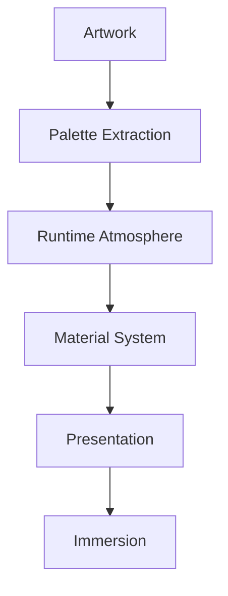

<!--
File: docs/design/system/mds-002-colour-system/04-runtime-atmosphere.md
Document: MDS-002
Chapter: 04
Title: Runtime Atmosphere
Status: Draft
Version: 0.2
-->

# Runtime Atmosphere

---

# Purpose

Runtime Atmosphere is one of the defining characteristics of the Mosaic Design System.

It is the mechanism through which the interface quietly reflects the emotional tone of the user's current entertainment without surrendering its own identity.

Unlike themes, which are selected by users...

or branding, which remains constant...

Runtime Atmosphere continuously adapts.

Its purpose is not to decorate the interface.

Its purpose is to increase immersion.

---

# Definition

Within MDS, **Runtime Atmosphere** is defined as:

> **The adaptive environmental colour system generated from the user's current World and applied subtly throughout the interface.**

Atmosphere exists to create emotional continuity between:

- artwork
- content
- interface

while preserving:

- accessibility
- semantic meaning
- brand identity

---

# Why Runtime Atmosphere Exists

Entertainment already possesses atmosphere.

Examples include:

- album artwork
- anime key visuals
- film posters
- book covers
- promotional art

Traditional applications typically ignore this.

Every title appears inside the same interface.

Mosaic intentionally embraces the emotional identity already present in media.

Instead of recolouring the interface...

It reflects the media.

---

# Reflection

Runtime Atmosphere should be thought of as **reflection** rather than **replacement**.

Incorrect.

```
Artwork

↓

Entire Interface

↓

Artwork Colours
```

Correct.

```
Artwork

↓

Atmosphere

↓

Subtle Reflection

↓

Interface
```

The interface should feel illuminated by the artwork.

Not painted with it.

This distinction is fundamental.

---

# Atmosphere Is Environmental

Atmosphere belongs to the environment.

Not individual components.

Example.

Poor.

```
Button

↓

Artwork Colour
```

Preferred.

```
Environment

↓

Artwork Reflection

↓

Components Inherit Atmosphere
```

Components should remain semantically stable.

Atmosphere surrounds them.

---

# Inputs

Runtime Atmosphere may evaluate:

```text
Current Focus

↓

Current Artwork

↓

Dominant Palette

↓

Luminance

↓

Contrast

↓

Theme

↓

Accessibility
```

These inputs collectively determine the environmental atmosphere.

No single input possesses authority.

---

# Outputs

Runtime Atmosphere produces conceptual outputs.

Examples include:

```
Atmosphere.Primary

Atmosphere.Secondary

Atmosphere.Highlight

Atmosphere.Glow

Atmosphere.Reflection
```

Future Material specifications determine how these outputs become visible.

---

# Atmosphere Is Contextual

The same artwork may produce different Atmospheres depending upon Context.

Example.

Browsing.

```
Artwork

↓

Subtle Reflection
```

Playback.

```
Artwork

↓

Reduced Reflection
```

Reading.

```
Artwork

↓

Soft Reflection
```

The artwork remains identical.

The user's activity changes.

Atmosphere should respect that activity.

---

# Atmosphere Never Becomes Brand

Brand and Atmosphere intentionally remain separate.

Example.

```
Brand

↓

Stable Identity
```

```
Atmosphere

↓

Adaptive Emotion
```

Artwork should never redefine:

- Brand.Primary
- Brand.Secondary
- Brand.Accent

Those tokens belong exclusively to Mosaic.

Atmosphere enhances.

Brand identifies.

---

# Atmosphere Should Be Peripheral

Users should rarely consciously notice Runtime Atmosphere.

Instead they should simply feel:

- warmer
- calmer
- brighter
- darker
- more immersive

Atmosphere should exist primarily within peripheral vision.

The entertainment remains the emotional centre.

---

# Adaptive Intensity

Atmosphere intensity should vary according to Context.

Examples.

```
Playback

↓

Low Intensity
```

```
Browsing

↓

Medium Intensity
```

```
Hero

↓

Highest Intensity
```

Atmosphere should never reduce readability.

Understanding always possesses higher priority than immersion.

---

# Atmosphere Regions

Future implementations may divide Atmosphere into conceptual regions.

```
Hero

↓

Primary Reflection

Canvas

↓

Supporting Reflection

Navigation

↓

Minimal Reflection

Overlay

↓

Neutral
```

This regional approach prevents atmosphere from overwhelming the interface.

---

# Atmosphere And Materials

Atmosphere should normally appear through Materials.

Examples include:

- acrylic
- translucency
- glow
- subtle gradients
- reflected highlights

Flat colour replacement should generally be avoided.

Atmosphere should feel like light interacting with materials.

Not paint replacing them.

This directly supports the Refraction System defined elsewhere within Mosaic.

---

# Atmosphere And Refraction

The Runtime Atmosphere becomes one of the primary inputs into the Mosaic Refraction System.

Conceptually.

```text
Artwork

↓

Colour Extraction

↓

Runtime Atmosphere

↓

Material Refraction

↓

Rendered Surface
```

Notice that artwork never directly colours interface elements.

Instead it influences how light appears to travel through the interface.

This distinction gives Mosaic a recognisable visual identity that remains independent of any particular artwork.

---

# Atmosphere Persistence

Atmosphere should evolve gradually.

Poor.

```
Artwork Changes

↓

Entire Interface Changes
```

Preferred.

```
Artwork Changes

↓

Atmosphere Blends

↓

Materials Adapt

↓

Composition Continues
```

Users should experience atmosphere as environmental change.

Not theme switching.

---

# Accessibility

Runtime Atmosphere must never reduce accessibility.

Accessibility always overrides atmosphere.

If an atmosphere would reduce:

- contrast
- readability
- recognisability

its intensity should reduce automatically.

Accessibility is considered a higher-order design constraint.

---

# Performance

Atmosphere should be computationally inexpensive.

Future implementations should:

- cache extracted palettes
- reuse generated atmosphere
- update only when Focus changes
- avoid recomputation during ordinary interaction

Atmosphere should never noticeably impact interaction performance.

Immersion should not come at the expense of responsiveness.

---

# Good Examples

## Hero Artwork

Artwork subtly illuminates surrounding acrylic surfaces.

Brand remains unchanged.

Typography remains readable.

Atmosphere feels natural.

---

## Dark Science Fiction

Cool blue reflections appear within Hero materials.

The rest of the interface remains restrained.

The experience feels cohesive.

---

## Warm Fantasy Novel

Soft amber reflections appear behind the Hero.

Supporting surfaces remain largely neutral.

Attention remains on the book cover.

---

# Anti-patterns

## Full Recolour

Every interface element adopts artwork colours.

Brand identity disappears.

---

## Saturated UI

Atmosphere becomes more visually interesting than the entertainment itself.

The interface now competes with content.

---

## Instant Theme Switching

Artwork changes produce abrupt colour changes.

Continuity is lost.

---

## Accessibility Compromise

Atmosphere reduces readability.

Immersion should never weaken usability.

---

# Atmosphere Model



Atmosphere exists between artwork and materials.

It does not bypass the Material System.

---

# Relationship To Future Specifications

Future specifications will formalise:

- palette extraction
- UV refraction
- acrylic rendering
- glow synthesis
- adaptive blending
- material shaders

MDS-002 defines only the conceptual role of Runtime Atmosphere.

Future MDS specifications define how it is implemented.

---

# Summary

Runtime Atmosphere is one of the defining innovations of the Mosaic Design System.

Rather than colouring the interface...

It allows the user's entertainment to illuminate it.

Brand remains stable.

Meaning remains stable.

Accessibility remains stable.

Only the atmosphere evolves.

When successful, users should feel that the interface belongs to their current entertainment without ever feeling that it has stopped being unmistakably Mosaic.

---

# Review Status

**Status**

Draft

**Next File**

`05-artwork-colour-extraction.md`
