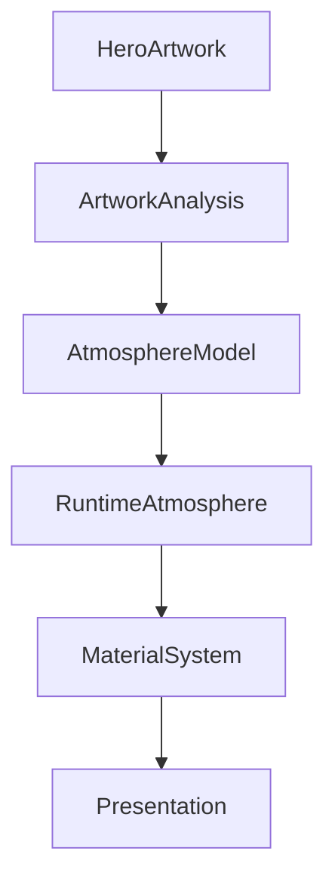

<!--
File: design/mds/MDS-002 Colour System/05-artwork-colour-extraction.md
Document: MDS-002
Chapter: 05
Title: Artwork Colour Extraction
Status: Draft
Version: 0.1
-->

# Artwork Colour Extraction

---

# Purpose

Runtime Atmosphere depends upon understanding the visual identity of the user's current entertainment.

This chapter defines how artwork should contribute to the Colour System.

Importantly...

Artwork should never directly determine interface colours.

Instead, artwork provides **environmental influence**.

This distinction allows Mosaic to remain recognisable while still feeling deeply connected to the media currently occupying the user's World.

---

# Philosophy

The objective of Artwork Colour Extraction is **not colour matching**.

The objective is **atmosphere generation**.

The Design System should never ask:

> **"What colour is this poster?"**

Instead it should ask:

> **"What kind of light would this artwork cast into the room?"**

This philosophy directly supports the Refraction System established elsewhere within the Mosaic Design Language.

---

# Definition

Within MDS, **Artwork Colour Extraction** is defined as:

> **The process of deriving stable atmospheric characteristics from entertainment artwork for use by the Runtime Atmosphere system.**

Artwork Extraction produces:

- atmosphere
- reflection
- lighting influence

It does **not** produce:

- themes
- brand colours
- semantic colours

---

# The Separation Principle

Artwork influences.

It does not control.

The Colour System therefore follows this pipeline.

```text
Artwork

↓

Visual Analysis

↓

Atmosphere Model

↓

Runtime Atmosphere

↓

Materials

↓

Presentation
```

Notice that Semantic Colours are intentionally absent.

Artwork never bypasses semantic meaning.

---

# Raw Colour Is Not Enough

Simply extracting dominant colours produces poor results.

Example.

A movie poster containing:

- bright red logo
- tiny blue sky
- black clothing

might incorrectly produce:

```
Bright Red Interface
```

This is undesirable.

Artwork extraction should instead understand:

- colour balance
- visual weight
- luminance
- saturation
- spatial distribution

The objective is atmosphere.

Not averaging pixels.

---

# Colour Characteristics

Future implementations should derive several conceptual properties.

## Dominant Hue

The overall emotional direction of the artwork.

---

## Accent Hue

Strong supporting colours.

Used sparingly.

---

## Luminance

Overall brightness.

Important for:

- atmosphere
- acrylic behaviour
- readability

---

## Saturation

Overall colour intensity.

High saturation should generally be reduced before entering Runtime Atmosphere.

Entertainment artwork often contains stronger colours than suitable interface materials.

---

## Temperature

Whether the artwork feels:

- warm
- cool
- neutral

Temperature strongly influences perceived atmosphere.

---

## Contrast Profile

Describes the visual energy of the artwork.

High contrast artwork should not automatically produce high contrast interfaces.

Instead, contrast influences how strongly atmosphere is expressed.

---

# Palette Generation

The extraction system should produce a constrained palette.

Conceptually.

```text
Artwork

↓

Analysis

↓

Primary Atmosphere

Secondary Atmosphere

Accent Reflection

Neutral Balance
```

Future specifications define the exact algorithms.

MDS defines only the conceptual outputs.

---

# Reflection Rather Than Sampling

Artwork should be treated as a light source.

Not a paint bucket.

Poor.

```
Artwork

↓

Sample Colour

↓

Interface
```

Preferred.

```
Artwork

↓

Ambient Light

↓

Reflection

↓

Materials
```

This distinction gives Mosaic its distinctive visual identity.

The interface feels illuminated by the media rather than recoloured by it.

---

# Stability

Artwork analysis should remain stable.

Minor artwork changes should not produce dramatically different atmospheres.

Future implementations should therefore favour:

- smoothing
- averaging
- constrained adaptation

over:

- immediate pixel sampling

Atmosphere should feel calm.

Not reactive.

---

# Hero Artwork

The Hero Artwork receives the greatest influence.

Examples.

```
Current Film

↓

Hero Atmosphere
```

```
Current Book

↓

Hero Reflection
```

```
Current Album

↓

Hero Glow
```

Peripheral artwork should contribute significantly less.

The current Focus always possesses the strongest environmental influence.

---

# Multiple Artwork Sources

Future Compositions may contain many artworks simultaneously.

Examples include:

- Continue Watching
- Related Works
- Collections
- Recommendations

Only one artwork should normally drive Runtime Atmosphere.

The Hero.

Supporting artwork should remain visually independent.

Allowing multiple artworks to influence atmosphere simultaneously would weaken coherence.

---

# Artwork Changes

Changing Focus naturally changes artwork.

Atmosphere should therefore evolve.

Preferred.

```text
Old Atmosphere

↓

Blend

↓

New Atmosphere
```

Avoid.

```text
Old Atmosphere

↓

Instant Replacement

↓

New Atmosphere
```

Blending preserves continuity.

---

# Accessibility

Artwork extraction must never reduce accessibility.

Examples.

Highly saturated artwork.

↓

Reduced saturation.

Very dark artwork.

↓

Maintain minimum contrast.

Very bright artwork.

↓

Protect readability.

Artwork always remains subordinate to accessibility.

---

# Performance

Artwork analysis should occur infrequently.

Recommended conceptual triggers include:

- Hero changes
- Focus changes
- artwork replacement

Ordinary scrolling or interaction should not repeatedly analyse artwork.

Future runtime systems should cache extracted atmosphere aggressively.

---

# Plugins

Extensions may contribute artwork.

They should never contribute atmosphere.

Example.

Anime Plugin.

```
Poster

↓

Artwork
```

Platform.

```
Artwork

↓

Atmosphere
```

This preserves one coherent visual language regardless of content source.

---

# Good Examples

## Science Fiction

Artwork.

Cool blue lighting.

Result.

Cool reflections.

Neutral surfaces.

Stable branding.

---

## Fantasy

Artwork.

Warm amber lighting.

Result.

Subtle amber acrylic.

Hero emphasis.

Brand unchanged.

---

## Music

Album artwork.

Rich magenta accents.

Result.

Very subtle magenta environmental glow.

Controls remain semantically coloured.

---

# Anti-patterns

## Dominant Colour Sampling

Largest colour immediately recolours the interface.

Atmosphere becomes unstable.

---

## Multi-Artwork Mixing

Several posters simultaneously influence the interface.

The atmosphere becomes visually noisy.

---

## Brand Replacement

Artwork changes Brand colours.

Users stop recognising Mosaic.

---

## Unbounded Saturation

Artwork saturation passes directly into the interface.

Readability suffers.

The interface competes with the media.

---

# Extraction Model



Artwork influences the environment.

It never directly colours components.

---

# Relationship To Future Specifications

Future specifications will define:

- dominant colour extraction
- palette clustering
- luminance balancing
- temporal blending
- UV refraction integration
- GPU acceleration
- cache invalidation

These implementation details intentionally remain outside the scope of MDS-002.

---

# Summary

Artwork Colour Extraction exists to transform entertainment into atmosphere.

Not into interface.

The platform should feel as though light from the user's entertainment is subtly interacting with the Mosaic materials.

This creates emotional continuity while preserving:

- brand identity
- accessibility
- semantic meaning
- compositional clarity

That balance is one of the defining characteristics of the Mosaic visual language.

---

# Review Status

**Status**

Draft

**Next File**

`06-theme-architecture.md`
