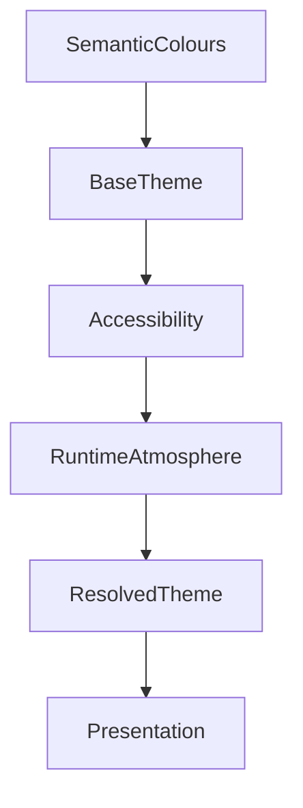

<!--
File: design/mds/MDS-002 Colour System/06-theme-architecture.md
Document: MDS-002
Chapter: 06
Title: Theme Architecture
Status: Draft
Version: 0.1
-->

# Theme Architecture

---

# Purpose

The Mosaic Colour System intentionally separates:

- Brand
- Semantic Meaning
- Runtime Atmosphere

The Theme Architecture defines how these independent systems combine into a coherent visual experience.

Unlike many applications, a Theme within Mosaic is **not** a palette.

A Theme is a structured interpretation of the Design System.

Themes should therefore alter implementation while preserving meaning.

---

# Definition

Within MDS, a **Theme** is defined as:

> **A deterministic mapping between semantic design intent and a specific visual implementation.**

A Theme does not define:

- hierarchy
- behaviour
- composition
- interaction

Those concepts already exist.

A Theme simply determines how they appear.

---

# Why Themes Exist

Users expect software to adapt to different environments.

Examples include:

- Light Mode
- Dark Mode
- High Contrast
- OLED Displays
- Accessibility

Rather than maintaining separate design systems for each environment, Mosaic defines one semantic architecture capable of producing many themes.

The user's World remains constant.

The Theme changes.

---

# Themes Are Interpretations

Every Theme is an interpretation of the same semantic language.

Example.

```text
Surface.Canvas

↓

Light Theme

↓

Warm Paper
```

```text
Surface.Canvas

↓

Dark Theme

↓

Deep Slate
```

```text
Surface.Canvas

↓

OLED Theme

↓

Pure Black
```

The semantic meaning remains unchanged.

Only the visual interpretation differs.

---

# Theme Hierarchy

Every Theme is constructed from the same conceptual layers.

```text
Brand

↓

Semantic Colours

↓

Runtime Atmosphere

↓

Accessibility

↓

Resolved Theme
```

Each layer contributes one responsibility.

No layer should replace another.

---

# Theme Responsibilities

Themes are responsible for:

- colour mapping
- contrast
- luminance
- neutral surfaces
- runtime blending
- accessibility adaptation

Themes are **not** responsible for:

- hierarchy
- layout
- component behaviour
- interaction

These responsibilities belong elsewhere within MDL and MDS.

---

# Base Themes

The Colour System currently defines two foundational themes.

```
Light
```

and

```
Dark
```

Every future theme should inherit from one of these foundations.

This ensures long-term consistency while allowing implementation to evolve.

---

# Derived Themes

Future implementations may introduce derived themes.

Examples include:

```
Dark

↓

OLED
```

```
Dark

↓

Cinema
```

```
Light

↓

Paper
```

These remain visual interpretations rather than independent design systems.

---

# Runtime Layering

Runtime Atmosphere sits above the Theme.

Conceptually.

```text
Theme

↓

Runtime Atmosphere

↓

Presentation
```

This ordering is intentional.

Changing artwork should never require regenerating the Theme.

Instead the Theme provides stable foundations upon which Runtime Atmosphere operates.

---

# Neutral Foundations

Every Theme should begin with a neutral foundation.

Neutral surfaces provide:

- readability
- accessibility
- restraint
- flexibility

Atmosphere then adds subtle environmental influence.

The interface should therefore feel illuminated rather than recoloured.

---

# Brand Consistency

Brand Colours should remain recognisable across every Theme.

Examples.

```
Brand.Primary

↓

Light Theme

↓

Adjusted Luminance
```

```
Brand.Primary

↓

Dark Theme

↓

Adjusted Contrast
```

The Brand adapts for accessibility.

It does not change identity.

---

# Theme Inheritance

Themes inherit from Semantic Tokens.

They do not redefine them.

```text
Semantic

↓

Theme

↓

Resolved Colour
```

Applications therefore consume identical Semantic Tokens regardless of the active Theme.

---

# Accessibility

Accessibility modifies Themes rather than replacing them.

Example.

```
Dark Theme

↓

High Contrast

↓

Resolved Theme
```

This layered approach preserves:

- semantic meaning
- runtime atmosphere
- brand identity

while improving readability.

---

# Theme Resolution

Future runtime systems should resolve themes using the following conceptual order.

```text
Base Theme

↓

Accessibility

↓

Runtime Atmosphere

↓

Device

↓

Presentation
```

This ordering ensures accessibility always possesses higher authority than atmosphere.

---

# Theme Persistence

Theme changes should preserve continuity.

Poor.

```
Dark

↓

Light

↓

Flash

↓

Complete Repaint
```

Preferred.

```
Dark

↓

Blend

↓

Light

↓

Atmosphere Re-evaluates
```

Theme transitions should feel calm.

Not dramatic.

---

# Themes Across Devices

Every client should communicate the same Theme.

Desktop.

↓

Desktop implementation.

Television.

↓

Television implementation.

Mobile.

↓

Mobile implementation.

The visual language remains recognisably Mosaic.

Only presentation adapts.

---

# Plugins

Extensions should never provide themes.

They consume them.

Plugins inherit:

- Semantic Colours
- Runtime Atmosphere
- Accessibility
- Brand

This ensures every extension automatically participates in future redesigns.

---

# Good Examples

## Light Theme

Neutral canvas.

Subtle shadows.

Restrained atmosphere.

Brand accents.

---

## Dark Theme

Deep neutral surfaces.

Artwork-driven reflections.

High readability.

Stable branding.

---

## OLED Theme

Pure black foundation.

Reduced luminance.

Atmosphere preserved.

Hierarchy unchanged.

---

# Anti-patterns

## Theme-Specific Semantics

```
Dark.Surface.Primary
```

Semantic meaning has leaked into themes.

---

## Runtime Themes

Artwork generating entirely new themes.

Atmosphere should refine.

Not replace.

---

## Brand Themes

Every theme changes brand identity.

Recognition decreases.

---

## Plugin Themes

Extensions introducing independent visual identities.

The ecosystem fragments.

---

# Theme Model



Themes translate semantic meaning into consistent visual language.

They do not redefine that meaning.

---

# Relationship To Future Specifications

Future specifications will formalise:

- Light Theme
- Dark Theme
- OLED Theme
- Accessibility Themes
- Theme blending
- Runtime transitions
- Platform-specific generation

MDS-002 establishes only the architectural framework.

---

# Summary

Themes are not collections of colours.

They are interpretations of the Mosaic Design Language.

Every Theme should communicate the same:

- hierarchy
- meaning
- identity

while allowing implementation to adapt to:

- environment
- accessibility
- user preference
- runtime atmosphere

The user's World remains constant.

The Theme simply provides the most appropriate visual expression of it.

---

# Review Status

**Status**

Draft

**Next File**

`07-light-and-dark.md`
