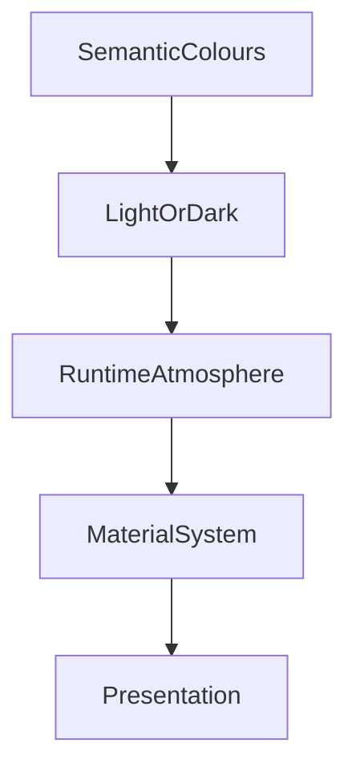

<!--
File: design/mds/MDS-002 Colour System/07-light-and-dark.md
Document: MDS-002
Chapter: 07
Title: Light and Dark
Status: Draft
Version: 0.1
-->

# Light and Dark

---

# Purpose

Light Mode and Dark Mode are often treated as independent themes.

Within Mosaic they are not.

They are two visual interpretations of the same semantic language.

This chapter defines how the Colour System should express identical understanding across both environments while preserving:

- hierarchy
- atmosphere
- accessibility
- brand identity

The objective is not visual parity.

The objective is conceptual parity.

---

# Philosophy

Light Mode and Dark Mode should answer exactly the same questions.

Users should never need to relearn:

- hierarchy
- emphasis
- navigation
- interaction

because they changed theme.

Only the visual expression should change.

Understanding should remain identical.

---

# One Design System

Mosaic intentionally rejects maintaining two independent colour systems.

Instead:

```text
Semantic Colours

↓

Light Theme

or

Dark Theme

↓

Presentation
```

Both themes inherit identical semantic meaning.

Neither introduces additional concepts.

---

# Light Mode

Light Mode is intended to feel:

- open
- calm
- breathable
- paper-like
- premium

Light Mode should avoid the stark, clinical appearance common in many productivity applications.

Instead it should feel like a softly illuminated gallery.

Neutral surfaces should dominate.

Artwork provides emotional colour.

---

# Dark Mode

Dark Mode is intended to feel:

- immersive
- cinematic
- focused
- atmospheric
- comfortable

Dark Mode is expected to become the primary mode for media consumption.

However...

It should not become:

- overly saturated
- excessively high contrast
- visually aggressive

The interface should quietly recede behind the media.

---

# Equal Hierarchy

The following concepts should possess identical hierarchy across both themes.

```
Hero

↓

Supporting

↓

Contextual

↓

Peripheral
```

Changing themes should never alter compositional understanding.

Only implementation changes.

---

# Surface Relationships

Surface relationships should remain consistent.

Example.

```
Canvas

↓

Primary

↓

Secondary

↓

Overlay

↓

Hero
```

The visual implementation changes.

The relationships remain identical.

Users should recognise the same structural language regardless of theme.

---

# Atmosphere Behaviour

Runtime Atmosphere should adapt differently depending upon the active theme.

## Light Mode

Atmosphere should appear primarily through:

- subtle colour reflections
- warm paper illumination
- restrained acrylic
- soft gradients

---

## Dark Mode

Atmosphere should appear primarily through:

- reflected light
- luminous acrylic
- ambient glow
- subtle edge illumination

The emotional effect remains similar.

The implementation differs.

---

# Contrast

Contrast should support readability.

Not dominate the experience.

Light Mode.

Contrast should feel:

- gentle
- comfortable
- editorial

Dark Mode.

Contrast should feel:

- cinematic
- focused
- restrained

Both should satisfy accessibility requirements.

Neither should rely upon extreme black-and-white contrast for ordinary interface elements.

---

# Neutral Foundations

Both themes should begin with neutral foundations.

Light.

```
Soft Paper
```

Dark.

```
Deep Slate
```

These foundations provide space for:

- artwork
- runtime atmosphere
- semantic accents

The interface remains visually calm regardless of theme.

---

# Brand Behaviour

Brand identity should remain stable.

Example.

```
Brand.Primary
```

Light.

↓

Adjusted luminance.

Dark.

↓

Adjusted contrast.

The colour may change physically.

The brand should remain immediately recognisable.

---

# Hero Behaviour

The Hero should remain the emotional centre in both themes.

Light Mode.

Artwork appears naturally illuminated.

Dark Mode.

Artwork appears naturally surrounded by reflected light.

Neither implementation should overpower the artwork itself.

---

# Acrylic Behaviour

Future Material specifications are expected to implement Acrylic differently.

Light Mode.

- lighter translucency
- softer blur
- brighter refraction

Dark Mode.

- deeper translucency
- stronger reflected highlights
- richer atmospheric depth

The material changes.

The compositional role remains identical.

---

# Accessibility

Accessibility possesses higher authority than theme.

If a conflict exists between:

- runtime atmosphere
- theme
- readability

Accessibility should always win.

Light and Dark Modes should therefore expose identical semantic information regardless of visual implementation.

---

# Theme Switching

Switching between Light and Dark should feel like environmental adaptation.

Not application replacement.

Preferred.

```text
Dark

↓

Blend

↓

Light

↓

Atmosphere Re-evaluates

↓

Materials Update
```

Avoid.

```text
Dark

↓

Flash

↓

Entire Interface Repaints
```

Continuity should remain uninterrupted.

---

# Automatic Themes

Future implementations may support automatic theme selection.

Examples include:

- system preference
- sunset
- ambient light
- bedtime routines

These behaviours should influence only the active theme.

They should never affect:

- hierarchy
- composition
- interaction
- semantic meaning

---

# Cross-Device Behaviour

Light and Dark Modes should remain conceptually identical across:

- desktop
- mobile
- television
- tablet

Different display technologies may require different implementation values.

The design language should remain recognisable.

---

# Plugins

Extensions should remain completely unaware of Light and Dark Modes.

Plugins consume:

- Semantic Colours
- Runtime Tokens

The Theme Resolver determines final implementation.

This guarantees that every extension automatically supports:

- Light Mode
- Dark Mode
- future themes

without additional development.

---

# Good Examples

## Reading

Light Mode.

Soft paper surfaces.

Gentle reflected artwork.

Minimal interface.

---

## Playback

Dark Mode.

Deep neutral canvas.

Subtle artwork reflections.

Controls quietly illuminated.

---

## Administration

Light Mode.

Clear hierarchy.

Minimal atmosphere.

Strong readability.

Entertainment and administration remain visually related without becoming identical.

---

# Anti-patterns

## Separate Design Systems

Light and Dark Modes introducing different hierarchy.

---

## Colour Inversion

Simply inverting colours.

The emotional character of the interface is lost.

---

## Saturated Dark Mode

Dark surfaces overwhelmed by artwork colours.

The interface becomes visually noisy.

---

## Pure White

Large regions of absolute white.

The interface feels clinical.

---

## Pure Black

Large regions of absolute black outside OLED-specific themes.

Visual depth decreases.

Atmosphere becomes difficult to communicate.

---

# Theme Behaviour Model



Theme determines environmental interpretation.

Atmosphere enriches that interpretation.

Neither changes semantic meaning.

---

# Relationship To Future Specifications

Future specifications will define:

- exact neutral scales
- luminance curves
- acrylic differences
- OLED behaviour
- HDR displays
- colour blending

This chapter establishes only the conceptual relationship between Light and Dark Modes.

---

# Summary

Light Mode and Dark Mode are two expressions of one design language.

Users should immediately recognise:

- the same hierarchy
- the same interaction
- the same composition
- the same companion

regardless of theme.

Only the environment changes.

The user's World remains exactly the same.

---

# Review Status

**Status**

Draft

**Next File**

`08-accessibility.md`
