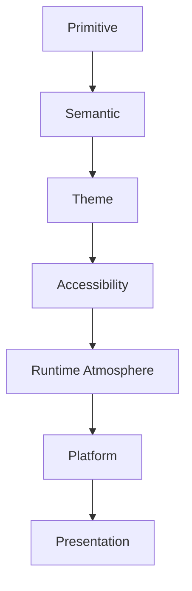

<!--
File: docs/design/system/mds-002-colour-system/09-colour-resolution.md
Document: MDS-002
Chapter: 09
Title: Colour Resolution
Status: Draft
Version: 0.2
-->

# Colour Resolution

---

# Purpose

Previous chapters established:

- Brand Colours
- Semantic Colours
- Runtime Atmosphere
- Theme Architecture
- Accessibility

This chapter defines how those independent systems become a single resolved colour presented to the user.

Colour Resolution is responsible for translating design intent into implementation while preserving every architectural guarantee established by the Mosaic Design Language.

Components should never determine colours themselves.

They should consume resolved semantic intent.

---

# Definition

Within MDS, **Colour Resolution** is defined as:

> **The deterministic process through which semantic colour intent becomes an accessible, context-aware, platform-specific colour value.**

Colour Resolution never creates meaning.

It only implements meaning.

---

# Why Resolution Exists

Without Colour Resolution every component becomes responsible for answering questions such as:

- Which theme is active?
- Which artwork is visible?
- Is accessibility enabled?
- Which device is being used?
- Which atmosphere should apply?

This creates duplication.

Instead:

```
Component

↓

Semantic Colour

↓

Resolved Colour
```

All complexity remains inside the Colour System.

---

# Resolution Pipeline

Every colour should follow the same conceptual resolution pipeline.

```text
Primitive Palette

↓

Semantic Colour

↓

Theme

↓

Accessibility

↓

Runtime Atmosphere

↓

Platform Adaptation

↓

Resolved Colour
```

Each layer contributes one responsibility.

No layer duplicates another.

---

# Resolution Order

Colour Resolution should always occur in the same order.

```text
1.

Primitive Colour

↓

2.

Semantic Colour

↓

3.

Theme

↓

4.

Accessibility

↓

5.

Runtime Atmosphere

↓

6.

Device Adaptation

↓

7.

Resolved Output
```

Changing this order weakens architectural consistency.

---

# Accessibility First

Accessibility should always possess higher authority than atmosphere.

Incorrect.

```
Artwork

↓

Low Contrast

↓

Unreadable Text
```

Correct.

```
Artwork

↓

Accessibility Validation

↓

Adjusted Atmosphere

↓

Readable Interface
```

Immersion should never reduce comprehension.

---

# Semantic Stability

One of the most important guarantees of the Colour System is:

```
Semantic Meaning

↓

Never Changes
```

Example.

```
Surface.Hero
```

may resolve differently depending upon:

- theme
- artwork
- accessibility
- device

The semantic identity remains identical.

Applications should therefore consume only Semantic Colours.

---

# Runtime Refinement

Runtime Atmosphere refines implementation.

It never replaces semantic meaning.

Example.

```
Surface.Hero

↓

Dark Theme

↓

Artwork Reflection

↓

Resolved Hero Surface
```

Atmosphere subtly influences the final result.

It never determines it completely.

---

# Device Adaptation

Different displays possess different characteristics.

Examples include:

- OLED
- LCD
- HDR
- SDR
- eInk
- Projection

Device adaptation should compensate for hardware differences while preserving perceived meaning.

Users should experience one Colour System.

Not device-specific colour languages.

---

# Resolution Is Deterministic

Given identical inputs...

Colour Resolution should always produce identical outputs.

Example.

```
Dark Theme

↓

Current Artwork

↓

TV

↓

Reduced Motion Disabled

↓

Resolved Colour
```

Every Mosaic client should produce visually equivalent results.

Determinism improves:

- testing
- caching
- accessibility
- predictability

---

# Resolution Inputs

Conceptually, Colour Resolution evaluates:

```text
Semantic Colour

↓

Theme

↓

Accessibility

↓

Atmosphere

↓

Display Characteristics

↓

User Preferences
```

These inputs refine implementation.

They do not alter semantic intent.

---

# Fallback Behaviour

Every Semantic Colour should possess a valid fallback.

Example.

```
Artwork Missing

↓

Brand Neutrals

↓

Resolved Surface
```

Components should never receive unresolved colours.

The system should always produce a meaningful visual result.

---

# Caching

Resolved colours should remain cacheable.

Example.

```
Artwork

↓

Atmosphere

↓

Resolved Palette

↓

Cache
```

The cache should invalidate only when:

- Focus changes
- artwork changes
- theme changes
- accessibility changes

Ordinary interaction should rarely require recolour resolution.

---

# Lazy Resolution

Colour Resolution should occur only when colours are required.

Unused semantic colours should remain unresolved.

This improves runtime performance while preserving identical architectural behaviour.

---

# Components

Components should consume only resolved Semantic Colours.

Correct.

```
Hero Tile

↓

Surface.Hero
```

Incorrect.

```
Hero Tile

↓

Determine Theme

↓

Determine Atmosphere

↓

Resolve Colour
```

Resolution belongs exclusively to the Colour System.

---

# Modules

Modules should never resolve colours.

Modules consume:

- Semantic Colours
- Runtime Tokens

The platform determines final colour values.

This guarantees future compatibility across:

- themes
- accessibility
- runtime atmosphere

without module modification.

---

# Good Examples

```
Surface.Canvas

↓

Dark Theme

↓

Resolved Neutral Surface
```

```
Action.Primary

↓

Brand Accent

↓

Accessibility

↓

Resolved Action Colour
```

```
Surface.Hero

↓

Artwork Reflection

↓

Adaptive Acrylic
```

Each example preserves semantic intent.

Only implementation changes.

---

# Anti-patterns

## Component Colour Logic

Every component resolving colours independently.

---

## Artwork Overrides

Artwork replacing Semantic Colours entirely.

---

## Platform Resolution

Flutter, CSS or SwiftUI redefining semantic meaning.

---

## Runtime Mutation

Runtime changing the identity of Semantic Colours.

Runtime refines implementation.

It never changes meaning.

---

# Colour Resolution Model



Meaning flows downward.

Implementation never flows upward.

---

# Relationship To Future Specifications

Future specifications are expected to define:

- palette blending
- atmosphere interpolation
- HDR colour mapping
- GPU colour pipelines
- platform renderers
- colour cache invalidation

This chapter defines the architectural process.

Future specifications define implementation.

---

# Summary

Colour Resolution is the mechanism through which the Mosaic Colour System becomes visible.

Its responsibility is to preserve:

- semantic meaning
- accessibility
- runtime atmosphere
- brand identity

while producing one coherent visual language across every supported platform.

Components should simply ask:

> **"What does this colour mean?"**

The Colour System answers everything else.

---

# Review Status

**Status**

Draft

**Next File**

`10-runtime-synthesis.md`
