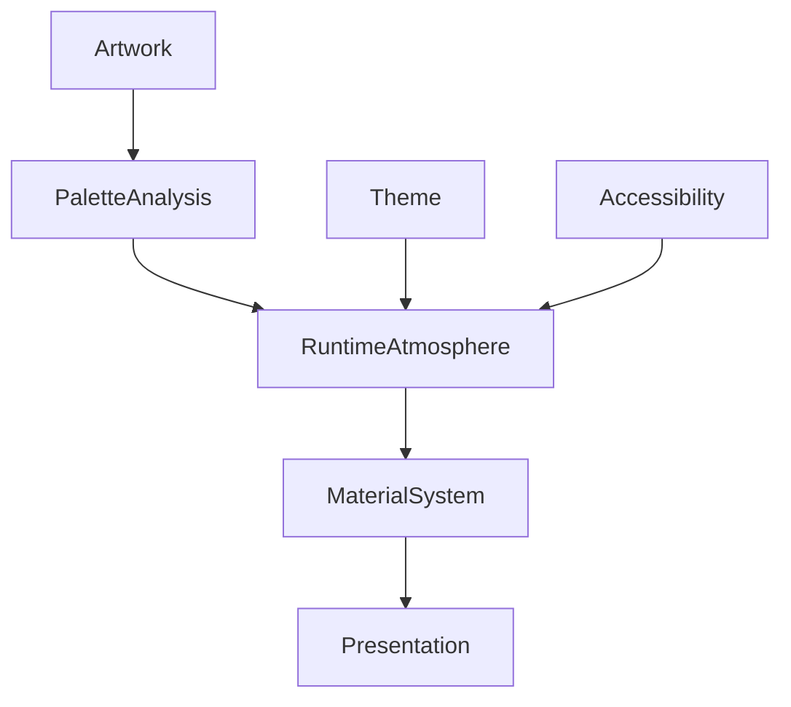

<!--
File: design/mds/MDS-002 Colour System/10-runtime-synthesis.md
Document: MDS-002
Chapter: 10
Title: Runtime Synthesis
Status: Draft
Version: 0.1
-->

# Runtime Synthesis

---

# Purpose

Previous chapters defined how colour should be:

- interpreted,
- organised,
- resolved.

This chapter defines the conceptual process through which those independent systems become one coherent runtime experience.

Unlike traditional theming systems, Mosaic does not simply select colours.

It synthesises an atmosphere.

Runtime Synthesis is the architectural process that combines:

- Brand
- Semantic Colour
- Runtime Atmosphere
- Theme
- Accessibility

into one visually coherent environment.

---

# Definition

Within MDS, **Runtime Synthesis** is defined as:

> **The continuous generation of a coherent visual atmosphere by combining stable semantic design intent with dynamic runtime inputs.**

Runtime Synthesis is not theme switching.

It is environmental adaptation.

---

# Why Synthesis Exists

Traditional design systems generally behave like this.

```text
Theme

↓

Static Colours

↓

Interface
```

Mosaic intentionally behaves differently.

```text
Semantic Meaning

↓

Runtime Analysis

↓

Atmosphere

↓

Material Response

↓

Interface
```

The result is an interface that feels alive without becoming unpredictable.

---

# Synthesis Is Layered

Runtime Synthesis intentionally occurs after semantic resolution.

```text
Semantic Meaning

↓

Theme

↓

Accessibility

↓

Artwork Analysis

↓

Atmosphere

↓

Material Response

↓

Presentation
```

Meaning is established first.

Emotion is introduced afterwards.

---

# Synthesis Inputs

Future runtime systems may combine information from multiple sources.

Examples include:

```
Current Artwork

↓

Current Focus

↓

Current Context

↓

Time Of Day

↓

Device

↓

Accessibility

↓

Theme

↓

Brand
```

Each contributes part of the final atmosphere.

No individual input should dominate the result.

---

# Brand Stability

Brand identity should remain the most stable input.

Brand provides:

- recognition
- trust
- familiarity

Runtime should never alter:

- Brand.Primary
- Brand.Secondary
- Brand.Accent

Instead it synthesises atmosphere around them.

Brand is the architecture.

Atmosphere is the lighting.

---

# Semantic Stability

Semantic colour meaning should also remain fixed.

Example.

```
Action.Primary
```

Runtime may alter:

- luminance
- saturation
- reflection

It must never alter:

- semantic responsibility
- interaction meaning
- hierarchy

Meaning remains stable.

Expression evolves.

---

# Atmosphere Synthesis

Artwork contributes emotional information.

Not direct colour.

Example.

```
Hero Artwork

↓

Palette Analysis

↓

Atmosphere

↓

Reflection

↓

Materials
```

Notice that components never receive artwork colours directly.

Materials interpret atmosphere.

---

# Material Response

Runtime Synthesis intentionally stops at Materials.

Example.

```text
Atmosphere

↓

Acrylic

↓

Refraction

↓

Surface
```

The Material System decides:

- diffusion
- translucency
- glow
- reflection

The Colour System provides only environmental influence.

This separation allows future Material Systems to evolve independently.

---

# Temporal Synthesis

Atmosphere should evolve gradually.

Preferred.

```text
Artwork Changes

↓

Palette Blend

↓

Atmosphere Blend

↓

Material Update
```

Avoid.

```text
Artwork Changes

↓

Immediate Colour Replacement
```

The environment should appear to breathe.

Not flash.

---

# Contextual Synthesis

Different Contexts should produce different synthesis strategies.

Example.

Playback.

```
Minimal Atmosphere
```

Browsing.

```
Moderate Atmosphere
```

Reading.

```
Warm Quiet Atmosphere
```

Administration.

```
Neutral Environment
```

The same artwork should therefore influence different experiences differently.

---

# Domain Synthesis

Future domains may influence atmospheric weighting.

Example.

Anime.

```
Artwork Influence

High
```

Music.

```
Artwork Influence

Medium
```

Administration.

```
Artwork Influence

Minimal
```

The platform should preserve behavioural consistency while respecting the emotional expectations of each domain.

---

# Performance Strategy

Runtime Synthesis should prioritise:

- caching
- incremental updates
- palette reuse
- deferred recomputation

The synthesis engine should update primarily when:

- Hero changes
- Focus changes
- artwork changes
- theme changes

Ordinary interaction should not repeatedly regenerate atmosphere.

---

# Failure Behaviour

If Runtime Synthesis cannot produce an atmosphere:

Preferred.

```text
Neutral Theme

↓

Brand Identity

↓

Continue
```

Avoid.

```text
No Artwork

↓

Broken Colours

↓

Visible Error
```

Atmosphere is an enhancement.

The platform should continue functioning normally without it.

---

# Plugin Participation

Plugins may contribute:

- artwork
- metadata
- contextual information

Plugins never participate directly in synthesis.

The synthesis engine remains entirely platform owned.

This guarantees visual consistency regardless of extension source.

---

# Good Examples

## Film

Hero artwork.

↓

Cool environmental reflections.

↓

Neutral interface.

↓

Readable typography.

Users feel the atmosphere.

They do not consciously notice colour processing.

---

## Book

Warm illustrated cover.

↓

Soft amber reflections.

↓

Paper-like acrylic.

↓

Quiet interface.

The experience feels literary rather than cinematic.

---

## Music

Album artwork.

↓

Subtle ambient glow.

↓

Playback remains visually dominant.

↓

Controls remain semantically consistent.

The artwork influences mood.

Not interaction.

---

# Anti-patterns

## Dynamic Theme Replacement

Artwork completely replaces the current theme.

Brand identity disappears.

---

## Material Bypass

Artwork colours applied directly to components.

Materials become irrelevant.

---

## Atmosphere Everywhere

Every interface region reacts equally.

Visual noise increases.

Hierarchy weakens.

---

## Instant Synthesis

Artwork changes produce immediate environmental changes.

Continuity disappears.

---

# Runtime Synthesis Model



The synthesis engine exists between semantic meaning and material expression.

It should never bypass either layer.

---

# Relationship To Future Specifications

Future specifications are expected to define:

- palette clustering
- colour interpolation
- HDR-aware synthesis
- GPU pipelines
- UV-indexed refraction integration
- multi-display synchronisation
- ambient lighting adaptation

These systems should all implement the architectural model established here.

---

# Summary

Runtime Synthesis is the process that gives Mosaic its distinctive visual character.

It does not create identity.

It does not create meaning.

It creates atmosphere.

By combining stable semantic design with subtle environmental adaptation, Mosaic becomes capable of reflecting the user's entertainment while remaining calm, recognisable and unmistakably itself.

---

# Review Status

**Status**

Draft

**Next File**

`11-governance.md`
