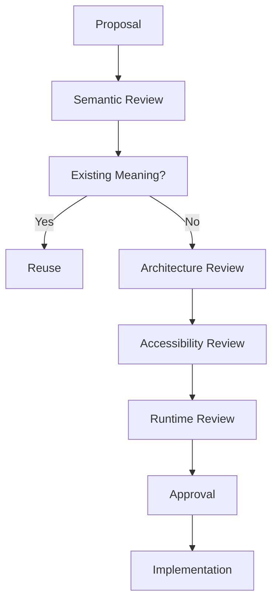

<!--
File: design/mds/MDS-002 Colour System/11-governance.md
Document: MDS-002
Chapter: 11
Title: Colour System Governance
Status: Draft
Version: 0.1
-->

# Colour System Governance

---

# Purpose

The Colour System is one of the most recognisable aspects of the Mosaic Design System.

Unlike implementation details, colour establishes long-term visual memory.

Poor governance leads to:

- inconsistent branding
- semantic drift
- accessibility regressions
- visual fragmentation
- plugin inconsistency

This chapter defines how the Colour System should evolve while preserving a coherent visual language across every Mosaic client and extension.

---

# Governance Philosophy

The Colour System should evolve continuously.

Its meaning should not.

The objective of governance is therefore not preserving individual colours.

It is preserving:

- semantic consistency
- accessibility
- emotional coherence
- brand identity

The interface may look different in ten years.

It should still feel unmistakably like Mosaic.

---

# Colour Is Architecture

Within Mosaic, colour is treated as architecture rather than decoration.

Changing:

```
Surface.Hero
```

is not simply a visual decision.

It potentially affects:

- hierarchy
- accessibility
- runtime atmosphere
- materials
- components
- every supported client

Consequently, colour changes should be reviewed with the same care as API changes.

---

# Ownership

The Colour System has clearly defined ownership.

| Layer | Owner |
|--------|-------|
| Primitive Colours | Design Systems |
| Brand Palette | Design Systems |
| Semantic Colours | Design Systems |
| Runtime Atmosphere | Runtime Platform |
| Theme Resolution | Runtime Platform |
| Client Rendering | Client Teams |

Ownership preserves architectural integrity.

It does not prevent contribution.

---

# Stable Responsibilities

The following responsibilities should remain extremely stable.

- Brand identity
- Semantic colour names
- Accessibility priorities
- Theme architecture
- Colour hierarchy

These concepts form part of the public Design System API.

Breaking them should require architectural review.

---

# Evolvable Responsibilities

The following may evolve more frequently.

- Primitive palette values
- Runtime atmosphere algorithms
- Artwork extraction heuristics
- Material rendering
- Platform implementation

Implementation should remain flexible.

Meaning should remain stable.

---

# Introducing New Colours

Before introducing a new Semantic Colour, contributors should answer the following.

## Question One

Does an existing Semantic Colour already communicate this meaning?

---

## Question Two

Is this genuinely a new semantic responsibility...

or merely another visual treatment?

---

## Question Three

Can Runtime Atmosphere solve this instead?

---

## Question Four

Will this colour remain meaningful independently of the current visual style?

---

## Question Five

Would another contributor naturally discover this token?

If uncertainty remains...

Refinement should continue before implementation.

---

# Brand Governance

Brand Colours require the highest level of stability.

Changes should occur only when:

- Mosaic identity evolves
- accessibility requires adjustment
- branding strategy changes

Artwork should never influence Brand.

Brand belongs exclusively to Mosaic.

---

# Semantic Governance

Semantic Colours represent the public language of the Design System.

Examples.

```
Surface.Primary

Text.Secondary

Action.Primary
```

These names should remain stable across:

- redesigns
- themes
- runtime improvements
- client platforms

Semantic drift should be considered architectural debt.

---

# Runtime Governance

Runtime Atmosphere should evolve independently.

Examples include:

- improved palette extraction
- better blending
- GPU acceleration
- HDR support
- smarter adaptation

These improvements should require no changes to consuming applications.

---

# Accessibility Governance

Accessibility possesses higher authority than aesthetics.

No visual proposal should be accepted if it weakens:

- readability
- semantic clarity
- colour independence
- contrast

Runtime Atmosphere should always adapt to accessibility.

Accessibility should never adapt to atmosphere.

---

# Theme Governance

Themes should:

- reinterpret implementation
- preserve semantic meaning

Themes should never:

- introduce new hierarchy
- redefine interaction
- alter composition

Those concepts belong to MDL.

---

# Plugin Governance

Extensions should never introduce:

- Brand colours
- Runtime colour systems
- Independent themes
- Alternative semantic colour hierarchies

Plugins consume the Colour System.

They do not extend its architecture.

This guarantees one coherent visual identity.

---

# Review Questions

Every colour proposal should answer:

- Does this strengthen semantic clarity?
- Does this improve accessibility?
- Does this preserve Brand identity?
- Does Runtime already solve this?
- Will this still make sense after a redesign?
- Would removing this colour reduce understanding?

If the answer to the final question is "no"...

The colour probably does not belong.

---

# Colour Drift

Colour Drift occurs when:

- duplicate semantic colours appear
- branding leaks into semantics
- atmosphere replaces hierarchy
- plugins introduce independent palettes
- components consume primitive colours

Colour Drift weakens the Design System gradually.

It should be corrected as early as possible.

---

# Governance Workflow



Reuse should always be preferred over expansion.

---

# Validation

Future tooling should automatically validate:

- duplicate semantic colours
- contrast compliance
- unresolved tokens
- primitive colour consumption
- runtime compatibility
- theme completeness

Automated validation should reinforce architectural review.

Not replace it.

---

# Success Criteria

The Colour System succeeds when:

- Brand remains instantly recognisable.
- Artwork enriches rather than dominates.
- Accessibility remains uncompromised.
- Runtime adaptation feels natural.
- Contributors naturally reuse Semantic Colours.
- Extensions visually disappear into the platform.

The strongest Colour System is one users rarely think about consciously.

They simply feel that everything belongs together.

---

# Architectural Decisions

| ADR | Decision |
|------|----------|
| ADR-093 | Semantic colour meaning is treated as a long-lived architectural contract. |
| ADR-094 | Accessibility always has higher authority than runtime atmosphere. |
| ADR-095 | Brand identity is independent from entertainment atmosphere. |
| ADR-096 | Plugins consume the Colour System but never redefine it. |

---

# Review Status

**Status**

Draft

**Next File**

`12-adrs.md`
